# 参考资料
《51单片机C语言程序设计经典实例》——陈志平著

[STC89C52单片机快速入门 第1讲 长江大学2020年电赛培训——bilibili@唐老师讲电赛](https://www.bilibili.com/video/BV1kp4y197ff/?spm_id_from=333.337.search-card.all.click)

[keil的基本使用方式——语雀@iszengmh](https://www.yuque.com/iszengmh/personalblog/hrn24gtyi6hndu4g)

[STC下载软件的使用——语雀@iszengmh](https://www.yuque.com/iszengmh/personalblog/yvmvrow108x0ilxl)

# 51单片机入门
## 配置信息
### 单片机信息
单片机类型：贴片式

单片机型号：STC89C52RC 40I-LQFP44

晶振频率：u11.0592 MHZ

### 软件信息
#### ARM keil
IDE-Version:

μVision V5.38.0.0

Copyright (C) 2022 ARM Ltd and ARM Germany GmbH. All rights reserved.

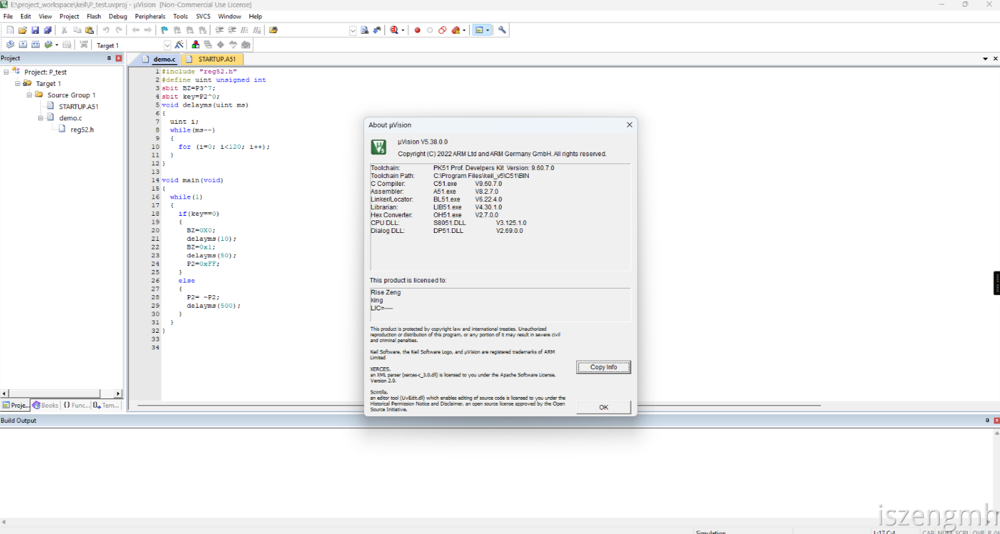

<h4 id="tnGSO">STC-ISP</h4>
V6.95U

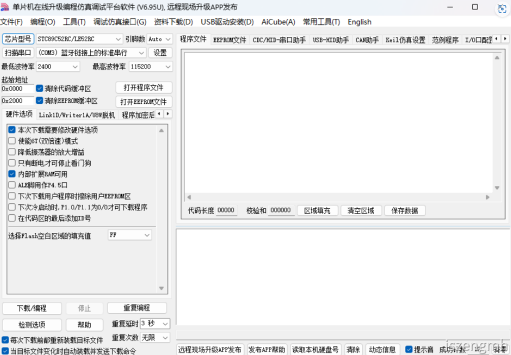


<h2 id="PEdFY">我的单片机(拼多多15块)</h2>

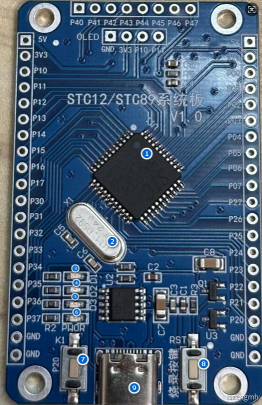

1. 贴片式单片机
2. 晶振 稳定频率以实现时钟计时 频率是u11.0592
3. led灯 D1 连接P3.5
4. led灯 D2 连接P3.6
5. led灯 D3 连接P3.7
6. led灯 这个按钮常亮，按复位键时会闪烁一下
7. 连接p20针脚的按钮
8. RESET复位键、烧录按键
9. typec接口

<h2 id="TH4rT">我的stc89单片机电路原理图</h2>
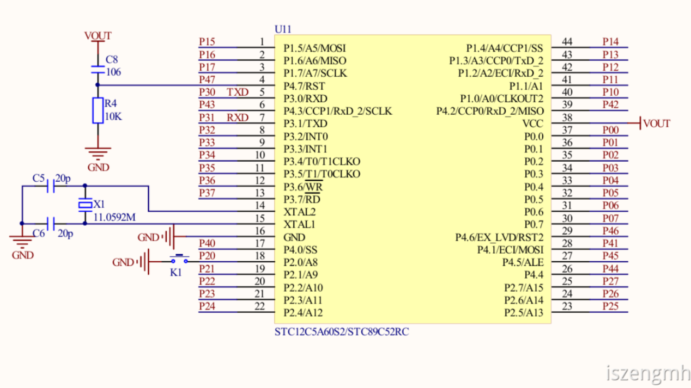

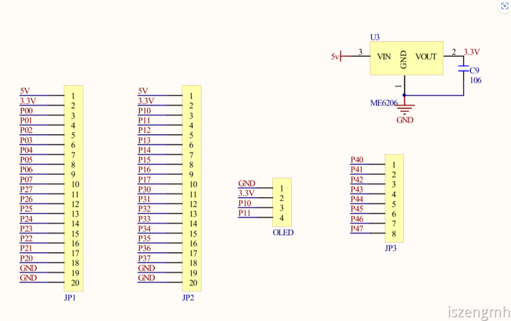

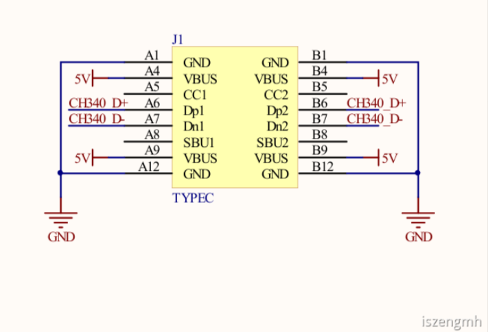

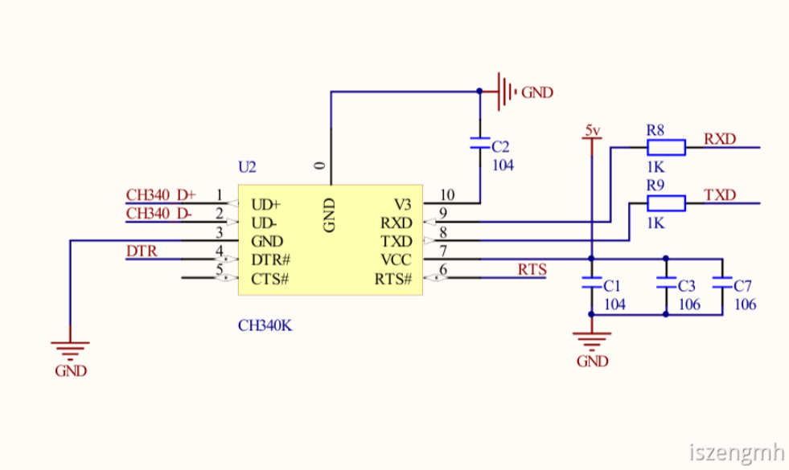

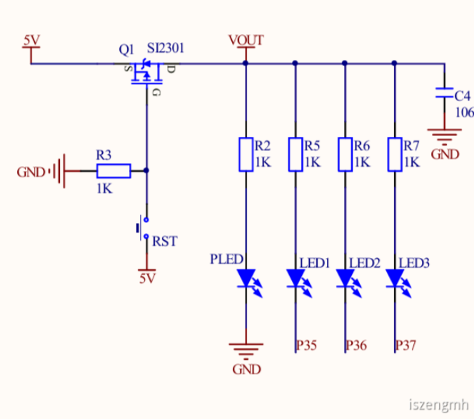
<h2 id="IEckp">常用单片机引脚功能 </h2>
VCC（40脚）：电源端，接+5V

VSS（20脚）： 接地端
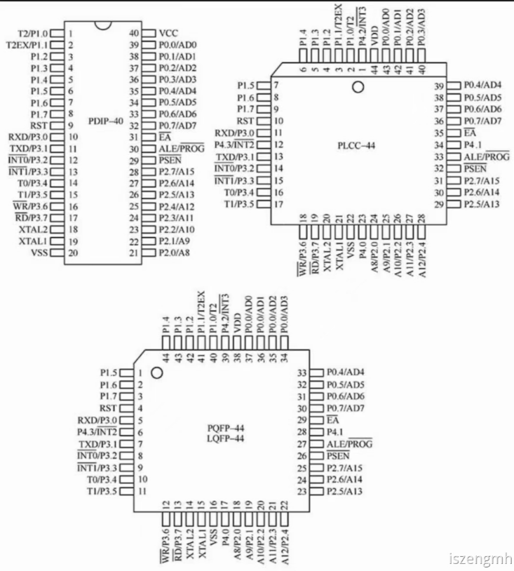

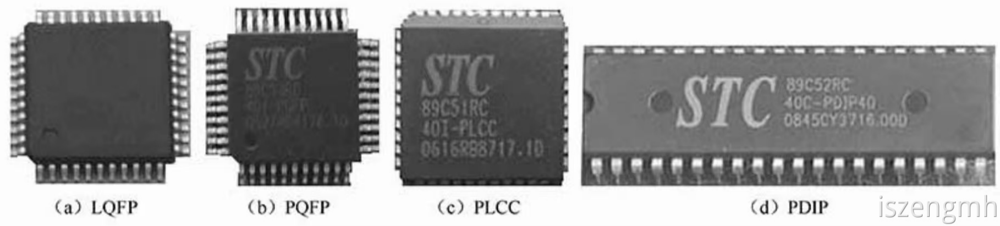

<h2 id="neY17">单片机的定义</h2>
英文是microcontroler，缩写为**MCU**（Micro Controler Unit），意思是微型控制器，微型化是计算机的主要发展方向之一。在微型计算机中，单片微型计算机（简称单片机），是其重要的组成部分。单片机依靠一定的硬件基础，根据特定环境，完成特定需求。

单片机是单片微型计算机（Single Chip Microcomputer, SCM）的简称，它是在一块芯片上集成了中央处理部件（Central Processing Unit, CPU）、数据存储器（Random Access Memory, RAM）、程序存储器（Read Only Memory，ROM）、定时/计时器和多种输入/输出（IO）接口等功能部件 ，片内各功能部件通过内部总线相互连接起来的微型计算机。

单片机的优点

    - 性价比高
    - 控制功能强
    - 高集成度、高可靠性
    - 低电压、低功耗
    - 体积小
    - 易扩展

STC单片机 STC89系列单片机是MCS-51系列单片机的派生产品。它们在指令系统、硬件结构和片内资源 上与标准的8052单片机完全兼容

STC89系列与AT89系列的区别（如AT89S51/S52）

    - 主要是下载方式不同，AT89是并行下载，而STC89C51/52采用串口下载方式；
    - 内存大小有所不同，AT89S51/52的片内RAM为128B256B，而STC89C51/52片内RAM为512B；
    - 部分特殊功能寄存器不同；
    - STC单片机相对执行速度更快，功能更加强大。

## 单片机的主要特性

+ 8051核心处理器单元；
+ 3V/5V工作电压，操作频率0~33MHz(STC89LE516AD最高可达90MHz)
+ 5V工作电压，操作频率0~40MHz
+ 支持12时钟（默认）或6时钟模式
+ 大容量内部数据RAM（1KB RAM）
+ 64/32/16/8KB片内Flash程序存储器，具有在应用可编程（IAP）和在系统可编程（ISP），可实现远程软件升级，无须编程器
+ STC89系列有些单片机内置看门狗和STC810复位电路，加强了系统的稳定和可靠性
+ 双DPTR数据指针
+ SPI（串行外围接口）和增强型UART
+ PCA（可编程计数器序列）
+ 具有PWM的捕获/比较功能
+ 4个8位I/O口，含3个高电流P1口，可直接驱动LED
+ 3个16位定时/计数器
+ 可编程看门狗定时器（WDT）
+ 低EMI方式（ALE禁止）
+ 兼容TTL和COMS逻辑电平
+ 掉电检测和低功耗模式等

## STC89系列单片机的命名规则
STC89系列单片机有多种型号，每种型号具有一定的含义，以下是其产品命名方式：

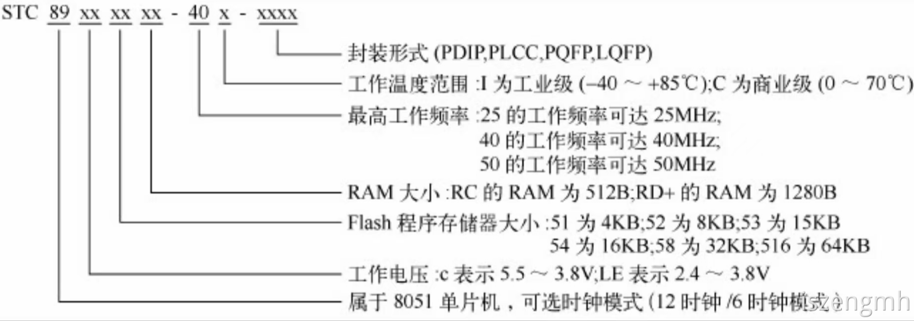

以我的单片机为例：

STC89C52RC 40I-LQFP44 可以拆分为**STC 89 C 52 RC  40 I LQFP 44**

44是最大频率为44 MHz意思

## 各类型号的主要参数
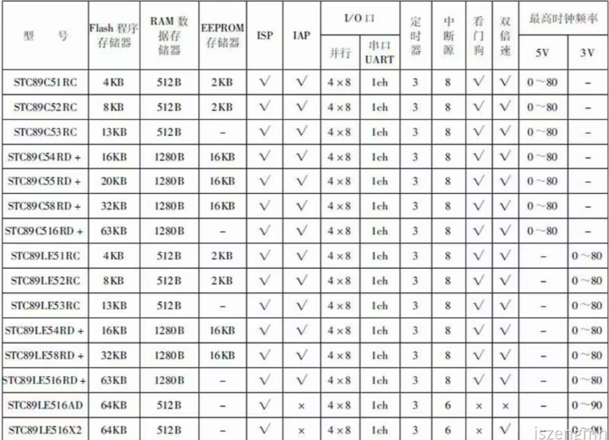

## 常用的封装形式
为适应不同产品的需求，通常有不同的封装形式

+ LQFP-44 (Low Quad Flat Package 薄型广场平面封装)
+ FQFP-44 (Plastic Quad Flat Package，塑料广场平面封装)
+ PLCC-44 (Plastic Leaded Chip Carrier)
+ PDIP-40（Plastic Dual In-line Package 塑料双直列直插式）


## 时钟电路引脚XTAL1和XTAL2
➢XTAL1（19脚）：接外部晶振和微调电容的一端，在片内它是振荡器反相放大器的输入，若使用外部TTL时钟时，该引脚必须接地。

➢XTAL2（18脚）：接外部晶振和微调电容的一端，在片内它是振荡器反相放大器的输出，若使用外部TTL时钟时，该引脚为外部时钟的输入端。

## 控制或其他电源利用引脚ALE/PROG、PSEN、EA、RST
请从图示中找到相应的引脚

➢ALE/[**PROG**]：**地址锁存/编程脉冲输入引脚**，用于控制地址锁存器锁存P0口输出的低8位地址，从而实现数据与低位地址的复用。该引脚可驱动（吸收或输出电流）8个LSTTL（Low-power Schottky TTL，低功耗甚高速TTL，功耗值为传统TTL的1/5）负载。

➢[**PSEN**]：**外部程序存储器读选通信号输出端**。它是读外部程序存储器的选通信号，低电平有效。

➢[**EA**]：**内部程序存储器和外部程序存储器选择端**。[EA]引脚为高电平时，CPU执行片内程序存储器指令。但是，当PC（程序计数器）值超过片内Flash地址范围时，将自动转向访问片外程序存储器。当[EA]为低电平时，不论片内是否有程序存储器，单片机只能访问片外程序存储器。

➢**RST**：**单片机复位信号输入端**。该信号高电平有效，在输入端保持两个机器周期的高电平后，就可以完成复位操作。

## 4组I/O端口P0、P1、P2和P3
➢P0（P0.0～P0.7）：P0端口是一个8位三态双向I/O端口，在访问外部存储器时，它是分时作低8位地址线和8位双向数据总线用。在不访问外部存储器时，作通用I/O端口用，用于传送CPU的I/O数据。P0端口能以吸收电流的方式驱动8个LSTTL负载，一般作为扩展时地址/数据总线使用。

➢P1（P1.0～P1.7）：P1端口是一个带内部上拉电阻的8位准双向I/O端口（作为输入时，端口锁存器置1）。对P1端口写1时，P1端口被内部的上拉电阻拉为高电平，这时可作为输入口。当P1端口作为输入端口时，因为有内部上拉电阻，那些被外部信号拉低的引脚会输出一个电流。P1端口能驱动（吸收或输出电流）4个TTL（Transistor-Transistor Logic）负载，它的每一个引脚都可定义为输入或输出线，其中P1.0、P1.1兼有特殊的功能。

T2/P1.0：定时/计数器2的外部计数输入/时钟输出。

T2EX/P1.1：定时/计数器2重装载/捕捉/方向控制。

➢P2（P2.0～P2.7）：P2端口是一个带内部上拉电阻的8位准双向I/O端口，当外部无扩展或扩展存储器容量小于256B时，P2端口可作一般I/O端口使用，扩充容量在64KB范围时，P2口为高8位地址输出端口。当作为一般I/O口使用时，可直接连接外部I/O设备，能驱动4个LSTTL负载。

➢P3（P3.0～P3.7）：P3端口是一个带内部上拉电阻的8位准双向I/O端口。向P3端口写入1时，P3端口被内部的上拉电阻上拉为高电平，可用做输入口。当作为输入时，被外部拉低的P3端口会因为内部上拉而输出电流。第一功能作为通用I/O端口，第二功能作控制口，见表1-2。P3端口能驱动4个LSTTL（Low-power Schottky TTL）负载。

## 入门程序

```
#include "reg52.h"
#define uint unsigned int
//sbit是51单片机封装的类型，是可寻地址位，也就是当前赋值给某一个变量时，其实引用寄存器地址，所以你会看到下面直接的赋值会对直接实现操作电压
//LED灯，我的单片机总共3 四个LED，可编程有三个，P3^5\P3^6\P3^7分别对应了D1,D2,D3的LED灯
sbit BZ=P3^7;
//P2^0代表P2.0这个引脚，申明一个变量并P2^0赋值，代表key引用了P2.0的寄存器地址，我的P2.0引脚连接了可编程按钮k1
sbit key=P2^0;

//粗略的延时函数
void delayms(uint ms)
{
    uint i;
    while(ms--)
    {
        for (i=0; i<120; i++);
    }
}

void main(void)
{
    while(1)
    {
        //当key等于0时，二进制0代表逻辑低电压,说明P2.0的按钮被按下，此时D3的LED灯会闪烁，长按还会一直闪烁
        if(key==0)
        {
            BZ=0x0; //赋值二进制0，代表输出低电平，LED灯会亮
            delayms(10);
            BZ=0x1;//赋值二进制1，代表输出高电平，LED灯会熄灭，由于有延时函数的关系，LED表现为闪烁现象
            delayms(50);
            P3=0xFF;//0xFF是十六进制，代表八位二进制为“11111111”，由于1代表高电平，说明这里表示将P3所有的引脚输出为高电平，如果有相应可编程元件还会有相应效果，因为我的D1,D2,D3是在P3.5、P3.6和P3.7上，此三个LED无论之前的状态如何，此时都会表现为熄灭的状态
        }
        else
        {
            P3= ~P3;//因为每个P的端口有8位，所以~P3是将P3的8位二进制取反值，二进制可能表现为“00000000”或者“11111111”，由于在循环里面，循环反复取反值会表现为D1,D2,D3不停地闪烁
            delayms(500);
        }
    }
}


```

## 专用IDE如何使用
使用keil IDE并将以上程序复制到项目中，keil的使用试请参考以下链接

[keil的基本使用方式——语雀@iszengmh](https://www.yuque.com/iszengmh/personalblog/hrn24gtyi6hndu4g)

## 如何将程序烧录到单片机
[STC下载软件的使用——语雀@iszengmh](https://www.yuque.com/iszengmh/personalblog/yvmvrow108x0ilxl)

## 作为初学者对51单片机的简要总结
单片机本身是一个独立单元，集成了CPU、I/O接口（P0,P1,P2,P3等端口，当然不同的单片机端口及命名也不一样）、RAM（数据存储器）、ROM（Flash程序存储器）。

I/O包含多个引脚，如果是8位单片机时，那么P0,P1,P2,P3等端口分别具有8个引脚，每个引脚代表二进制上的一位。

通过程序操作逻辑电平，可以实现对输出电压的操作，单片机原理是使用电压的水平来区别不一样的指令（51单片机的逻辑电平范围为：**低电平（逻辑0）**：通常为0V到0.8V。**高电平（逻辑1）**：通常为2V到5V。当然不一样单片机有不一样的标准），比如LED连接P3^5这个引脚，当需要LED亮起时，只要在程序输出二进制为0时，输出低电平，LED灯就会亮。因为每个引脚代表一位，每个端口共持有8位/8个引脚，所以P3^5引脚此时二进制表现0，如果看P3端口所有引脚的二进制表现，那么二进制表现应该为11110111，可以看到第五位是0，P3的其他引脚如果也有LED，那么肯定是熄灭的，因为是高电平，二进制表现为1。

**一个最重要学习前提是一定先查看你要学习的实验板是什么类型，先仔细查看相应的芯片原理图、电路图、PCB原理图等，更能清楚引脚接入了哪些元器件。**

