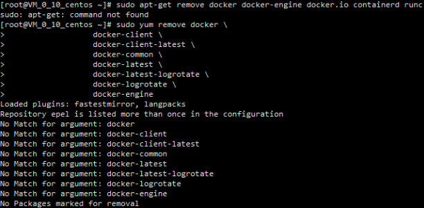

# 参考链接

[Install Docker Engine on CentOS——Docker](https://docs.docker.com/engine/installation/linux/centos/)

# 确保旧版本已经卸载

<!--more-->
```bash
sudo yum remove docker \
                  docker-client \
                  docker-client-latest \
                  docker-common \
                  docker-latest \
                  docker-latest-logrotate \
                  docker-logrotate \
                  docker-engine
```



# 安装的方法

# install Docker Repository

```bash
# 安装yum-utils，它携带了yum-config-manager
sudo yum install -y yum-utils
#安装repository
sudo yum-config-manager \
    --add-repo \
    https://download.docker.com/linux/centos/docker-ce.repo
```

如果需要指定 `nightly` 和 `test` 版本，则可以指定以下命令

```bash
sudo yum-config-manager --enable docker-ce-nightly
sudo yum-config-manager --enable docker-ce-test
```

你也同样可以禁用他们，或者启用他们

```bash
 sudo yum-config-manager --disable docker-ce-nightly
 sudo yum-config-manager --enable docker-ce-test
```

## 安装Docker工程

查看仓库中的清单

```bash
yum list docker-ce --showduplicates | sort -r
```

安装命令

```bash
#安装格式
sudo yum install docker-ce-<VERSION_STRING> docker-ce-cli-<VERSION_STRING> containerd.io
#安装示例
sudo yum install docker-ce docker-ce-cli containerd.io
```

## start Docker

```bash
sudo systemctl start docker
```

## docker更改国内镜像

```bash
# 创建docker目录
mkdir  /etc/docker/
sudo vi /etc/docker/daemon.json
```

输入以下文件内容

```json
{
"registry-mirrors": [
    "http://hub-mirror.c.163.com",
    "http://docker.mirrors.ustc.edu.cn"
    ]
}
```

## 测试docker是否安装成功

```bash
sudo docker run hello-world
```
