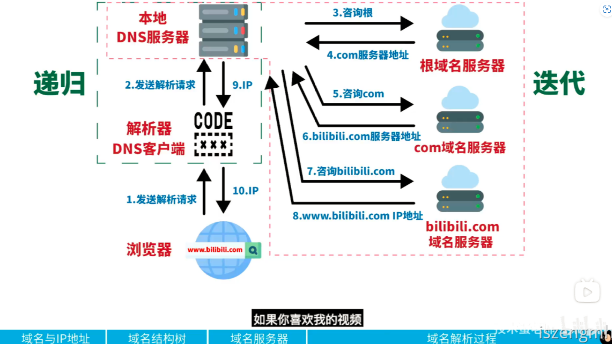
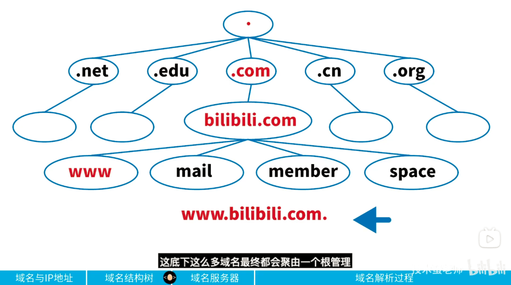

<h1 id="mKzUa">参考链接</h1>

[DNS域名解析过程——bilibili@技术蛋老师](https://www.bilibili.com/video/BV1uL4y1B7aE)

# DNS解析原理

## 原理图示



## 简述

首先一个完整的域名是这样子的`www.bilibili.com.`，要注意后面是有一个点，这个点表示根，所有顶级域名(.com、.cn、.org)由于根进行管理。域名的解析过程也会按照以下的结构进行查找，每个节点都有对应的域名服务器。



## 用CMD演示解析过程

当输入命令`nslookup`时，会跳出`>`这样的命令模式，输入`set type=ns`，然后再输入根域名也就是`.`会显示所有的解析类型

```

admin@admin:~$ nslookup
> set type=ns
> .
Server:         172.29.240.1
Address:        172.29.240.1#53

Non-authoritative answer:
    nameserver = m.root-servers.net.
    nameserver = b.root-servers.net.
    nameserver = c.root-servers.net.
    nameserver = d.root-servers.net.
    nameserver = e.root-servers.net.
    nameserver = f.root-servers.net.
    nameserver = g.root-servers.net.
    nameserver = h.root-servers.net.
    nameserver = a.root-servers.net.
    nameserver = i.root-servers.net.
    nameserver = j.root-servers.net.
    nameserver = k.root-servers.net.
    nameserver = l.root-servers.net.

Authoritative answers can be found from:
> set type=b
unknown query type: b
> set type=a
> b.root-servers.net.
Server:         172.29.240.1
Address:        172.29.240.1#53

Non-authoritative answer:
Name:   b.root-servers.net
Address: 199.9.14.201
> server 199.9.14.201
Default server: 199.9.14.201
Address: 199.9.14.201#53
> set type=ns
> com.
Server:         199.9.14.201
Address:        199.9.14.201#53

Non-authoritative answer:
*** Can't find com.: No answer

Authoritative answers can be found from:
com     nameserver = a.gtld-servers.net.
com     nameserver = b.gtld-servers.net.
com     nameserver = c.gtld-servers.net.
com     nameserver = d.gtld-servers.net.
com     nameserver = e.gtld-servers.net.
com     nameserver = f.gtld-servers.net.
com     nameserver = g.gtld-servers.net.
com     nameserver = h.gtld-servers.net.
com     nameserver = i.gtld-servers.net.
com     nameserver = j.gtld-servers.net.
com     nameserver = k.gtld-servers.net.
com     nameserver = l.gtld-servers.net.
com     nameserver = m.gtld-servers.net.
a.gtld-servers.net      internet address = 192.5.6.30
a.gtld-servers.net      has AAAA address 2001:503:a83e::2:30
b.gtld-servers.net      internet address = 192.33.14.30
b.gtld-servers.net      has AAAA address 2001:503:231d::2:30
c.gtld-servers.net      internet address = 192.26.92.30
c.gtld-servers.net      has AAAA address 2001:503:83eb::30
d.gtld-servers.net      internet address = 192.31.80.30
d.gtld-servers.net      has AAAA address 2001:500:856e::30
e.gtld-servers.net      internet address = 192.12.94.30
e.gtld-servers.net      has AAAA address 2001:502:1ca1::30
f.gtld-servers.net      internet address = 192.35.51.30
f.gtld-servers.net      has AAAA address 2001:503:d414::30
> server 192.33.14.30
Default server: 192.33.14.30
Address: 192.33.14.30#53
> set type=ns
> bilibili.com.
Server:         192.33.14.30
Address:        192.33.14.30#53

Non-authoritative answer:
*** Can't find bilibili.com.: No answer

Authoritative answers can be found from:
bilibili.com    nameserver = ns3.dnsv5.com.
bilibili.com    nameserver = ns4.dnsv5.com.
ns3.dnsv5.com   internet address = 129.211.176.212
ns3.dnsv5.com   internet address = 162.14.18.188
ns3.dnsv5.com   internet address = 162.14.24.251
ns3.dnsv5.com   internet address = 162.14.25.251
ns3.dnsv5.com   internet address = 18.194.2.137
ns3.dnsv5.com   internet address = 183.192.201.94
ns3.dnsv5.com   internet address = 223.166.151.16
ns3.dnsv5.com   has AAAA address 2402:4e00:1430:1102:0:9136:2b2b:ba61
ns3.dnsv5.com   internet address = 52.77.238.92
ns3.dnsv5.com   internet address = 61.151.180.51
ns4.dnsv5.com   internet address = 101.226.220.12
ns4.dnsv5.com   internet address = 129.211.176.151
ns4.dnsv5.com   internet address = 162.14.24.248
ns4.dnsv5.com   internet address = 162.14.25.248
ns4.dnsv5.com   internet address = 183.192.164.119
ns4.dnsv5.com   internet address = 223.166.151.126
ns4.dnsv5.com   has AAAA address 2402:4e00:1020:1264:0:9136:29b6:fc32
ns4.dnsv5.com   internet address = 52.198.159.146
ns4.dnsv5.com   internet address = 59.36.120.147
> server 129.211.176.212
Default server: 129.211.176.212
Address: 129.211.176.212#53
> set type=a
> www.bilibili.com.
Server:         129.211.176.212
Address:        129.211.176.212#53

www.bilibili.com        canonical name = a.w.bilicdn1.com.
>
>
>
>
> a.w.bilicdn1.com.
Server:         129.211.176.212
Address:        129.211.176.212#53

a.w.bilicdn1.com        canonical name = g.w.bilicdn1.com.
Name:   g.w.bilicdn1.com
Address: 110.43.34.72
Name:   g.w.bilicdn1.com
Address: 110.43.33.147
Name:   g.w.bilicdn1.com
Address: 110.43.33.166
Name:   g.w.bilicdn1.com
Address: 139.159.246.60
Name:   g.w.bilicdn1.com
Address: 139.9.62.5
>


```
