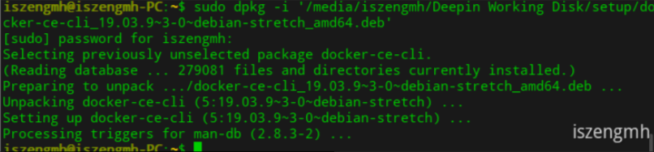
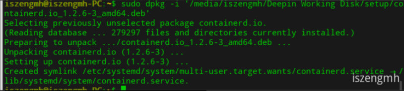
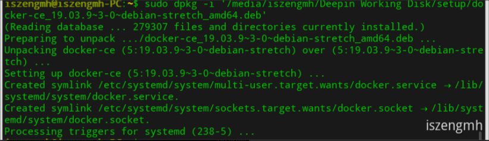
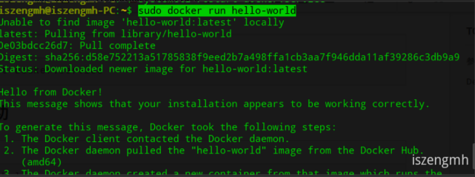

# 参考链接
[Install Docker Engine on Debian#install-from-a-package——Docker  ](https://docs.docker.com/engine/install/debian/#install-from-a-package)

[查看deepin操作系统版本命令——CSDN@小张1995 ](https://blog.csdn.net/weixin_42408060/article/details/103417988)

[Debian 发行版本——debian](https://www.debian.org/releases/index.zh-cn.html)

[linux 查看 x64 x86 arm64 以及它们的区别——CSDN@ok_kakaka](https://blog.csdn.net/clksjx/article/details/102589570)

# Deepin之手动安装Docker
## 概述
由于deepin是基于Debian开发的，所以我直接可以根据官方提供的，基于Debian的docker包来安装。

## 确保已经删除旧版本docker
Older versions of Docker were called `docker`, `docker.io`, or `docker-engine`. If these are installed, uninstall them:

<!--more-->

```plain
sudo apt-get remove docker docker-engine docker.io containerd runc
```

## debian的发行版本
+ [下一代 Debian 正式发行版的代号为 bullseye](https://www.debian.org/releases/bullseye/)      — 发布时间尚未确定
+ [Debian 10（buster）](https://www.debian.org/releases/buster/)      — 当前的稳定版（stable）
+ [Debian 9（stretch）](https://www.debian.org/releases/stretch/)      — 旧的稳定版（oldstable）
+ [Debian 8（jessie）](https://www.debian.org/releases/jessie/)      — 更旧的稳定版（oldoldstable）
+ [Debian 7（wheezy）](https://www.debian.org/releases/wheezy/)      — 被淘汰的稳定版
+ [Debian 6.0（squeeze）](https://www.debian.org/releases/squeeze/)      — 被淘汰的稳定版
+ [Debian GNU/Linux 5.0（lenny）](https://www.debian.org/releases/lenny/)      — 被淘汰的稳定版
+ [Debian GNU/Linux 4.0（etch）](https://www.debian.org/releases/etch/)      — 被淘汰的稳定版
+ [Debian GNU/Linux 3.1（sarge）](https://www.debian.org/releases/sarge/)     — 被淘汰的稳定版
+ [Debian GNU/Linux 3.0（woody）](https://www.debian.org/releases/woody/)      — 被淘汰的稳定版
+ [Debian GNU/Linux 2.2（potato）](https://www.debian.org/releases/potato/)      — 被淘汰的稳定版
+ [Debian GNU/Linux 2.1（slink）](https://www.debian.org/releases/slink/)      — 被淘汰的稳定版
+ [Debian GNU/Linux 2.0（hamm）](https://www.debian.org/releases/hamm/)      — 被淘汰的稳定版

## 查看Deepin是哪个Debian版本
下面是查看Debian版本号的命令，我自己显示的是9.0，所以我本文是安装stretch版本的

```bash
cat /etc/debian_version
```

## 查看CPU架构
我返回提x86_64，由于amd64是基于x86_64标准的，所以我们选择amd64的docker包

```bash
arch
```

## docker版本地址
```bash
https://download.docker.com/linux/debian/dists/<debian version>/pool/stable/<your cpu architecture>/
# 示例
https://download.docker.com/linux/debian/dists/stretch/pool/stable/amd64/
```

我们需要下载的文件：

docker-ce\docker-ce-cli\container.io

上面三种下载最新即可：

[https://download.docker.com/linux/debian/dists/stretch/pool/stable/amd64/containerd.io_1.2.6-3_amd64.deb](https://download.docker.com/linux/debian/dists/stretch/pool/stable/amd64/containerd.io_1.2.6-3_amd64.deb)

[https://download.docker.com/linux/debian/dists/stretch/pool/stable/amd64/docker-ce-cli_19.03.9~3-0~debian-stretch_amd64.deb](https://download.docker.com/linux/debian/dists/stretch/pool/stable/amd64/docker-ce-cli_19.03.9~3-0~debian-stretch_amd64.deb)

[https://download.docker.com/linux/debian/dists/stretch/pool/stable/amd64/docker-ce_19.03.9~3-0~debian-stretch_amd64.deb](https://download.docker.com/linux/debian/dists/stretch/pool/stable/amd64/docker-ce_19.03.9~3-0~debian-stretch_amd64.deb)

## 安装docker包
要注意contain.io要在docker-ce先安装，因为docker-ce依赖contain.io，依次代入以下命令安装。

```bash
sudo dpkg -i <youpackage path>.deb
```







## 修改国内镜像
```bash
sudo vi /etc/docker/daemon.json
```

在文件中输入以下内容，首次可能是自动创建文件：

```bash
{

"registry-mirrors": ["http://hub-mirror.c.163.com","http://docker.mirrors.ustc.edu.cn"]

}
```

重启docker服务

```bash
systemctl restart docker.service
```

如果不修改镜像为国内镜像，则可能出现响应超时

```bash
iszengmh@iszengmh-PC:~$ sudo docker run hello-world
Unable to find image 'hello-world:latest' locally
docker: Error response from daemon: Get https://registry-1.docker.io/v2/library/hello-world/manifests/latest: Get https://auth.docker.io/token?scope=repository%3Alibrary%2Fhello-world%3Apull&service=registry.docker.io: dial tcp: lookup auth.docker.io on 192.168.1.1:53: read udp 192.168.1.115:34378->192.168.1.1:53: i/o timeout.
See 'docker run --help'.
```

## 测试是否安装成功
```bash
sudo docker run hello-world
```


由于没有分配用户权限所以需要用sudo命令。
