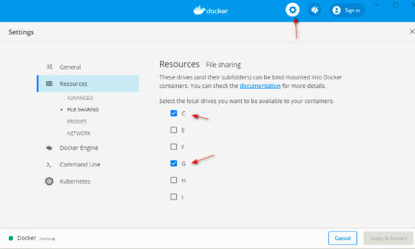

# 参考链接
[Sharing your C drive with Docker for Windows when using Azure Active Directory——TOMSSL@Tom Chantler  ](https://tomssl.com/sharing-your-c-drive-with-docker-for-windows-when-using-azure-active-directory-azuread-aad/)


# Docker之如何挂载本地磁盘
如果是windows的话直接使用图形界面，勾选可用于挂载的磁盘即可

后面直接使用在容器里面使用命令挂载即可：

```shell
# 挂载本地磁盘
mount <盘符>
```


