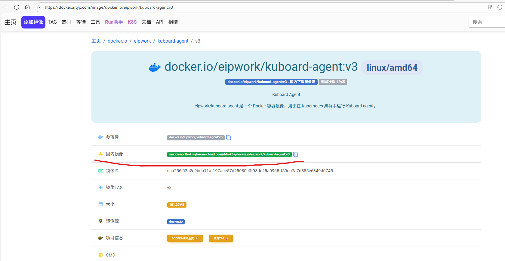
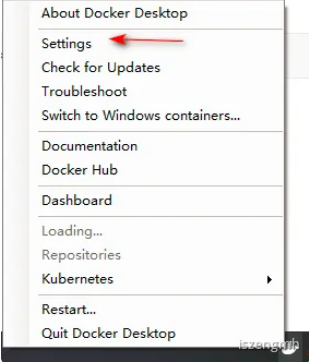
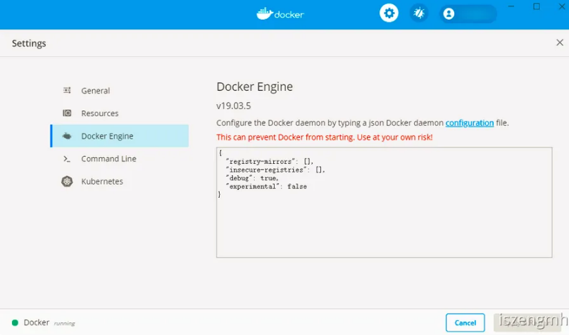
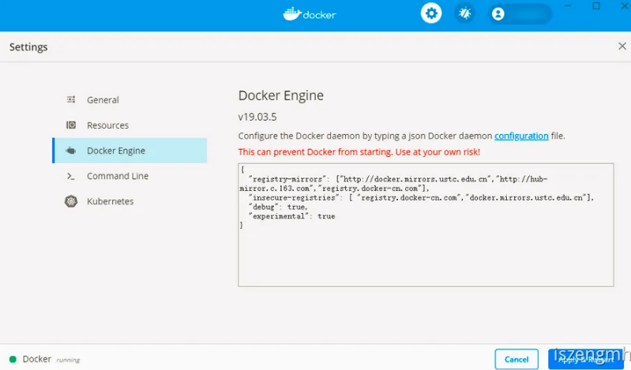
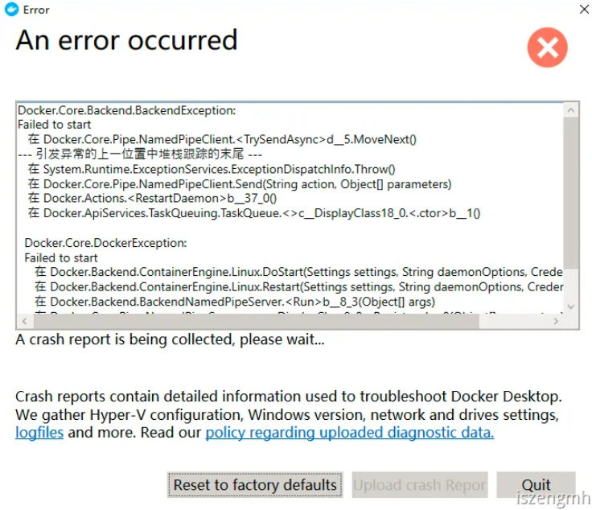

# 参考链接 

[docker hub 国内镜像加速地址——博客园@lvusyy](https://www.cnblogs.com/lovesKey/p/11335619.html)  

[docker pull——Docker](https://docs.docker.com/engine/reference/commandline/pull/)  

[渡渡鸟镜像同步站](https://docker.aityp.com/image/gcr.io/k8s-minikube/storage-provisioner:v5)

# 如何选择对应的镜像

一是按照以往可以直接从网络搜索引擎查找相关文章，就可以找到，
二是我这里直接推荐一个专门收集镜像信息的网站————[渡渡鸟镜像同步站](https://docker.aityp.com/image/gcr.io/k8s-minikube/storage-provisioner:v5)，但是这个网站我之前试过，好像同步比较慢一点，之前kicbase.0.0.48已经出了，但是最新的是47

在这个渡渡鸟的镜像网站里面，搜索框随便搜索一个项目，可以在里面看到有个叫`国内镜像`的，直接复制路径中的域名即可



# 在下载镜像时指定镜像 

```shell
docker run hello-world --registry-mirror=https://docker.mirrors.ustc.edu.cn
```

# Docker for Desktop如何改换镜像 

## 右键进入setting 



## 点击Docker Engine 



## 在右边输入框中输入以下json后，点击Apply&Restart 

```json
{
  "registry-mirrors" : [
    "http://docker.mirrors.ustc.edu.cn",
    "http://hub-mirror.c.163.com"
  ],
  "insecure-registries" : [
    "docker.mirrors.ustc.edu.cn"
  ],
  "debug" : true,
  "experimental" : true
}
```



## 注意问题 

一开始我本来其中是有加入`"registry.docker-cn.com"`的，但是，发现会崩溃，可能是这个镜像有问题，或者是我网络问题，建议还是不要使用这个镜像地址。

```json
{
  "registry-mirrors" : [
    "http://docker.mirrors.ustc.edu.cn",
    "http://hub-mirror.c.163.com",
    "registry.docker-cn.com"
  ],
  "insecure-registries" : [
    "registry.docker-cn.com",
    "docker.mirrors.ustc.edu.cn"
  ],
  "debug" : true,
  "experimental" : true
}
```



# linux下如何更换镜像源 

执行以下命令

```shell
sudo vi /etc/docker/daemon.json
```

根据json文件中文件结构，将镜像源替换为以下源

```json
{
  "registry-mirrors": [
    "https://swr.cn-north-4.myhuaweicloud.com",
    "https://registry.k8s.io",
    "https://hub-mirror.c.163.com",
    "https://registry.mirror.aliyuncs.com"
  ]
}
```

保存后，执行以下命令重新启动docker

```shell
sudo systemctl daemon-reload
sudo systemctl restart docker
```

