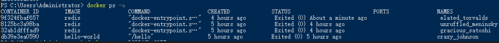
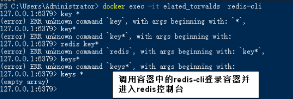
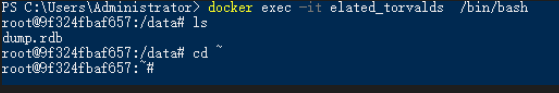

# 参考链接</h1>
[Docker容器进入的4种方式——博客园@浮華落盡](https://www.cnblogs.com/xhyan/p/6593075.html) 

[SSH into a Container—— DevTools CLI Documentation](https://phase2.github.io/devtools/common-tasks/ssh-into-a-container/)

# 本文可能所需的其他知识
 
## 创建容器运行（没有镜像自动下载）
 
此命令会自动创建容器，如果容器所需的镜像不存在，会自动从docker中配置好的镜像源下载，然后创建容器，并运行，容器名称会自动设置。注意，多次执行会创建多个容器并运行，没有必要时无需多次使用。请使用`docker ps -a`查看容器。

<!--more-->
```shell
docker run <images name>
# images name,镜像名称，如redis
```


## 启动指定已有的容器
 
```shell
docker start <container id>
```

## 查看所有已有容器的相关信息
 
```shell
docker ps -a
```




## 停止指定容器
 
```shell
docker stop <container id>
```

## 停止所有容器
 
```shell
docker stop $(docker ps -aq)
```

# 常用的进入容器的方法
 
* 使用docker attach
* 使用SSH（exec命令）
* 使用nsenter

# SSH into a Container（SSH进入容器）
 
> exec命令可以用于连接正在运行的容器


以下命令可以查看命令用法

```shell
docker exec --help
```

以下是命令格式

```shell
docker exec -it <container name> <command>
# container name容器的NAME，可以通过调用docker ps -a 查看你需要进入的容器NAME，注意不是images
# command 这个是进入容器后运行的命令，即bash命令，属于这个容器的Shell/bash
```



以下可以获取容器的bash，如果容器是linux，相当于进入登录进linux，可以自由输入容器中的命令。

```shell
docker exec -it <container name> /bin/bash
```



