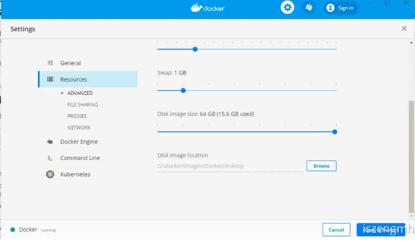
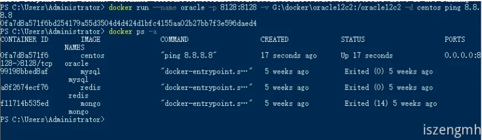
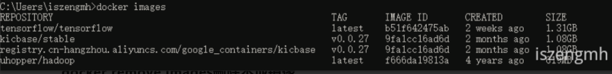

# 参考链接 

[Docker Desktop for Windows By Docker](https://hub.docker.com/editions/community/docker-ce-desktop-windows)

[Getting Started with Docker Desktop for Windows](https://docs.docker.com/docker-for-windows/)

[玩转spring全家桶（视频课程）——极客时间@丁雪丰  ](https://time.geekbang.org/course/detail/100023501-83549)

[Change Docker images location in Windows——Paolo Brocco Works](https://www.pbworks.net/change-docker-images-location-in-windows/)

[使用Docker搭建MySQL服务——博客园@sablier](https://www.cnblogs.com/sablier/p/11605606.html)


# 说明 

> Docker is a full development platform to build, run, and share containerized applications.
>
> Docker 是全开发平台构建、运行和共享容器化应用。
>

你可以在docker安装linux和windows的容器，通俗来讲类似于虚拟机，但与虚拟机不同。

# Getting Started 

+ 使用以下命令可查询docker的版本


```shell

docker --version

```

+ 使用以下命令，Pull一个镜像用于测试

```shell

docker run hello-world

```

会有以下结果

```

docker : Unable to find image 'hello-world:latest' locally
latest: Pulling from library/hello-world
1b930d010525: Pull complete
Digest: sha256:c3b4ada4687bbaa170745b3e4dd8ac3f194ca95b2d0518b417fb47e5879d9b5f
Status: Downloaded newer image for hello-world:latest
Hello from Docker!
This message shows that your installation appears to be working correctly.
...

```

+ 使用以下命令可以列出所有已经存在的镜像

```shell

docker image ls

```

+ 使用以下命令显示详细的所有容器信息

```shell

docker container ls --all

```

显示结果如下

| CONTAINER ID | **IMAGE** |**COMMAND** | **CREATED** | STATUS                  | PORTS | NAMES        |
| ------------ | ----------------------------------------- | -------------------------------------------- | -------------------------------------------- | ----------------------- | ----- | ------------ |
| 0d6b52ebfb01 | hello-world | "/hello"  | 21 hours ago  | Exited (0) 21 hours ago |       | kind_satoshi |

+ 以下命令可以查看帮助

```shell

docker --help
docker container --help
docker container ls --help
docker run --help

```

# 国内镜像源 

由于官方docker hub镜像源，是国外的，在国内速度比较缓慢，国内可以替换是国内的镜像源。

[官方docker hub:https://hub.docker.com](https://hub.docker.com)

[官方镜像源：https://www.docker-cn.com/registry-mirror  ](https://www.docker-cn.com/registry-mirror)

[阿里云镜像源：https://dev.aliyun.com/](https://dev.aliyun.com/)

如何更换镜像源，可参考[Docker之如何更换国内镜像](https://iszengmh.pages.dev/posts/docker%E4%B9%8B%E5%A6%82%E4%BD%95%E6%9B%B4%E6%8D%A2%E5%9B%BD%E5%86%85%E9%95%9C%E5%83%8F)


# 一些常用容器的创建命令 

##  mongo 

先把mongo镜像摘取下来

```shell

docker pull mongo
```

运行mongo容器

```shell

docker run --name <container name> -p <localPort>:<containerPort> -v <localDisk>:<containerDisk> -e MONGO_INITDB_ROOT_USERNAME=admin -e MONGO_INITDB_ROOT_PASSWORD=admin -d mongo
# --name <container name> 指定要运行的容器名称
# -p <localPort>:<containerPort> 把本地端口与容器里面的端口进行映射
# -v <localDisk>:<containerDisk>  把本地的磁盘地址与容器磁盘地址进行映射
# -e MONGO_INITDB_ROOT_USERNAME=admin 在容器创建MONGO_INITDB_ROOT_USERNAME的环境变量,在mongo官方有说明
# -e MONGO_INITDB_ROOT_PASSWORD=admin 在容器中创建MONGO_INITDB_ROOT_PASSWORD的环境变量,在mongo官方有说明
# -d mongo 指定一个叫mongo的镜像

# 完整示例如下
docker run --name mongo -p 27017:27017 -v ~/docker-data/mongo:/data/db -e MONGO_INITDB_ROOT_USERNAME=admin -e MONGO_INITDB_ROOT_PASSWORD=admin -d mongo
```

##  redis 

```shell

docker run --name redis -d -p 6379:6379 redis
# --name redis  指定容器名称为redis
# -d   后台运行容器
# -p 6379:6379  把本地端口与容器里面的端口，指定容器端口号为6379
# redis   镜像名为redis

```

##  创建一个纯净的centos 

```shell

docker pull centos
docker run --name oracle -p 8128:8128 -v G:\docker\oracle12c2:/oracle12c2 -d centos

```

##  mysql 

```shell

duso docker run -p 3306:3306 --name mysql \
-v <local disk eg:c:/mysql/conf>:/etc/mysql \
-v <local disk eg:c:/mysql/logs>:/var/log/mysql \
-v <local disk eg:c:/mysql/data>:/var/lib/mysql \
-e MYSQL_ROOT_PASSWORD=123456 \
-d mysql

# 不使用MYSQL_USER创建用户，可能会创建失败

docker run --name mysql -d -p 3306:3306 -v G:\docker\mysql:/var/lib/mysql  -e MYSQL_DATABASE=test -e MYSQL_USER=market   -e MYSQL_PASSWORD=market    -e MYSQL_ROOT_PASSWORD=root  mysql

```
# daemon.js常用配置 

##  修改镜像源为国内镜像源 

[Docker之如何更换国内镜像——语雀@iszengmh](https://www.yuque.com/iszengmh/personalblog/ot19p5)

##  修改images安装位置 

[Change Docker images location in Windows——Paolo Brocco Works](https://www.pbworks.net/change-docker-images-location-in-windows/)

桌面版本直接右键任务栏图标，点击Dashboard，点设置，再自己设置



添加以下配置到daemon.js中去

```json

"graph": "your local directory"

```

以下为示例

```json

{
  "registry-mirrors" : [],
  "insecure-registries" : [],
  "debug" : true,
  "experimental" : true,
  "graph": "D:\\ProgramData\\Docker"
}

```

# 需要注意的问题 

##  docker运行后自动退出了 

[docker容器刚运行就自动退出了——博客园@zippo_123 ](https://www.cnblogs.com/zippo123/p/11233431.html)

这是需要docker规定创建必须有一个携带的命令，所以创建容器的命令参考：

```shell


docker run --name <container name>  -d centos ping 8.8.8.8

```



进入bash则可以输入这样的命令：

```shell

docker exec -it oracle bash

```
# 常用命令 

## linux安装docker 

```shell
sudo apt install -y docker.io
sudo service docker start         #启动docker服务
sudo usermod -aG docker ${USER}   #当前用户加入docker组，可以当前用户操作docker
```


## 重启 docker

```shell

sudo systemctl daemon-reload
sudo systemctl restart docker

```

##  docker pull从镜像源中，拉取一个镜像到本地 

```shell

docker pull <image>
# image，是镜像名称
```

##  docker search 从镜像源中，搜索指定镜像 

```shell


docker search <image>
# image 是镜像名称

```

##  docker images查看本地所有镜像 

```bash

docker images

```



##  docker remove images删除本地镜像 

```bash

docker rmi <IMAGE ID>

```

##  docker run 

```shell


# 根据镜像创建容器，没有对应镜像时自动从镜像源中下载
docker run [OPTIONS] IMAGE [COMMAND] [ARG...]
# -d 后台运行容器
# -e 设置环境变量
# --expose/-p 宿主端口：容器端口
# --name 容器名称
# --link 链接不同容器名称
# -v 宿主目录：容器目录挂载磁盘卷

```

##  docker start/stop 启动或者停止容器 

```shell


docker start/stop <container name>

```

##  docker ps查看容器信息 

```shell


docker ps <container name>

```

##  docker logs查看容器日志 

```shell


docker logs <container name>

```

##  删除容器 

```shell


docker rm <container name or id>

```
## 重新生成容器

### 不删除volumes，保留数据

```bash
# 1. 停止并删除容器、网络 (默认不删除卷)
docker compose down

# 2. 重新创建并启动容器
docker compose up -d
```

### 删除所有卷

```bash
docker compose down -v
docker compose up -d
```

### 只是想重新创建`docker-compose.yml`中的特定服务

```bash
# 重新创建 web 服务，但不重新创建其依赖的服务
docker compose up -d --no-deps --force-recreate web
```
--no-deps 参数表示不重新创建该服务所依赖的其他服务