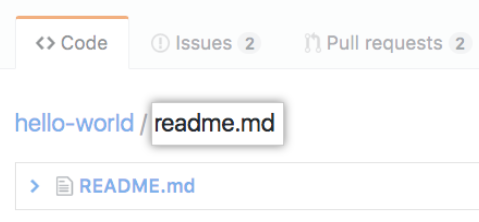
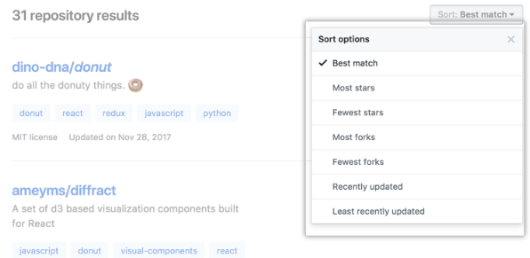

# 参考链接

[Searching wikis——Github](https://help.github.com/en/github/searching-for-information-on-github/searching-wikis)

[了解搜索语法——Github](https://docs.github.com/cn/search-github/getting-started-with-searching-on-github/understanding-the-search-syntax#filter-qualifiers-based-on-exclusion)

# Searching wikis for Github

## 使用标签(关键字)查询

> Use quotations around multi-word search terms. For example, if you want to search for issues with the label "In progress," you'd search for label:"in progress". Search is not case sensitive.
> 
> 在多个单词搜索词中使用引号。例如，如果你想去搜索针对issues为in progress时，你可以搜索`label:"in progress"`。搜索是不区分大小写的。

官方文档中多次提到wiki应该是指你所需要查找的知识吧，因为有类似维基百科的这种收集知识的网站。

## `user` and `org` qualifier

searching wikis within user's or organizaion's respositories在用户或者组织的仓库的中搜索

| Qualifier 限定词 |  Example  | 
| ------------------------ | --------------------------------------------------------------------------------------------------------------------------------------------------- |
| user:USERNAME            | `user:defunkt` matches wiki pages from repositories owned by @defunkt. `user:defunkt`将匹配用户为Defunkt的wiki页面                                 |
| org:ORGNAME              | `org:github` matches wikis in repositories owned by the GitHub organization.`org:github`将匹配组织为Github的wikis                                |
| repo:USERNAME/REPOSITORY | `repo:defunkt/gibberish` matches wiki pages from @defunkt's "gibberish" repository.`repo:defunkt/gibberish`将从用户@defunkt匹配名为"gibberish"的仓库 |

## Search within a wiki page title or body text 搜索标题和文本内容

> The `in` qualifier limits the search to the wiki page title or body text. Without the qualifier, both the title and body text are searched.`in`限定词限制搜索为标题和内容中的文体。没有限制词，标题和内容文本都会被搜索。

| Qualifier 限定词 | Example |
| ------------- | ------------------------------------------------------------------------------------------------------------------------------------------------------------ |
| in:title      | `usage in:title` matches wiki page titles with the word "usage." `usage in:title` 匹配单词为“usage”的标题                                                  |
| in:body       | `installation in:body` matches wiki pages with the word "installation" in their main body text. `installation in:body` 匹配单词为“installation”的主要内容文本。 |

## Search by last updated date

> The `updated` qualifier matches wiki pages that were last updated within the specified date range. `updated`限定词匹配在指定日期内被更新的wiki页面

| Qualifier 限定词      | Example |
| ------------------ | ------------------------------------------------------------------------------------------------------------------------------------------------------------------------------------------ |
| updated:YYYY-MM-DD | `usage updated:>2016-01-01` matches wiki pages with the word "usage" that were last updated after 2016-01-01. `usage updated:>2016-01-01` 匹配单词为"usage"并且上次更新时间为2016-01-01的wiki页面 |

## findingfiles in Github在github中查询文件

> + File finder results exclude some directories like `build`, `log`, `tmp`, and `vendor`. To search for files within these directories, use the `[filename](https://help.github.com/en/articles/searching-code#search-by-filename)`[ code search qualifier](https://help.github.com/en/articles/searching-code#search-by-filename).
>
> 文件查询器结果不包含一些路径名，像“build”，“log”，“tmp”和“vendor”。在这些路径中查询文件，使用“`[filename](https://help.github.com/en/articles/searching-code#search-by-filename)`[ code search qualifier](https://help.github.com/en/articles/searching-code#search-by-filename)”
>
> + You can also open the file finder by pressing `t` on your keyboard. For more information, see "[Keyboard shortcuts](https://help.github.com/en/articles/keyboard-shortcuts)."
>
> 你也可以通过按“t”键，打开文件查询器。针对更多信息，请查询[Keyboard shortcuts](https://help.github.com/en/articles/keyboard-shortcuts)
>

1. 在Github中，进入主页面
2. 在你的仓库名下，点击**Find File**。

3. 在输入框查询输入你想查询的文件名

4. 在结果清单中点击你想查找的文件

# Sorting search results对搜索结果排序

最基本的排序方式

## [Sort by interactions按照互动数排序](https://help.github.com/en/github/searching-for-information-on-github/sorting-search-results#sort-by-interactions)

| 限定词 | Example |
| --- | --- |
| sort:interactions or sort:interactions-desc | [**org:github sort:interactions**](https://github.com/search?q=org%3Agithub+sort%3Ainteractions&type=Issues)，匹配组织为github的issues，并且按最高reaction和评论数排序** ** |
| sort:interactions-asc | [**org:github sort:interactions-asc**](https://github.com/search?utf8=%E2%9C%93&q=org%3Agithub+sort%3Ainteractions-asc&type=Issues) 匹配组织为github的仓库issues，以最低reaction和评论数排序 |

## [Sort by reactions 仅按照反响数排序](https://help.github.com/en/github/searching-for-information-on-github/sorting-search-results#sort-by-reactions)

| 限定词 | Example |
| --- | --- |
| sort:reactions or sort:reactions-desc | [**org:github sort:reactions **](https://github.com/search?q=org%3Agithub+sort%3Areactions&type=Issues)匹配组织为github的仓库issues，以最高reaction数排序 |
| sort:reactions-asc | [**org:github sort:reactions-asc**](https://github.com/search?q=org%3Agithub+sort%3Areactions-asc&type=Issues)匹配组织为github的仓库issues，以最低reaction数排序 |
|sort:reactions-reaction | [**org:github sort:reactions-+1**](https://github.com/search?q=org%3Agithub+sort%3Areactions-%2B1&type=Issues)匹配组织为github的仓库issues, 以最多点赞 (👍) reactions排序 |
| | [**org:github sort:reactions--1**](https://github.com/search?utf8=%E2%9C%93&q=org%3Agithub+sort%3Areactions--1&type=Issues)匹配组织为github的仓库issues, 以最多点踩的 (👎) reactions排序. |
| |  |
| | [**org:github sort:reactions-smile**](https://github.com/search?utf8=%E2%9C%93&q=org%3Agithub+sort%3Areactions-smile&type=Issues) 匹配组织为github的仓库issues，以最多笑脸的(😄) reactions排序. |
| | [**org:github sort:reactions-tada**](https://github.com/search?utf8=%E2%9C%93&q=org%3Agithub+sort%3Areactions-tada&type=Issues) 匹配组织为github的仓库issues，以最多欢呼的  (🎉) reactions排序. |
| | [**org:github sort:reactions-heart**](https://github.com/search?utf8=%E2%9C%93&q=org%3Agithub+sort%3Areactions-heart&type=Issues) 匹配组织为github的仓库issues，以最多心的 (❤️) reactions排序. |

## [Sort by author date以作者日期排序](https://help.github.com/en/github/searching-for-information-on-github/sorting-search-results#sort-by-author-date)

| 限定词 | Example |
| --- | --- |
| sort:author-date or sort:author-date-desc | [**feature org:github sort:author-date**](https://github.com/search?utf8=%E2%9C%93&q=feature+org%3Agithub+sort%3Aauthor-date&type=Commits) 匹配提交中包含“feature”字眼，组织为github的仓库，以作者日期降序排序，即按最新排序. |
| sort:author-date-asc | [**feature org:github sort:author-date-asc**](https://github.com/search?utf8=%E2%9C%93&q=feature+org%3Agithub+sort%3Aauthor-date-asc&type=Commits) 匹配提交中包含“feature”字眼，组织为github的仓库，以作者日期升序排序，即按最远的时间排序. |

## [Sort by committer date按提交者日期排序](https://help.github.com/en/github/searching-for-information-on-github/sorting-search-results#sort-by-committer-date)

| 限定词 | Example |
| --- | --- |
| sort:committer-date or sort:committer-date-desc | [**feature org:github sort:committer-date**](https://github.com/search?utf8=%E2%9C%93&q=feature+org%3Agithub+sort%3Acommitter-date&type=Commits)匹配提交中包含“feature”字眼，组织为github的仓库，以提交者日期降序排序，即按最新排序. |
| sort:committer-date-asc | ``[**feature org:github sort:committer-date-asc **](https://github.com/search?utf8=%E2%9C%93&q=feature+org%3Agithub+sort%3Acommitter-date-asc&type=Commits)匹配提交中包含“feature”字眼，组织为github的仓库，以提交者日期升序排序，即按最远的时间排序. |

## [Sort by updated date 按更新日期排序](https://help.github.com/en/github/searching-for-information-on-github/sorting-search-results#sort-by-updated-date)

| 限定词 | Example |
| --- | --- |
| sort:updated or sort:updated-desc | [**feature sort:updated**](https://github.com/search?utf8=%E2%9C%93&q=feature+sort%3Aupdated&type=Repositories) 匹配包含“feature”字眼的仓库，以最近更新日期的排序. |
| sort:updated-asc | [**feature sort:updated-asc **](https://github.com/search?utf8=%E2%9C%93&q=feature+sort%3Aupdated-asc&type=Repositories)匹配包含“feature”字眼的仓库，以最近较少更新日期的排序. |

# Searching for respository

> 你通过拼接任意的修饰符去搜索仓库
>
> You can search for repositories globally across all of GitHub, or search  for repositories within a particular organization. For more  information, see "[About searching on GitHub](https://help.github.com/en/articles/about-searching-on-github)."你可以在Github中全局搜索仓库，或在一个特定组织中搜索仓库，针对更多信息，请查看"[About searching on GitHub](https://help.github.com/en/articles/about-searching-on-github)."
>
> To include forks in the search results, you will need to add `fork:true` or `fork:only` to your query. For more information, see "[Searching in forks](https://help.github.com/en/articles/searching-in-forks)."在搜索结果包含forks，你需要添加`fork:true`和`fork:only`到你查询中，针对更多信息，请查看[Searching in forks](https://help.github.com/en/articles/searching-in-forks)
>
> For a list of search syntaxes that you can add to any search qualifier to further improve your results, see "[Understanding the search syntax](https://help.github.com/en/articles/understanding-the-search-syntax)".搜索语法清单，你可以添加搜索修饰符去进一步改善你的搜索结果。查看"[Understanding the search syntax](https://help.github.com/en/articles/understanding-the-search-syntax)"
>
> 
>
> Use quotations around multi-word search terms. For example, if you  want to search for issues with the label "In progress," you'd search for  `label:"in progress"`. Search is not case sensitive.使用引号包含多个单词搜索项。例如，如果你想从标签为“In progress”去搜索issues,你可以使用“`label:"in progress"`”，搜索不区分大小写。
>
> 
>

## search by respository name,description,content of readme file通过仓库名、描述、README文件内容搜索

| Qualifier | Example |
| --- | --- |
| in:name | [**jquery in:name**](https://github.com/search?q=jquery+in%3Aname&type=Repositories) matches repositories with "jquery" in their name.匹配仓库名包含jquery |
| in:description | [**jquery in:name,description**](https://github.com/search?q=jquery+in%3Aname%2Cdescription&type=Repositories)**,file** matches repositories with "jquery" in their name or description.匹配仓库和描述包含jquery |
| in:readme | [**jquery in:readme**](https://github.com/search?q=jquery+in%3Areadme&type=Repositories) matches repositories mentioning "jquery" in their README file.匹配仓库的README file 中有提到过"jquery"    |
| repo:owner/name | [**repo:octocat/hello-world**](https://github.com/search?q=repo%3Aoctocat%2Fhello-world) matches a specific repository name.匹配一个指定的仓库名 |

## [Search based on the contents of a repository基于仓库内容搜索](https://help.github.com/en/github/searching-for-information-on-github/searching-for-repositories#search-based-on-the-contents-of-a-repository)

你可以“in:readme”来搜索仓库中的README文件。

除了“in:readme”，你没有其他方法可以查询仓库内容了。在仓库中搜索指定文件或者内容，你可以使用文件查找器或者专用搜索修饰符，更多信息，看"[Finding files on GitHub](https://help.github.com/en/articles/finding-files-on-github)" and "[Searching code](https://help.github.com/en/articles/searching-code)."

| Qualifier | Example   |
| --------- | ---------------------------------------------------------------------------------------------------------------------------------------------------------------------------------------- |
| in:readme | [**octocat in:readme**](https://github.com/search?q=octocat+in%3Areadme&type=Repositories) matches repositories mentioning "octocat" in their README file.匹配README文件有提到过“octocat”仓库 |

## [Search within a user's or organization's repositories在用户或者组织的仓库中搜索](https://help.github.com/en/github/searching-for-information-on-github/searching-for-repositories#search-within-a-users-or-organizations-repositories)

你可以通过“user”或者“org”修饰符，来搜索用户或者组织所拥有的仓库

| Qualifier     | Example     |
| ------------- | --------------------------------------------------------------------------------------------------------------------------------------------------------------------------------------------------------------- |
| user:USERNAME | [**user:defunkt forks:>100**](https://github.com/search?q=user%3Adefunkt+forks%3A%3E%3D100&type=Repositories) matches repositories from @defunkt that have more than 100 forks.匹配用户为defunkt有超过100forks的仓库。 |
| org:ORGNAME   | [**org:github**](https://github.com/search?utf8=%E2%9C%93&q=org%3Agithub&type=Repositories) matches repositories from GitHub.匹配组织为Github的仓库                                                                |

## [Search by repository size通过仓库大小搜索](https://help.github.com/en/github/searching-for-information-on-github/searching-for-repositories#search-by-repository-size)

“size”修饰符查询仓库可以匹配指定的大小（千字节），使用[greater than, less than, and range qualifiers](https://help.github.com/en/articles/understanding-the-search-syntax).

| Qualifier             | Example             |
| --------------------- | -------------------------------------------------------------------------------------------------------------------------------------------------------------- |
| size:n | [**size:1000**](https://github.com/search?q=size%3A1000&type=Repositories) matches repositories that are 1 MB exactly.匹配刚好为1MB（1000字节）的仓库                 |
|                       | [**size:>=30000**](https://github.com/search?q=size%3A%3E%3D30000&type=Repositories) matches repositories that are at least 30 MB.匹配至少30MB的仓库             |
|                       | [**size:<50**](https://github.com/search?q=size%3A%3C50&type=Repositories) matches repositories that are smaller than 50 KB.匹配小于50KB的仓库                   |
|                       | [**size:50..120**](https://github.com/search?q=size%3A50..120&type=Repositories) matches repositories that are between 50 KB and 120 KB.匹配50KB到120KB之间的仓库 |

## [Search by number of followers搜索粉丝大小](https://help.github.com/en/github/searching-for-information-on-github/searching-for-repositories#search-by-number-of-followers)

你可以过滤基于粉丝大小的仓库，使用[greater than, less than, and range qualifiers的](https://help.github.com/en/articles/understanding-the-search-syntax)“followers”修饰符

| Qualifier                  | Example  |
| -------------------------- | ------------------------------------------------------------------------------------------------------------------------------------------------------------------------------------------------------------------------------------------------------------------------- |
|followers:n | [**node followers:>=10000**](https://github.com/search?q=node+followers%3A%3E%3D10000) matches repositories with 10,000 or more followers mentioning the word "node".匹配粉丝大于10000并且有提到过node这个单词的仓库                                                                    |
|                            | [**styleguide linter followers:1..10**](https://github.com/search?q=styleguide+linter+followers%3A1..10&type=Repositories) matches repositories with between 1 and 10 followers, mentioning the word "styleguide linter."匹配粉丝数量1到10之间的并且有提到过“styleguide linter”单词的仓库 |

## [Search by number of forks](https://help.github.com/en/github/searching-for-information-on-github/searching-for-repositories#search-by-number-of-forks)通过forks数量搜索

| Qualifier | Example |
| --- | --- |
|forks:n | [**forks:5**](https://github.com/search?q=forks%3A5&type=Repositories) matches repositories with only five forks.匹配只有5个forks的仓库 |
| | [**forks:>=205**](https://github.com/search?q=forks%3A%3E%3D205&type=Repositories) matches repositories with at least 205 forks.匹配至少205个forks的仓库 |
| | [**forks:<90**](https://github.com/search?q=forks%3A%3C90&type=Repositories) matches repositories with fewer than 90 forks.匹配小于90forks的仓库 |
| | [**forks:10..20**](https://github.com/search?q=forks%3A10..20&type=Repositories) matches repositories with 10 to 20 forks.匹配10到20个Forks的仓库 |

## Search by number of stars通过star数搜索

| Qualifier | Example |
| --- | --- |
|stars:n | [**stars:500**](https://github.com/search?utf8=%E2%9C%93&q=stars%3A500&type=Repositories) matches repositories with exactly 500 stars.匹配刚好500个star的仓库 |
| | [**stars:10..20**](https://github.com/search?q=stars%3A10..20+size%3A%3C1000&type=Repositories) matches repositories 10 to 20 stars, that are smaller than 1000 KB. 匹配10到20个Star的仓库，仓库比1000KB小    |
| | [**stars:>=500 fork:true language:php**](https://github.com/search?q=stars%3A%3E%3D500+fork%3Atrue+language%3Aphp&type=Repositories) matches repositories with the at least 500 stars, including forked ones, that are written in PHP. 匹配至少500个star、包含至少一个forks、语言为PHP的仓库    |

## Search by when a repository was created or last updated通过仓库被创建或者最后一次更新来搜索

> You can filter repositories based on time of creation or time of last update. For repository creation, you can use the `created` qualifier; to find out when a repository was last updated, you'll want to use the `pushed` qualifier. The `pushed` qualifier will return a list of repositories, sorted by the most recent commit made on any branch in the repository.
>

> 你可以过滤仓库基于创建时间或者上次更新时间。针对仓库创建，你可以使用`created`修饰符；你可以使用`pushed`修饰符查出一个上次更新时间的仓库，`pushed`修饰符将返回一个仓库清单，清单以近期最多的提交分类（包含分支）。
> 
> Both take a date as a parameter. Date formatting must follow the [ISO8601](http://en.wikipedia.org/wiki/ISO_8601) standard, which is `YYYY-MM-DD` (year-month-day). You can also add optional time information `THH:MM:SS+00:00` after the date, to search by the hour, minute, and second. That's `T`, followed by `HH:MM:SS` (hour-minutes-seconds), and a UTC offset (`+00:00`).
> 
> 两个修饰符以date作为参数。date格式化必须根据 [ISO8601](http://en.wikipedia.org/wiki/ISO_8601) 标准，例如`YYYY-MM-DD` (年-月-日)。你也可以添加可选的时间信息`THH:MM:SS+00:00` 在date后，这可以通过时分秒去查询。`T`遵循`HH:MM:SS` 和 UTC偏移量(`+00:00`).

| Qualifier                                                    | Example                                                                                                                                                                                                                                                                                          |
| ------------------------------------------------------------ | ------------------------------------------------------------------------------------------------------------------------------------------------------------------------------------------------------------------------------------------------------------------------------------------------ |
|created:YYYY-MM-DDpushed:YYYY-MM-DD | [**webos created:<2011-01-01**](https://github.com/search?q=webos+created%3A%3C2011-01-01&type=Repositories) matches repositories with the word "webos" that were created before 2011.查询仓库时间为2011年之前，并且有“webos”单词的仓库                                                                        |
|                                                              | [**css pushed:>2013-02-01**](https://github.com/search?utf8=%E2%9C%93&q=css+pushed%3A%3E2013-02-01&type=Repositories) matches repositories with the word "css" that were pushed to after January 2013.匹配2013年1月后提交的，并且有“css”单词的仓库。                                                          |
|                                                              | [**case pushed:>=2013-03-06 fork:only**](https://github.com/search?q=case+pushed%3A%3E%3D2013-03-06+fork%3Aonly&type=Repositories)matches repositories with the word "case" that were pushed to on or after March 6th, 2013, and that are forks.匹配2013年3月6日之后（包含2013年3月6日），并且有包含单词“case”的仓库 |

## [Search by language](https://help.github.com/en/github/searching-for-information-on-github/searching-for-repositories#search-by-language)通过语言搜索

| Qualifier | Example |
| --- | --- |
| language:LANGUAGE | [**rails language:javascript**](https://github.com/search?q=rails+language%3Ajavascript&type=Repositories) matches repositories with the word "rails" that are written in JavaScript.匹配语言为JavaScript并且包含单词“rails”的仓库 |

## [Search by topic](https://help.github.com/en/github/searching-for-information-on-github/searching-for-repositories#search-by-topic)通过话题搜索

| Qualifier | Example |
| --- | --- |
| topic:TOPIC | [**topic:jekyll**](https://github.com/search?utf8=%E2%9C%93&q=topic%3Ajekyll&type=Repositories&ref=searchresults) matches repositories that have been classified with the topic "jekyll." |

## [Search by number of topics](https://help.github.com/en/github/searching-for-information-on-github/searching-for-repositories#search-by-number-of-topics) 以话题的数量来搜索

| Qualifier | Example |
| --- | --- |
| topics:n | [**topics:5**](https://github.com/search?utf8=%E2%9C%93&q=topics%3A5&type=Repositories&ref=searchresults) matches repositories that have five topics. |
| | [**topics:>3**](https://github.com/search?utf8=%E2%9C%93&q=topics%3A%3E3&type=Repositories&ref=searchresults) matches repositories that have more than three topics. |

## [Search by license](https://help.github.com/en/github/searching-for-information-on-github/searching-for-repositories#search-by-license) 通过开源许可证搜索

| Qualifier | Example |
| --- | --- |
| license:LICENSE_KEYWORD | [**license:apache-2.0**](https://github.com/search?utf8=%E2%9C%93&q=license%3Aapache-2.0&type=Repositories&ref=searchresults) matches repositories that are licensed under Apache License 2.0. |

## [Search by public or private repository](https://help.github.com/en/github/searching-for-information-on-github/searching-for-repositories#search-by-public-or-private-repository)通过私有和公共的仓库进行

| Qualifier | Example |
| --- | --- |
| is:public | [**is:public org:github**](https://github.com/search?q=is%3Apublic+org%3Agithub&type=Repositories&utf8=%E2%9C%93) matches repositories owned by GitHub that are public. |
| is:private | [**is:private pages**](https://github.com/search?utf8=%E2%9C%93&q=pages+is%3Aprivate&type=Repositories) matches private repositories you have access to and that contain the word "pages." |

## [Search based on whether a repository is a mirror](https://help.github.com/en/github/searching-for-information-on-github/searching-for-repositories#search-based-on-whether-a-repository-is-a-mirror)以仓库是否为镜像来搜索

| Qualifier | Example |
| --- | --- |
| mirror:true | [**mirror:true GNOME**](https://github.com/search?utf8=%E2%9C%93&q=mirror%3Atrue+GNOME&type=) matches repositories that are mirrors and contain the word "GNOME." |
| mirror:false | [**mirror:false GNOME**](https://github.com/search?utf8=%E2%9C%93&q=mirror%3Afalse+GNOME&type=) matches repositories that are not mirrors and contain the word "GNOME." |

## [Search based on whether a repository is archived](https://help.github.com/en/github/searching-for-information-on-github/searching-for-repositories#search-based-on-whether-a-repository-is-archived)搜索仓库是否归档

| Qualifier | Example |
| --- | --- |
| archived:true | [**archived:true GNOME**](https://github.com/search?utf8=%E2%9C%93&q=archived%3Atrue+GNOME&type=) matches repositories that are archived and contain the word "GNOME." |
| archived:false | [**archived:false GNOME**](https://github.com/search?utf8=%E2%9C%93&q=archived%3Afalse+GNOME&type=) matches repositories that are not archived and contain the word "GNOME." |

## [Search based on number of issues with ](https://help.github.com/en/github/searching-for-information-on-github/searching-for-repositories#search-based-on-number-of-issues-with-good-first-issue-or-help-wanted-labels)[good first issue](https://help.github.com/en/github/searching-for-information-on-github/searching-for-repositories#search-based-on-number-of-issues-with-good-first-issue-or-help-wanted-labels)[ or ](https://help.github.com/en/github/searching-for-information-on-github/searching-for-repositories#search-based-on-number-of-issues-with-good-first-issue-or-help-wanted-labels)[help wanted](https://help.github.com/en/github/searching-for-information-on-github/searching-for-repositories#search-based-on-number-of-issues-with-good-first-issue-or-help-wanted-labels)[ labels](https://help.github.com/en/github/searching-for-information-on-github/searching-for-repositories#search-based-on-number-of-issues-with-good-first-issue-or-help-wanted-labels) 基于[good first issue](https://help.github.com/en/github/searching-for-information-on-github/searching-for-repositories#search-based-on-number-of-issues-with-good-first-issue-or-help-wanted-labels)和[help wanted](https://help.github.com/en/github/searching-for-information-on-github/searching-for-repositories#search-based-on-number-of-issues-with-good-first-issue-or-help-wanted-labels)的issues数量

| Qualifier | Example |
| --- | --- |
| good-first-issues:>n | [**good-first-issues:>2 javascript**](https://github.com/search?utf8=%E2%9C%93&q=javascript+good-first-issues%3A%3E2&type=) matches repositories with more than two issues labeled `good-first-issue` and that contain the word "javascript." |
| help-wanted-issues:>n | [**help-wanted-issues:>4 react**](https://github.com/search?utf8=%E2%9C%93&q=react+help-wanted-issues%3A%3E4&type=) matches repositories with more than four issues labeled `help-wanted` and that contain the word "React." |

## exclude keywords to search

您可以使用 NOT 语法排除包含特定字词的结果。 NOT 运算符只能用于字符串关键词， 不适用于数字或日期。

| 查询  | 示例  |
| --- | ------------------------------------------------------------------------------------------------------------------------ |
| NOT | [hello NOT world](https://github.com/search?q=hello+NOT+world&type=Repositories) 匹配含有 "hello" 字样但不含有 "world" 字样的仓库。 |

缩小搜索结果范围的另一种途径是排除特定的子集。 您可以为任何搜索限定符添加 - 前缀，以排除该限定符匹配的所有结果。

| 查询           | 示例  |
| ------------ | ----------------------------------------------------------------------------------------------------------------------------------------------------------------------------------- |
| -_QUALIFIER_ | [cats stars:>10 -language:javascript](https://github.com/search?q=cats+stars%3A%3E10+-language%3Ajavascript&type=Repositories) 匹配含有 "cats" 字样、有超过 10 个星号但并非以 JavaScript 编写的仓库。 |
|              | [mentions:defunkt -org:github](https://github.com/search?utf8=%E2%9C%93&q=mentions%3Adefunkt+-org%3Agithub&type=Issues) 匹配提及 @defunkt 且不在 GitHub 组织仓库中的议题                      |
