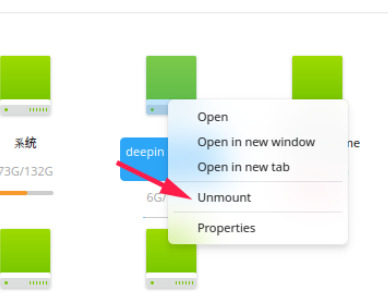
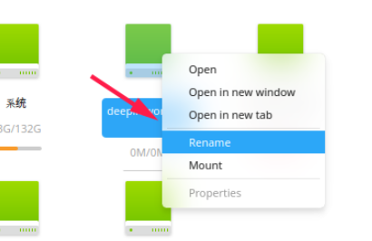
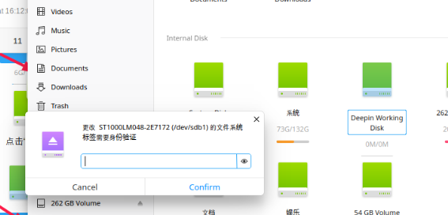
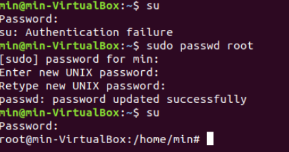

# 参考链接

[Deepin Linux 重命名挂载磁盘——简书@白帽札记  ](https://www.jianshu.com/p/6efd382094ec)

# 如何重命名磁盘名称

##  方法1 

1. 首先右键所需磁盘名称，找到“卸载/unmount”，先卸载了磁盘,这要注意是有软件安装在此磁盘中并已经打开，或者在此磁盘中的文件是否已经打开，需要先关闭所有软件和文件

2. 右键所需磁盘，点击“重命名/Rename”

3. 输入需要修改的磁盘名称，点击回车，会弹出需要输入管理员密码，点击“确认/comfirm”即可
   

##  方法2（未验证）

[Deepin Linux 重命名挂载磁盘——简书@白帽札记  ](https://www.jianshu.com/p/6efd382094ec)

1. 查看当前所有分区

`sudo fdisk -l`

2. 先卸载要修改名称的分区：

`sudo umount /dev/sda5`

3. 修改名称:

`sudo ntfslabel /dev/sda5 music`

注：ntfslabel会修改名称后自动重新加载，不用再执行mount命令

# 问题总结

## 使用su root代码时，出现authentication failure

su命令不能切换root，提示su: Authentication failure，只要你sudo passwd root过一次之后，下次再su的时候只要输入密码就可以成功登录了。

