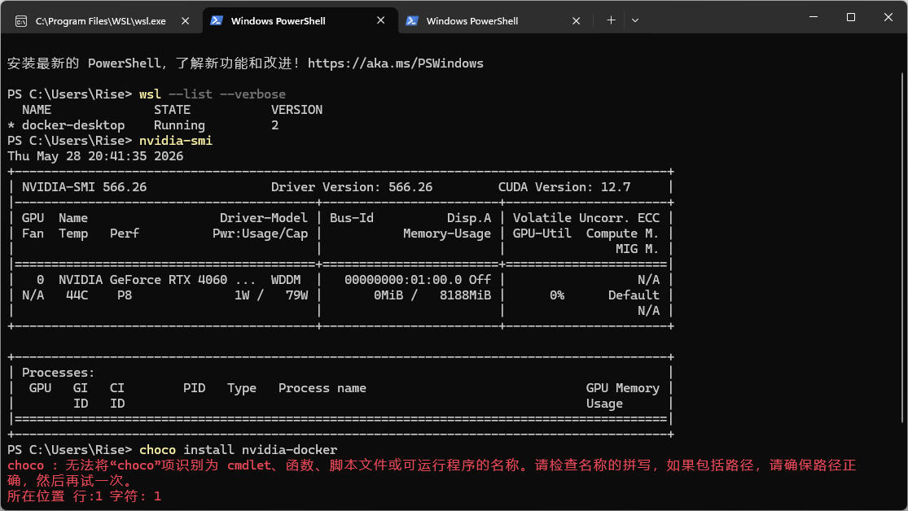
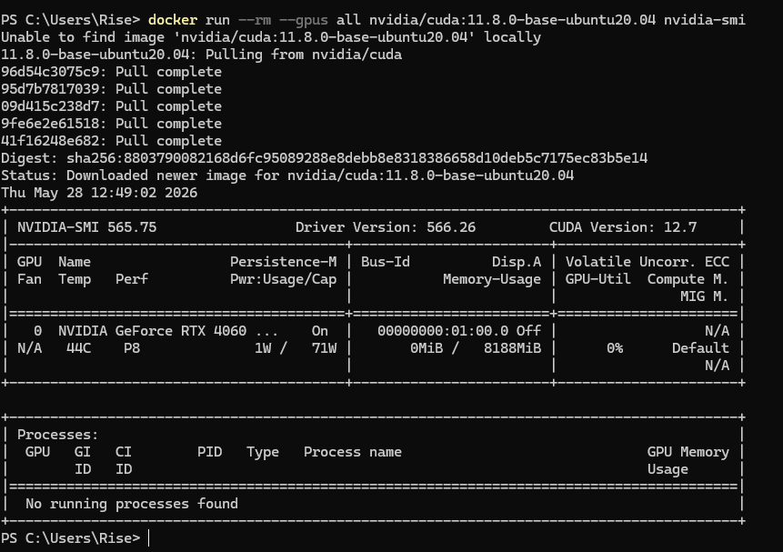

# 参考链接

[在 Win Docker Desktop 中配置以使用宿主机的 GPU 资源 —— CSDN@学亮编程手记](https://blog.csdn.net/a772304419/article/details/150641781)


# 前言

本示例以window平台的docker desktop为例，主要建设一个能本地运行的MCP server，用于codex或者其他AI 工具的逻辑推理支持。

# 测试nvidia驱动
使用以下命令，看看是否能正常显示驱动，正常情况下你有nvidia显卡，这个命令应该能正常显示

```bash
nvidia-smi
```




# 测试docker是否能正常使用nvidia驱动

如果能打印跟在宿主机中cmd一样的输出，说明docker能正常使用nvidia

```bash
docker run --rm --gpus all nvidia/cuda:11.8.0-base-ubuntu20.04 nvidia-smi
```

