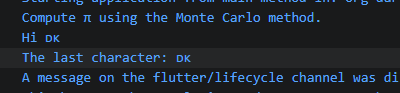

# 版本
除非另有说明，文档之所提及适用于 Dart 3.11.0 版本本页面最后更新时间：2025-12-16。
# 参考链接

[dart的基本类型——Dart](https://dart.cn/language/built-in-types)

# 基本类型

dart有如下的基本类型：
* Numbers (int, double)
* Strings (String)
* Booleans (bool)
* Records ((value1, value2))
* Functions (Function)
* Lists (List, also known as arrays)
* Sets (Set)
* Maps (Map)
* Runes (Runes; often replaced by the characters API)
* Symbols (Symbol)
* The value null (Null)

Object是所有类的超集

# String

字符串是编译时常量，任何赋值表达式都工作在编译时常量中的（编译时常量就是会将任何赋值由字符串转换成实际的类型，无论在代码表面是boolean、还是数字，在赋值时都是会当作字符串，然后转换成对应的基本类型）

```dart
// These work in a const string.表面上0和true，都是数字和布尔值，但是都当成字符串，并在赋值中转换成对应的基本类型
const aConstNum = 0;
const aConstBool = true;
const aConstString = 'a constant string';

// These do NOT work in a const string.而下面这种申明为var不是，数字和boolean依然是本身的类型，赋值给新的变量
var aNum = 0;
var aBool = true;
var aString = 'a string';
const aConstList = [1, 2, 3];

//下面这个也不是编译时常量，因为前面已经转换过类型了，所以赋值也是实际类型赋值
const validConstString = '$aConstNum $aConstBool $aConstString';
// const invalidConstString = '$aNum $aBool $aString $aConstList';

```

# boolean


dart中的布尔类型申明为'bool'，

```dart
bool b=true;
bool a=false;
```

# 特殊符号和字形集

dart的characters可以用处理特殊的符号和字形集

```dart
import 'package:characters/characters.dart';

var hi = 'Hi 🇩🇰';
void main() async {
  print('Compute π using the Monte Carlo method.');
  print(hi);
  // print('The end of the string: ${hi.substring(hi.length - 1)}');//会报错，报Bad UTF-8 encoding (U+FFFD; REPLACEMENT CHARACTER) found while decoding string: The end of the string: �


  print('The last character: ${hi.characters.last}');
}
```



# symbol

符号对象表示Dart程序中声明的操作符或标识符。你 可能永远不需要用符号，但它们确实如此无价之宝对于 请按名称引用标识符，因为最小化会改变标识符 名称，但不包括标识符号。

要获得标识符的符号，使用符号字面，后面跟着标识符：#

```dart
#radix
#bar
```