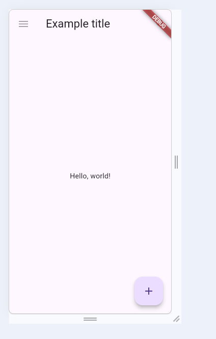
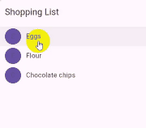

# 参考链接

# 一个基本运行代码

flutter是以widget作为基本显示单位的，所有的widget都是继承于`StatelessWidget`和`StatefulWidget`

```dart
import 'package:flutter/material.dart';

void main() {
  //main是dart的运行入口，但是runApp方法是flutter的运行入口，一个APP启动点
  runApp(
    //runApp接受一个Widget的参数
    const Center(
      child: Text(
        'Hello, world!',
        textDirection: TextDirection.ltr,
        style: TextStyle(color: Colors.blue),
      ),
    ),
  );
}
```

# material design

需要先在`pubspec.yaml`文件中加入

```dart
flutter:
  uses-material-design: true
```

就可以导入`material.dart`包了，但是runApp必须是`MaterialApp`这个Widget作为起点入口
```dart
import 'package:flutter/material.dart';

void main() {
  runApp(const MaterialApp(title: 'Flutter Tutorial', home: TutorialHome()));
}

class TutorialHome extends StatelessWidget {
  const TutorialHome({super.key});

  @override
  Widget build(BuildContext context) {
    // Scaffold is a layout for
    // the major Material Components.
    return Scaffold(
      appBar: AppBar(
        leading: const IconButton(
          icon: Icon(Icons.menu),
          tooltip: 'Navigation menu',
          onPressed: null,
        ),
        title: const Text('Example title'),
        actions: const [
          IconButton(
            icon: Icon(Icons.search),
            tooltip: 'Search',
            onPressed: null,
          ),
        ],
      ),
      // body is the majority of the screen.
      body: const Center(child: Text('Hello, world!')),
      floatingActionButton: const FloatingActionButton(
        tooltip: 'Add', // used by assistive technologies
        onPressed: null,
        child: Icon(Icons.add),
      ),
    );
  }
}
```


# 手势操作

手势操作用的是`GestureDetector`，它虽然没有实际的界面，但是可以却可以发现用户的操作手势。当用户轻点`Container`时，`GestureDetector`会会调用`onTap`回调方法。利用`GestureDetector`可以监听用户的点击、输入、拖拽和缩放。
```dart
import 'package:flutter/material.dart';

class MyButton extends StatelessWidget {
  const MyButton({super.key});

  @override
  Widget build(BuildContext context) {
    return GestureDetector(
      onTap: () {
        print('MyButton was tapped!');
      },
      child: Container(
        height: 50,
        padding: const EdgeInsets.all(8),
        margin: const EdgeInsets.symmetric(horizontal: 8),
        decoration: BoxDecoration(
          borderRadius: BorderRadius.circular(5),
          color: Colors.lightGreen[500],
        ),
        child: const Center(child: Text('Engage')),
      ),
    );
  }
}

void main() {
  runApp(
    const MaterialApp(
      home: Scaffold(body: Center(child: MyButton())),
    ),
  );
}

```

# 有状态widget

React也有相关的状态，和这个也有些类似，不过React是直接让变量绑定setState方法，一旦变量发生变化，UI也渲染也会重构。不过flutter的似乎简化了UI生命周期

Widget需要在构造函数中用const修饰，用来防止父级UI rebuild时，复用而造成的内存开销，除非是动态资源。通常来说如果是静态widget，那原则上必须使用const修饰，像`const SizedBox(width: 16)`

Counter.createState()重写了父类方法，并接收一个State返回类型，方法会被多次调用，

_CounterState继承了State类，可以在build里面调用父类setState并传入一个回调函数，回调函数可以用来更新自己设定的动态变量，setState最后会调用`_element!.markNeedsBuild();`来重构UI。

```dart
import 'package:flutter/material.dart';


void main() {
  runApp(
    const MaterialApp(
      home: Scaffold(body: Center(child: Counter())),
    ),
  );
}


class Counter extends StatefulWidget {
  // This class is the configuration for the state.
  // It holds the values (in this case nothing) provided
  // by the parent and used by the build  method of the
  // State. Fields in a Widget subclass are always marked
  // "final".

  const Counter({super.key});

  @override
  State<Counter> createState() => _CounterState();
}

class _CounterState extends State<Counter> {
  int _counter = 0;

  @override
  Widget build(BuildContext context) {
    // This method is rerun every time setState is called,
    // for instance, as done by the _increment method above.
    // The Flutter framework has been optimized to make
    // rerunning build methods fast, so that you can just
    // rebuild anything that needs updating rather than
    // having to individually changes instances of widgets.
    return Row(
      mainAxisAlignment: MainAxisAlignment.center,
      children: <Widget>[
        ElevatedButton(
            onPressed: () => {
                  setState(() {
                    // This call to setState tells the Flutter framework
                    // that something has changed in this State, which
                    // causes it to rerun the build method below so that
                    // the display can reflect the updated values. If you
                    // change _counter without calling setState(), then
                    // the build method won't be called again, and so
                    // nothing would appear to happen.
                    _counter++;
                  })
                },
            child: const Text('Increment')),
        const SizedBox(width: 16),
        Text('Count: $_counter'),
      ],
    );
  }
}

```


另外一个可以将ElevatedButton的内容，再作一层封装。这个例子，我倒是看懂一些，**只要保证每次widget的实例构建后不作任何更改就可以使用`StatelessWidget`构造，否则必须使用`StatefulWidget`**，你也能灵活使用StatelessWidget来构建动态UI。应该怎么理解这句话呢，虽然`CounterDisplay`这个widget中的count变量是动态的，但是实际上count是外部传入的，内部UIrebuild每次都构建一个新widget实例，每个widget实例都const。

至于每次动态刷新，flutter如何减少内存的消耗，得再看看原理。

```dart
import 'package:flutter/material.dart';

class CounterDisplay extends StatelessWidget {
  const CounterDisplay({required this.count, super.key});

  final int count;

  @override
  Widget build(BuildContext context) {
    return Text('Count: $count');
  }
}

class CounterIncrementor extends StatelessWidget {
  const CounterIncrementor({required this.onPressed, super.key});

  final VoidCallback onPressed;

  @override
  Widget build(BuildContext context) {
    return ElevatedButton(onPressed: onPressed, child: const Text('Increment'));
  }
}

class Counter extends StatefulWidget {
  const Counter({super.key});

  @override
  State<Counter> createState() => _CounterState();
}

class _CounterState extends State<Counter> {
  int _counter = 0;

  void _increment() {
    setState(() {
      ++_counter;
    });
  }

  @override
  Widget build(BuildContext context) {
    return Row(
      mainAxisAlignment: MainAxisAlignment.center,
      children: <Widget>[
        CounterIncrementor(onPressed: _increment),
        const SizedBox(width: 16),
        CounterDisplay(count: _counter),
      ],
    );
  }
}

void main() {
  runApp(
    const MaterialApp(
      home: Scaffold(body: Center(child: Counter())),
    ),
  );
}
```

# 示例用于参考
```dart
import 'package:flutter/material.dart';

class Product {
  const Product({required this.name});

  final String name;
}

typedef CartChangedCallback = void Function(Product product, bool inCart);

class ShoppingListItem extends StatelessWidget {
  ShoppingListItem({
    required this.product,
    required this.inCart,
    required this.onCartChanged,
  }) : super(key: ObjectKey(product));

  final Product product;
  final bool inCart;
  final CartChangedCallback onCartChanged;

  Color _getColor(BuildContext context) {
    // The theme depends on the BuildContext because different
    // parts of the tree can have different themes.
    // The BuildContext indicates where the build is
    // taking place and therefore which theme to use.

    return inCart //
        ? Colors.black54
        : Theme.of(context).primaryColor;
  }

  TextStyle? _getTextStyle(BuildContext context) {
    if (!inCart) return null;

    return const TextStyle(
      color: Colors.black54,
      decoration: TextDecoration.lineThrough,
    );
  }

  @override
  Widget build(BuildContext context) {
    return ListTile(
      onTap: () {
        onCartChanged(product, inCart);
      },
      leading: CircleAvatar(
        backgroundColor: _getColor(context),
        child: Text(product.name[0]),
      ),
      title: Text(product.name, style: _getTextStyle(context)),
    );
  }
}

class ShoppingList extends StatefulWidget {
  const ShoppingList({required this.products, super.key});

  final List<Product> products;

  // The framework calls createState the first time
  // a widget appears at a given location in the tree.
  // If the parent rebuilds and uses the same type of
  // widget (with the same key), the framework re-uses
  // the State object instead of creating a new State object.

  @override
  State<ShoppingList> createState() => _ShoppingListState();
}

class _ShoppingListState extends State<ShoppingList> {
  final _shoppingCart = <Product>{};

  void _handleCartChanged(Product product, bool inCart) {
    setState(() {
      // When a user changes what's in the cart, you need
      // to change _shoppingCart inside a setState call to
      // trigger a rebuild.
      // The framework then calls build, below,
      // which updates the visual appearance of the app.

      if (!inCart) {
        _shoppingCart.add(product);
      } else {
        _shoppingCart.remove(product);
      }
    });
  }

  @override
  Widget build(BuildContext context) {
    return Scaffold(
      appBar: AppBar(title: const Text('Shopping List')),
      body: ListView(
        padding: const EdgeInsets.symmetric(vertical: 8),
        children: widget.products.map((product) {
          return ShoppingListItem(
            product: product,
            inCart: _shoppingCart.contains(product),
            onCartChanged: _handleCartChanged,
          );
        }).toList(),
      ),
    );
  }
}

void main() {
  runApp(
    const MaterialApp(
      title: 'Shopping App',
      home: ShoppingList(
        products: [
          Product(name: 'Eggs'),
          Product(name: 'Flour'),
          Product(name: 'Chocolate chips'),
        ],
      ),
    ),
  );
}
```


# 响应生命周期变化的事件

通常来说应用要有针对应用启动、运行、销毁（退出）这些事件监听和处理，比如重写`State.initState`，每次widget的状态初始化都会调用这个方法，重写后可以用于初始化自己自定义的变量。widget销毁，可以重写`dispose`，可以用于为服务取消时间计数器，但是重写后记得在方法末尾加上`super.dispose`，因为父类也有针对widget销毁的基础实现。

# keys

每个Widget的一个`key`的变量，用于区分每个widget实例的区别，就像屏幕中list 列表，列表中item在滚动消失在屏幕中时，其实经历了widget实例上一个和下一个实例的比较

# Global Keys

就像widget tree中`Row`下包含了Text和button两个实例，Text和button各有自己`key`，那Row的`key`相对Text和button就是他们的Global key，可以用于区分他们在同一个widget包围下，也可以用于关于一个child widget和另外一个child widget。