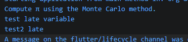
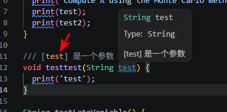
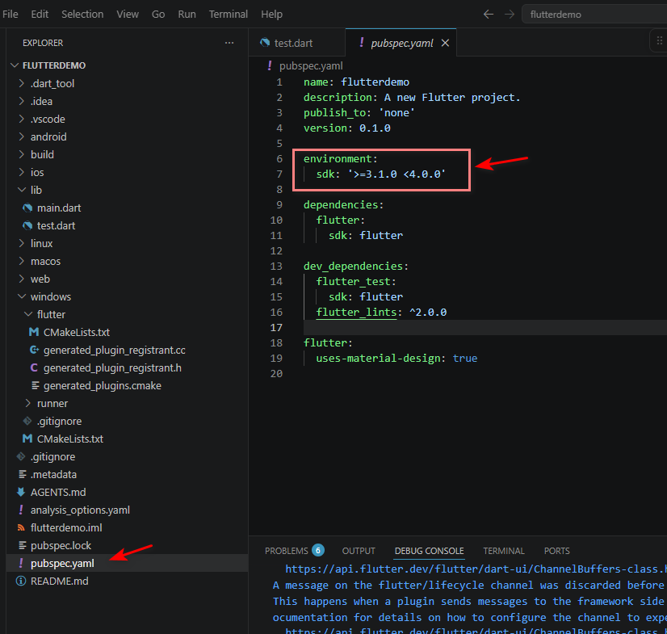

# 版本

除非另有说明，文档之所提及适用于 Dart 3.11.0 版本本页面最后更新时间：2025-12-16。

# 参考链接

[dart语言overview——Dart](https://dart.cn/overview)

# dart介绍

dart语言设计主在打破技术壁垒，将dart语言与flutter结合，实现跨平台开发。Dart 也是 Flutter 的基础。 Dart 作为 Flutter 应用程序的编程语言，为驱动应用运行提供了环境，同时 Dart 还支持许多核心的开发任务，例如格式化，分析和代码测试。

现代高级语言语法大同小异，学过JAVA等高级语言的，应该不难上手。

# dart语言的基本特点

* Dart 语言是类型安全的，它使用静态类型检查来确保变量的值 始终 与变量的静态类型相匹配。
* Dart 内置了 健全的空值安全，这意味着只有你声明值可以为空的情况下，值才可以为空；

# 丰富的依赖库
> Dart 拥有 丰富的核心库，为许多日常编程任务提供了必要工具：

> *  为每个 Dart 程序提供的内置类型，集合与其他核心功能 (`dart:core`)
>
> *  更丰富的集合类型，诸如队列、链接列表、哈希图和二叉树 (`dart:collection`)
> 
> *  用于在不同的数据表示形式之间进行转换编码器和解码器，包括 JSON 和 UTF-8 > (`dart:convert`)
> 
> *  数学常数和函数，以及随机数生成 (`dart:math`)
> 
> *  异步编程支持，比如 Future 和 Stream 类 (`dart:async`)
> 
> *  能够有效处理固定大小的数据（例如，无符号的 8 字节整数）和 SIMD 数字类型的列表 > (`dart:typed_data`)
> 
> *  为非 Web 应用程序提供的文件、套接字、HTTP 和其他 I/O 支持 (`dart:io`)
> 
> *  用于提供 C 语言风格代码互通性支持的外部函数接口 (`dart:ffi`)
> 
> *  使用 isolates 的并发编程 — 这些独立的工作程序与线程相似但它们不共享内存并仅通过消息进行通信 (`dart:isolate`)
> 
> *  基于 Web 的应用程序中需要与浏览器和文档对象模型 (DOM) 交互的 HTML 元素和其他资源 (`dart:js_interop` and `package:web`)


> 除核心库外，Dart 还通过一整套软件包提供了许多 API。 Dart 团队发布了许多有用的补充包，例如：
> 
> * characters (字符)
>  
> * intl (国际化)
>  
> * http (http 请求)
>  
> * crypto (哈希加密)
> 
> * markdown
> 
> 此外，第三方发布者和更广泛的社区也发布了上千个软件包，支持诸如此类功能：
> 
> * XML
> 
> * Windows integration (Windows API 调用)
> 
> * SQLite
> 
> * compression (压缩)


# 变量

## 空安全

dart在很多地方都JS很像，JS有个致使的缺点，在空值安全问题上是简直灾难，dart显然借鉴的同时，改进了问题

dart在空值安全上引入三个关键更改：

* dart在默认情况下都不允许变量空值的，但是允许你在变量类型上添加问号来表示这个变量允许空值

```dart
String? name  // Nullable type. Can be `null` or string.

String name   // Non-nullable type. Cannot be `null` but can be string.

```
* 因为Dart默认不允许空值，所以在初始化时必须赋初始值，有问号的变量则不需要，因为默认是空值

* 空值变量在空值情况，不能调用类型中的方法，如`toString`，`hashcode`，这和其他语言一样

## 断言assert

```dart
int? lineCount;
assert(lineCount == null);
```
当你在生产环境中运行代码时，assert() 调用会被忽略。另外在开发过程中，assert(condition) 如果其 条件 为 false，会抛出一个异常。

## 延迟初始化变量

在其他语言中，我更喜欢称之为懒加载，与问号变量一样，不需要初始化，但是**如果你没有初始化一个 late 变量，那么当变量被使用时会发生运行时错误。**

```dart
late String description;

void main() {
  description = 'Feijoada!';
  print(description);
}

```

如果懒加载变量在申明时，便指定初始化的方法或者值，但是在申明变量是不会被初始化的，只有调用到这个变量才会初始化

```dart
late String test = testLateVariable();

late String test2 = "test2 late";

void main() async {
  print('Compute π using the Monte Carlo method.');
  print(test);
  print(test2);
}

String testLateVariable() {
  return "test late variable";
}
```
按打印顺序就可以看到test、test2变量是调用到时才会初始化，无论你是引用一个方法，还是一个字符值。


## 常量和final

基本用法和其他语言相似，但是final 对象不能被修改，但它的字段可能可以被更改。相比之下，const 对象及其字段不能被更改：它们是 不可变的。

```dart
final person=new Person();
person=new People();//bad

person.name="John";//right，如果初始化的值是类，那么更改类是不行，但是类里面的值是可以，只要类里面值不是常量或者final修饰

const person=new Person();
person=new People();//bad
person.name="John"//bad

```

## 通配符变量

`_`实际是一个占位符，再顶级或者类成员作用域是无法使用通配符变量，只有块级或者方法局部作用域，才能使用，并且同一作用域内多个`_`的申明并不会冲突

```dart
//块级作用域，或者方法作用域内
main() {
  var _ = 1;
  int _ = 2;
}

//for循环
for (var _ in list) {}

//catch子句
try {
  throw '!';
} catch (_) {
  print('oops');
}

//泛型和函数类型参数
class T<_> {}
void genericFunction<_>() {}

takeGenericCallback(<_>() => true);

//函数参数
Foo(_, this._, super._, void _()) {}

list.where((_) => true);

void f(void g(int _, bool _)) {}

typedef T = void Function(String _, String _);

```

# 操作符

## 所有操作符

|Description	|Operator	|Associativity|
|--|--|--|
|unary postfix	|`expr ++`    `expr --`    `()`    `[]`    `?[]`    `.`    `?.`    `!`	|None|
|unary prefix	|`- expr` `! expr` `~ expr` `++ expr` `-- expr`  `await expr`	|None|
|multiplicative	|`*`    `/`    `%`  `~/`	|Left|
|additive	|`+`    `-`	|Left|
|shift	|`<<`    `>>`    `>>>`	|Left|
|bitwise AND	|`&`	|Left|
|bitwise XOR	|`^`	|Left|
|bitwise OR	|`\|`	|Left|
|relational and type test	|`>=`    `>`    `<=`    `<`    `as`    `is`   `is!`	|None|
|equality	|`==`    `!=`	|None|
|logical AND	|`&&`	|Left|
|logical OR	|`\|\|`	|Left|
|if-null	|`??`	|Left|
|conditional	|`expr1 ? expr2 : expr3`	|Right|
|cascade	|`..`    `?..`	|Left|
|assignment	|`=`    `*=`    `/=`    `+=`    `-=`    `&=`    `^=` （不只表格内赋值符号）	|Right|
|spread (See note)	|`...`    `...?`	|None|


## 优先级

下面两种写法都是一样的，因为%和==的优先级都比&&要高，但是一般推荐，还是用上面的一种，因为我觉得优先级这个作为程序员容易忘，而且代码的易读性会提高
```dart
// Parentheses improve readability.
if ((n % i == 0) && (d % i == 0)) {
  // ...
}

// Harder to read, but equivalent.
if (n % i == 0 && d % i == 0) {
  // ...
}
```


## 运算符

```dart
assert(2 + 3 == 5);
assert(2 - 3 == -1);
assert(2 * 3 == 6);
assert(5 / 2 == 2.5); // Result is a double
assert(5 ~/ 2 == 2); // Result is an int
assert(5 % 2 == 1); // Remainder

assert('5/2 = ${5 ~/ 2} r ${5 % 2}' == '5/2 = 2 r 1');

```

## 赋值

```dart
int a;
int b;

a = 0;
b = ++a; // Increment a before b gets its value.
assert(a == b); // 1 == 1

a = 0;
b = a++; // Increment a after b gets its value.
assert(a != b); // 1 != 0

a = 0;
b = --a; // Decrement a before b gets its value.
assert(a == b); // -1 == -1

a = 0;
b = a--; // Decrement a after b gets its value.
assert(a != b); // -1 != 0

```

## 比较

```dart
assert(2 == 2);
assert(2 != 3);
assert(3 > 2);
assert(2 < 3);
assert(3 >= 3);
assert(2 <= 3);

```

## 测试结果

```dart
//强制转换结果
(employee as Person).firstName = 'Bob';

//判断类型
if (employee is Person) {
  // Type check
  employee.firstName = 'Bob';
}

```
## `?.`和`??=`以及 `?[]`

?.表示，如果变量为空，则取右边的值，这个EMCS6的语法是一致的

??=也是类似，如果左边的对象是空的，则将右边的赋值，否则不赋值

?[]通过是数组和列表，比如判断personList是否为空，如果不空才取出指定数值，`person=personList?[0]`表示如果personList不为空则取出第一个元素并赋值
## 条件操作符

??表示name是空的，则return 'Guest'
```dart
String playerName(String? name) => name ?? 'Guest';
```

## 级联符号

`..`允许创建实例后，可以直接往里面的成员变量，直接地赋值，有点语法糖的意思，没有特别作用只是简化写法

```dart
var paint = Paint()
  ..color = Colors.black
  ..strokeCap = StrokeCap.round
  ..strokeWidth = 5.0;

//不要被上面的换行迷惑了，实际上就是一行代码，不过，上面易读性更高
var paint = Paint()..color = Colors.black..strokeCap = StrokeCap.round..strokeWidth = 5.0;


//上面的写法相当于下面的

var paint = Paint();
paint.color = Colors.black;
paint.strokeCap = StrokeCap.round;
paint.strokeWidth = 5.0;

```


如果想在`..`的基础上，再加上对是否空值的判断，那么可以在前面加问号，那么它就是新的条件赋值符


```dart
//object?..variableName = 'value' 意思是如果object为空，才对成员变量“variableName”进行赋值，如果object不为空，那么“variableName”就不会赋值
document.querySelector('#confirm') // Get an object.
  ?..textContent =
      'Confirm' // Use its members.
  ..classList.add('important')
  ..onClick.listen((e) => window.alert('Confirmed!'))
  ..scrollIntoView();


//也可以采用下面的写法

final button = document.querySelector('#confirm');
button?.textContent = 'Confirm';
button?.classList.add('important');
button?.onClick.listen((e) => window.alert('Confirmed!'));
button?.scrollIntoView();


//更多的写法

final addressBook =
    (AddressBookBuilder()
          ..name = 'jenny'
          ..email = 'jenny@example.com'
          ..phone =
              (PhoneNumberBuilder()
                    ..number = '415-555-0100'
                    ..label = 'home')
                  .build())
        .build();

```


要注意，方法的返回必须是object，不能是void
```dart
var sb = StringBuffer();
sb.write('foo')
  ..write('bar'); // Error: method 'write' isn't defined for 'void'.

```

# 注释

## 多行注释

其他注释不讲了，跟其他语言一样，但是有个`///`有些特别，跟`/**`这样的文档注释是一样，可以在注释里面引用变量、方法、顶层变量、函数参数



# 版本控制 

dart设计了可以用于避免编译版本冲突的问题，可以指定本项目用的编译版本，比如2.18之后的版本才允许你使用空值安全，所以避免后续的版本编译冲突问题，可以指定版本


dart允许在dart文件中，预加载版本选择，但是必须写在所有代码之前，而且是写在注释中的

```dart
// Description of what's in this file.
// @dart = 2.17
import 'dart:math';
...
```