# 参考链接
[布局——Flutter官方文档](https://docs.flutter.cn/ui/layout)

[自适应&响应式布局——Flutter官方文档](https://docs.flutter.cn/ui/adaptive-responsive/general)

# 布局结构

在下面的示例中，下面截图显示三个带标签的图标
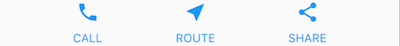

下面这张截图包括行和列的可视化布局。这张图中，debugPaintSizeEnabled 被设置为 true，因此可以看到可视化布局。
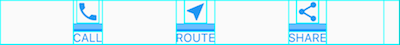

以下是上方示例的 widget 树示意图：

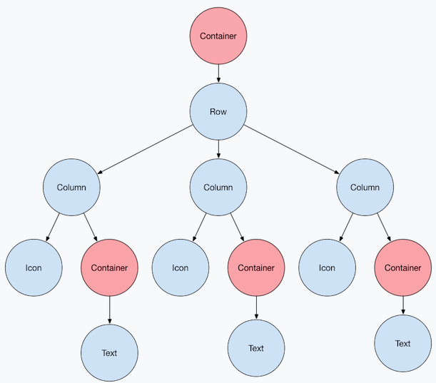

# 横向纵向排列

Row 和 Column布局示例很像React中ant design，只不过flutter中的Row 和 Column适用于不一样的主题

* Row 和 Column 是两种最常用的布局模式。

* Row 和 Column 每个都有一个子 widget 列表。

* 一个子 widget 本身可以是 Row、Column 或其他复杂 widget。

* 可以指定 Row 或 Column 如何在垂直和水平方向上对齐其子项。

* 可以拉伸或限制特定的子 widget。

* 可以指定子 widget 如何占用 Row 或 Column 的可用空间。


布局设计示例：

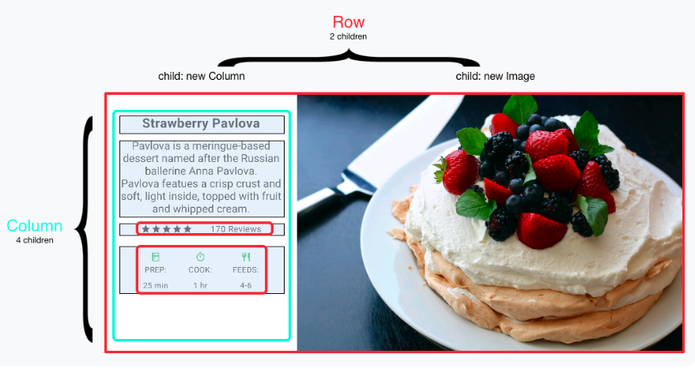

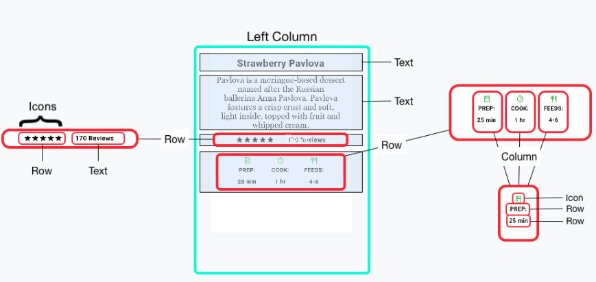

flutter也有更多关于排列而已的替代方案：[ListTitle](https://api.flutter-io.cn/flutter/material/ListTile-class.html?_gl=1*105a6hg*_ga*Njk2Mjg1NzE0LjE3NzUxODMxMjQ.*_ga_HPSFTRXK91*czE3NzY3NjYxODIkbzIwJGcxJHQxNzc2NzY2ODQwJGozMCRsMCRoMA..)和[ListView](https://api.flutter-io.cn/flutter/widgets/ListView-class.html?_gl=1*1vepz3v*_ga*Njk2Mjg1NzE0LjE3NzUxODMxMjQ.*_ga_HPSFTRXK91*czE3NzY3NjYxODIkbzIwJGcxJHQxNzc2NzY2ODQwJGozMCRsMCRoMA..)

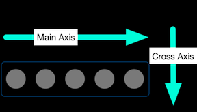    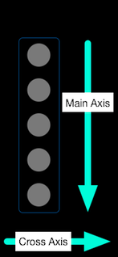

## MainAxisAlignment

`MainAxisAlignment`是用于横向纵向两种排列布局的类(依赖于不一样的widget，通常是作为一些widget的参数)，有多个不场景的参数。下面一些例子，我主要为横向的布局提供示例，纵向只提供一个示例，因为逻辑原理一样。

### MainAxisAlignment.spaceEvenly

`MainAxisAlignment.spaceEvenly`是轴心居中，但是均匀占用空间
```dart
import 'package:flutter/material.dart';

void main() {
  runApp(MaterialApp(
    title: 'Shopping List',
    home: Scaffold(
      appBar: AppBar(title: Text('Shopping List')),
      body: Row(
        mainAxisAlignment: MainAxisAlignment.spaceEvenly,
        children: [
          Image.asset('assets/imgs/pic1.png'),
          Image.asset('assets/imgs/pic2.png'),
          Image.asset('assets/imgs/pic3.png'),
        ],
      ),
    ),
  ));
}
```
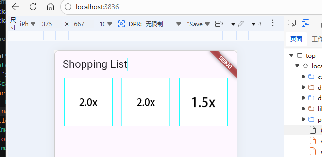

下面是纵向的布局，逻辑原理跟横向是相同的
```dart
import 'package:flutter/material.dart';
import 'package:flutter/rendering.dart';

void main() {
  debugPaintSizeEnabled = true;
  runApp(MaterialApp(
    title: 'Shopping List',
    home: Scaffold(
      appBar: AppBar(title: Text('Shopping List')),
      body: Column(
        mainAxisAlignment: MainAxisAlignment.spaceEvenly,
        children: [
          Image.asset('assets/imgs/pic1.png', bundle: null),
          const Image(image: AssetImage('assets/imgs/pic2.png')),
          Image.asset('assets/imgs/pic3.png')
        ],
      ),
    ),
  ));
}
```
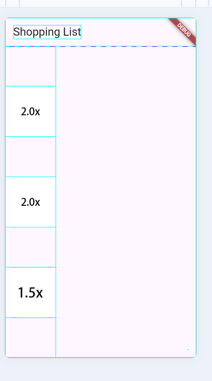


## MainAxisAlignment.center

`MainAxisAlignment.center`仅是轴心居中，左右会自动分配一样的剩余空间
```dart
import 'package:flutter/material.dart';
import 'package:flutter/rendering.dart';

void main() {
  debugPaintSizeEnabled = true;
  runApp(MaterialApp(
    title: 'Shopping List',
    home: Scaffold(
      appBar: AppBar(title: Text('Shopping List')),
      body: Row(
        mainAxisAlignment: MainAxisAlignment.center,
        children: [
          Image.asset('assets/imgs/pic1.png', bundle: null),
          const Image(image: AssetImage('assets/imgs/pic2.png')),
          Image.asset('assets/imgs/pic3.png')
        ],
      ),
    ),
  ));
}
```

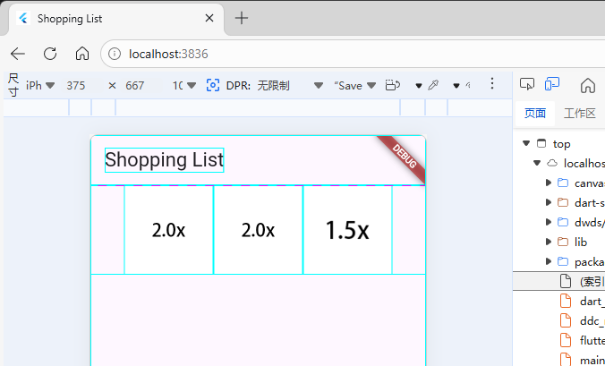

## MainAxisAlignment.start

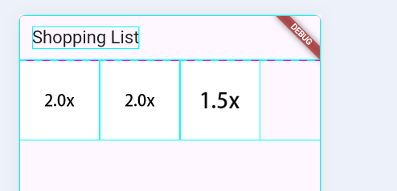

## MainAxisAlignment.end

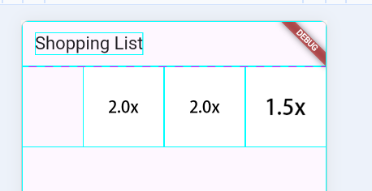

## MainAxisAlignment.spaceAround
`MainAxisAlignment.spaceAround`轴心居中，并会使得元素之间的间隔变大，但是左右剩余空间会变小。下面是两种不同的分辨率
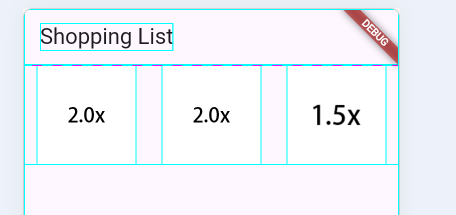

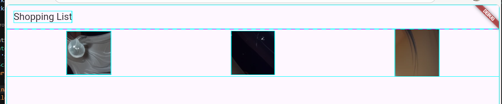

## MainAxisAlignment.spaceBetween

`MainAxisAlignment.spaceBetween`轴心居中，左右不保留空间，间隔平均分配。下面是两种不一样的分辨率
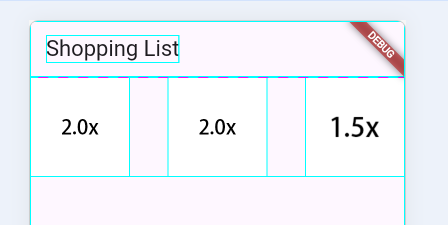
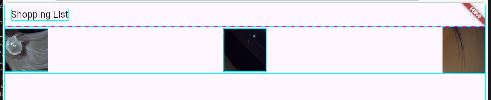

## CrossAxisAlignment.start

当你为Row配置`MainAxisAlignment.spaceEvenly`时，其实默认能配置了`CrossAxisAlignment.center`，这是一个默认值，你即使不明确设置一样为会在设置。

当我们同时设置`CrossAxisAlignment.start`，会发生什么变化呢，官方对这个参数解释是：`将子元素放置为起始边与横轴的起始边对齐`

**其实我也现在才发现，行高是以图片最大的那个设置**

```dart
import 'package:flutter/material.dart';
import 'package:flutter/rendering.dart';

void main() {
  debugPaintSizeEnabled = true;
  runApp(MaterialApp(
    title: 'Shopping List',
    home: Scaffold(
      appBar: AppBar(title: Text('Shopping List')),
      body: Row(
        mainAxisAlignment: MainAxisAlignment.spaceEvenly,
        crossAxisAlignment: CrossAxisAlignment.start,
        children: [
          Image.asset('assets/imgs/pic1.png', bundle: null),
          const Image(image: AssetImage('assets/imgs/pic2.png')),
          Image.asset('assets/imgs/pic3.png')
        ],
      ),
    ),
  ));
}

```
前面的示例其实我没有说过，但是实际上我的图片大小是不一样，只是因为不太容易看出来，现在设置`CrossAxisAlignment.start`，代表横向布局中，元素是紧贴上边缘的，大小不一样会很明显
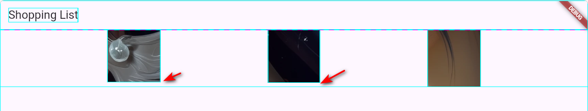


## CrossAxisAlignment.end

与`CrossAxisAlignment.start`相反的`CrossAxisAlignment.end`，代表横向布局中，元素是紧贴下边缘的

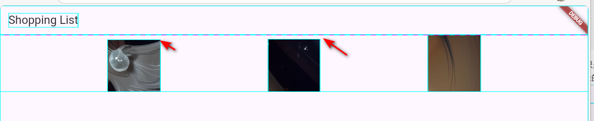

## Row 不支持CrossAxisAlignment.baseline

`CrossAxisAlignment.baseline`似乎用于，横向布局中文本的水本对齐，但是在ROW中如果指定了这个参数，会报错

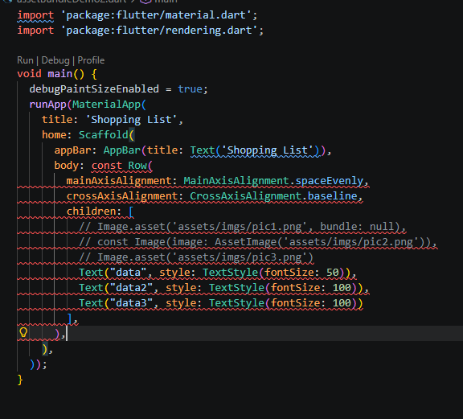

## CrossAxisAlignment.stretch

这个参数还没有看出来什么用途，注释是这样解释的`这会导致传递给子元素的约束在横轴上变得紧密`
```dart
import 'package:flutter/material.dart';
import 'package:flutter/rendering.dart';

void main() {
  debugPaintSizeEnabled = true;
  runApp(MaterialApp(
    title: 'Shopping List',
    home: Scaffold(
      appBar: AppBar(title: Text('Shopping List')),
      body: Row(
        // mainAxisAlignment: MainAxisAlignment.spaceEvenly,
        crossAxisAlignment: CrossAxisAlignment.stretch,
        children: [
          Image.asset('assets/imgs/pic1.png', bundle: null),
          const Image(image: AssetImage('assets/imgs/pic2.png')),
          Image.asset('assets/imgs/pic3.png')
        ],
      ),
    ),
  ));
}

```
图中黄白交叉的内容，是表示内容已经超出右侧屏幕。而且已经超出1458px
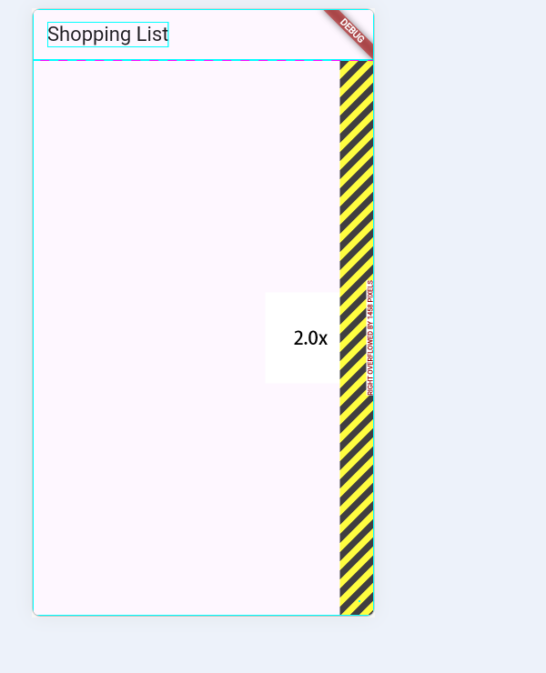

# 调整widget的大小

当图片大小太时，会明显超出屏幕，可以`Expanded`类来灵活调节，下面你可以看看下面两个分辨率下的布局，在大的分辨率中，会使图片使用更大宽高，或者变成原始图片的宽高。
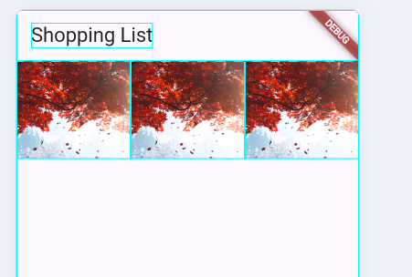

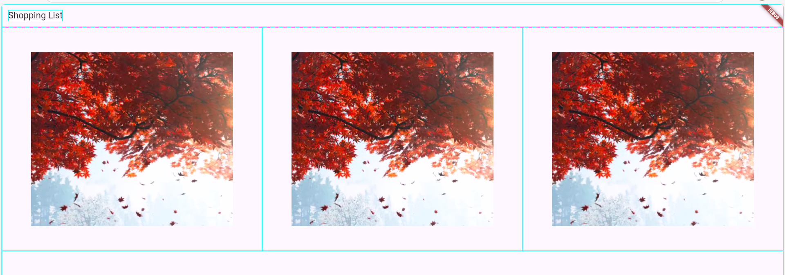

也许你想要一个 widget 占用的空间是兄弟项的两倍。为了达到这个效果，可以使用 `Expanded` widget 的 flex 属性，这是一个用来确定 widget 的弹性系数的整数。默认的弹性系数为 1，以下代码将中间图像的弹性系数设置为 2：
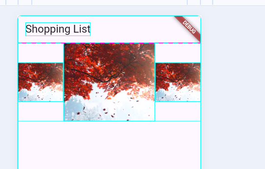
感觉加一个动画就能变成画廊了

## MainAxisSize.min
默认情况下，行或列沿其主轴会占用尽可能多的空间，但如果要将子项紧密组合在一起，请将其 `mainAxisSize` 设置为 `MainAxisSize.min`。以下示例使用此属性将星形图标组合在一起
```dart
import 'package:flutter/material.dart';
import 'package:flutter/rendering.dart';

void main() {
  final stars = Row(
    mainAxisSize: MainAxisSize.min,
    children: [
      Icon(Icons.star, color: Colors.green[500]),
      Icon(Icons.star, color: Colors.green[500]),
      Icon(Icons.star, color: Colors.green[500]),
      const Icon(Icons.star, color: Colors.black),
      const Icon(Icons.star, color: Colors.black),
    ],
  );

  final ratings = Container(
    padding: const EdgeInsets.all(20),
    child: Row(
      mainAxisAlignment: MainAxisAlignment.spaceEvenly,
      children: [
        stars,
        const Text(
          '170 Reviews',
          style: TextStyle(
            color: Colors.black,
            fontWeight: FontWeight.w800,
            fontFamily: 'Roboto',
            letterSpacing: 0.5,
            fontSize: 20,
          ),
        ),
      ],
    ),
  );

  debugPaintSizeEnabled = true;
  runApp(MaterialApp(
    title: 'Shopping List',
    home: Scaffold(
      appBar: AppBar(title: Text('Shopping List')),
      body: Row(
        mainAxisAlignment: MainAxisAlignment.spaceEvenly,
        crossAxisAlignment: CrossAxisAlignment.center,
        children: [ratings],
      ),
    ),
  ));
}

```

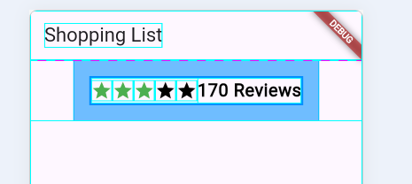


# 通用布局

flutter提供的widget分为widget库中标准Widget、Material库和Cupertino库（IOS UI），标准Widget是通用的，但是Material库和Cupertino库中的Widget只能应用在自己的主题中。

## Material Widget

`Scaffold`: 提供结构化的布局框架，为常用的 Material Design 应用元素提供插槽。

`AppBar`: 创建一个显示在屏幕顶部的横条。

`Card`: 将相关信息整理到一个有圆角和阴影的盒子中。

`ListTile`: 将最多三行的文本、可选的导语以及后面的图标组织在一行中。

## Cupertino Widget

`CupertinoPageScaffold` :Provides the basic layout structure for an iOS-style page.

`CupertinoNavigationBar` :Creates an iOS-style navigation bar at the top of the screen.

`CupertinoSegmentedControl` :Creates a segmented control for selecting.

`CupertinoTabBar` and `CupertinoTabScaffold` :Creates the characteristic iOS bottom tab bar.

## 标准widget

`Container`：向 widget 增加`padding`、`margins`、`borders`、`background color` 或者其他的“装饰”。

`GridView`:将 widget 展示为一个可滚动的网格。

`ListView`:将 widget 展示为一个可滚动的列表。

`Stack`:将 widget 覆盖在另一个的上面。

## Container

```dart
Widget _buildImageColumn() {
  return Container(
    decoration: const BoxDecoration(color: Colors.black26),
    child: Column(children: [_buildImageRow(1), _buildImageRow(3)]),
  );
}
Widget _buildDecoratedImage(int imageIndex) => Expanded(
  child: Container(
    decoration: BoxDecoration(
      border: Border.all(width: 10, color: Colors.black38),
      borderRadius: const BorderRadius.all(Radius.circular(8)),
    ),
    margin: const EdgeInsets.all(4),
    child: Image.asset('images/pic$imageIndex.jpg'),
  ),
);

Widget _buildImageRow(int imageIndex) => Row(
  children: [
    _buildDecoratedImage(imageIndex),
    _buildDecoratedImage(imageIndex + 1),
  ],
);

```
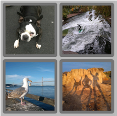


## GridView

* 在网格中使用 widget

* 当列的内容超出渲染容器的时候，它会自动支持滚动。

* 创建自定义的网格，或者使用下面提供的网格的其中一个：

  `GridView.count` 允许你制定列的数量

  `GridView.extent` 允许你制定单元格的最大宽度

### `GridView.extent` 
```dart
import 'package:flutter/material.dart';

void main() {
  List<Widget> _buildGridTileList(int count) =>
      List.generate(count, (i) => Image.asset('assets/imgs/pic$i.png'));

  Widget _buildGrid() => GridView.extent(
        maxCrossAxisExtent: 150,
        padding: const EdgeInsets.all(4),
        mainAxisSpacing: 4,
        crossAxisSpacing: 4,
        children: _buildGridTileList(30),
      );

  runApp(MaterialApp(
      title: 'Shopping List',
      home: Scaffold(
          appBar: AppBar(title: Text('Shopping List')),
          body: Container(child: _buildGrid()))));
}
```
因为我的图片资源只有6个，所以其他都没却显示，每次滚动到CardView里面的新item时，都rebuild UI
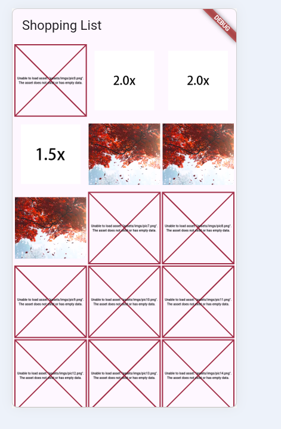


横屏模式下的状态如下，箭头和蓝色方格是因为开启了debug
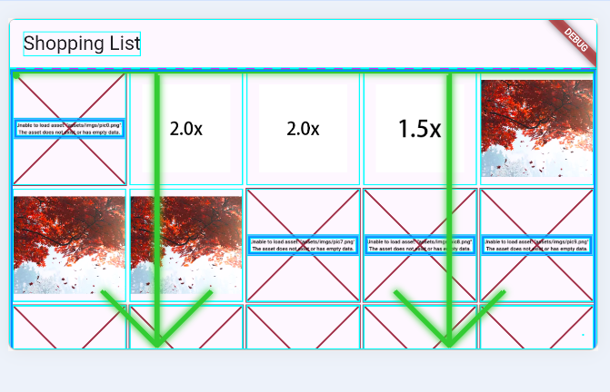

### `GridView.count`
 `GridView.count`不能设定`maxCrossAxisExtent`，可以设置`crossAxisCount`，这个表示当超过指定的数量后会自动换行，无论是横屏还是竖屏状态。如果横屏状态，宽度的增加不会使单行的item增加，而是拉大item的宽高
```dart
import 'package:flutter/material.dart';
import 'package:flutter/rendering.dart';

void main() {
  List<Widget> _buildGridTileList(int count) =>
      List.generate(count, (i) => Image.asset('assets/imgs/pic$i.png'));

  Widget _buildGrid() => GridView.count(
        crossAxisCount: 3,
        padding: const EdgeInsets.all(4),
        mainAxisSpacing: 4,
        crossAxisSpacing: 4,
        children: _buildGridTileList(30),
      );

  debugPaintSizeEnabled = true;
  runApp(MaterialApp(
      title: 'Shopping List',
      home: Scaffold(
          appBar: AppBar(title: Text('Shopping List')),
          body: Container(child: _buildGrid()))));
}

```
竖屏状态：
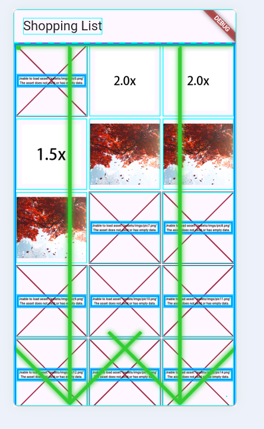
横屏状态：
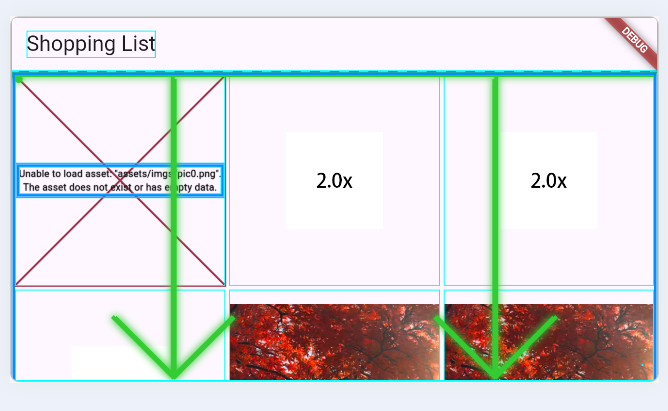

## ListView

```dart
import 'package:flutter/material.dart';
import 'package:flutter/rendering.dart';

void main() {
  ListTile _tile(String title, String subtitle, IconData icon) {
    return ListTile(
      title: Text(
        title,
        style: const TextStyle(fontWeight: FontWeight.w500, fontSize: 20),
      ),
      subtitle: Text(subtitle),
      leading: Icon(icon, color: Colors.blue[500]),
    );
  }

  Widget _buildList() {
    return ListView(
      children: [
        _tile('CineArts at the Empire', '85 W Portal Ave', Icons.theaters),
        _tile('The Castro Theater', '429 Castro St', Icons.theaters),
        _tile('Alamo Drafthouse Cinema', '2550 Mission St', Icons.theaters),
        _tile('Roxie Theater', '3117 16th St', Icons.theaters),
        _tile(
          'United Artists Stonestown Twin',
          '501 Buckingham Way',
          Icons.theaters,
        ),
        _tile('AMC Metreon 16', '135 4th St #3000', Icons.theaters),
        const Divider(),
        _tile('K\'s Kitchen', '757 Monterey Blvd', Icons.restaurant),
        _tile('Emmy\'s Restaurant', '1923 Ocean Ave', Icons.restaurant),
        _tile('Chaiya Thai Restaurant', '272 Claremont Blvd', Icons.restaurant),
        _tile('La Ciccia', '291 30th St', Icons.restaurant),
      ],
    );
  }

  debugPaintSizeEnabled = true;
  runApp(MaterialApp(
      title: 'Shopping List',
      home: Scaffold(
          appBar: AppBar(title: Text('Shopping List')),
          body: Container(child: _buildList()))));
}

```
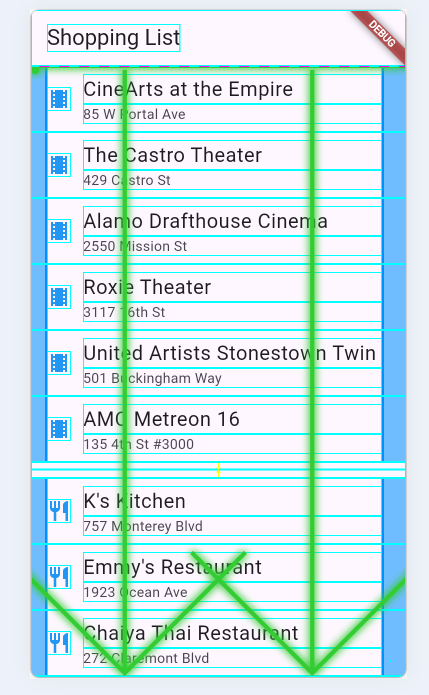

## Stack

Stack可以覆盖在另一个widget之上，比如在图片添加标注的文本的功能。

```dart
import 'package:flutter/material.dart';
import 'package:flutter/rendering.dart';

void main() {
  debugPaintSizeEnabled = true;
  runApp(MaterialApp(
      title: 'Shopping List',
      home: Scaffold(
          appBar: AppBar(title: Text('Shopping List')), body: _buildStack())));
}

Widget _buildStack() {
  return Stack(
    alignment: const Alignment(0.6, 0.6),
    children: [
      const CircleAvatar(
        backgroundImage: AssetImage('assets/imgs/pic6.png'),
        radius: 100,
      ),
      Container(
        decoration: const BoxDecoration(color: Colors.black45),
        child: const Text(
          'Mia B',
          style: TextStyle(
            fontSize: 20,
            fontWeight: FontWeight.bold,
            color: Colors.white,
          ),
        ),
      ),
    ],
  );
}

```
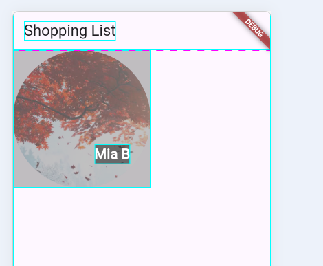

## Card
可以实现带有卡片效果的Widget
```dart
import 'package:flutter/material.dart';

void main() {
  runApp(MaterialApp(
      title: 'Shopping List',
      home: Scaffold(
          appBar: AppBar(title: Text('Shopping List')), body: _buildCard())));
}

Widget _buildCard() {
  return SizedBox(
    height: 210,
    child: Card(
      child: Column(
        children: [
          ListTile(
            title: const Text(
              '1625 Main Street',
              style: TextStyle(fontWeight: FontWeight.w500),
            ),
            subtitle: const Text('My City, CA 99984'),
            leading: Icon(Icons.restaurant_menu, color: Colors.blue[500]),
          ),
          const Divider(),
          ListTile(
            title: const Text(
              '(408) 555-1212',
              style: TextStyle(fontWeight: FontWeight.w500),
            ),
            leading: Icon(Icons.contact_phone, color: Colors.blue[500]),
          ),
          ListTile(
            title: const Text('costa@example.com'),
            leading: Icon(Icons.contact_mail, color: Colors.blue[500]),
          ),
        ],
      ),
    ),
  );
}

```
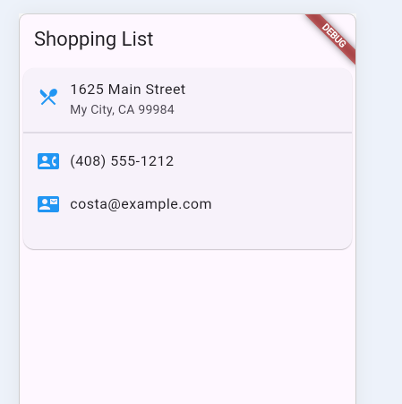


# 构建响应式布局

本次只讲解三种监听屏幕变化的方式，如果有机会再看看是否单开一篇去总结响应式布局。

响应式布局就是能实时根据屏幕的大小，做不一样布局显示，比如你将屏幕横屏时，屏幕的宽度就变大了，那么原先的布局就不合适了。

下面是三种监听屏幕大小变化的方法

|特性|	`MediaQuery.sizeOf`	|`MediaQuery.of`	|`LayoutBuilder`	|
|--|--|--|--|
|监听范围|	仅监听 `size` 变化|	监听 所有 MediaQuery 数据|	监听父级约束（constraints）	|
|重建触发|	仅屏幕尺寸变化时重建|	任何系统数据变化都重建（亮度、字体、方向等）|	父级约束变化时重建	|
|性能|	✅ 最好|	⚠️ 较差（过度重建）|	✅ 好	|
|获取数据|	屏幕物理尺寸|	完整的 MediaQueryData	|父容器分配的约束空间|	


性能差异的原因
```dart
// MediaQuery.sizeOf - 性能最好 ⭐
// 底层使用了 InheritedModel，只订阅 size 这一个属性
final size = MediaQuery.sizeOf(context);
// 只有当屏幕尺寸改变时才重建（如旋转屏幕）

// MediaQuery.of - 性能较差
// 订阅整个 MediaQueryData 对象
final mq = MediaQuery.of(context);
final size = mq.size;
// 亮度变化、文字缩放、时间格式变化、安全区变化...都会触发重建！

```

`LayoutBuilder`，我觉得更适合构建那种移动的窗口，比如弹窗，可调整大小的窗口，因为`LayoutBuilder`是监听父级约束的变化的。


下面是大概的用法

```dart
import 'package:flutter/material.dart';

void main() {
  runApp(MaterialApp(
      title: 'Flutter layout demo',
      home: Scaffold(
          appBar: AppBar(title: Text('Flutter layout demo')),
          body: LayoutBuilder(
            builder: (context, constraints) {
              MediaQueryData mediaQuery = MediaQuery.of(context);
              print("Screen width: ${mediaQuery.size.width}");
              print("Screen height: ${mediaQuery.size.height}");

              //test for MediaQueryData.sizeOf
              print("Size of: ${MediaQuery.sizeOf(context)}");
              print("Size of width: ${MediaQuery.sizeOf(context).width}");
              print("Size of height: ${MediaQuery.sizeOf(context).height}");
              if (constraints.maxWidth > 600) {
                return _buildWideContainers();
              } else {
                return _buildNormalContainer();
              }
            },
          ))));
}

Widget _buildNormalContainer() {
  return Container(
    color: Colors.blue,
    child: Text('Normal Container'),
  );
}

Widget _buildWideContainers() { 
  return Container(
    color: Colors.green,
    child: Text('Wide Containers'),
  );
}
```
竖屏状态：
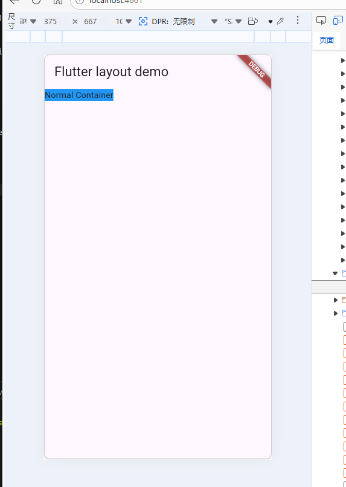

横屏状态：
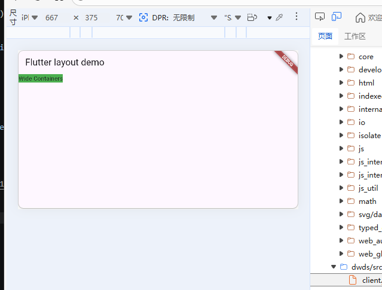

日志打印：
竖屏：
```
Screen width: 375
Screen height: 667
Size of: Size(375.0, 667.0)
Size of width: 375
Size of height: 667
```
横屏：
```
Screen width: 667
Screen height: 375
Size of: Size(667.0, 375.0)
Size of width: 667
Size of height: 375
```