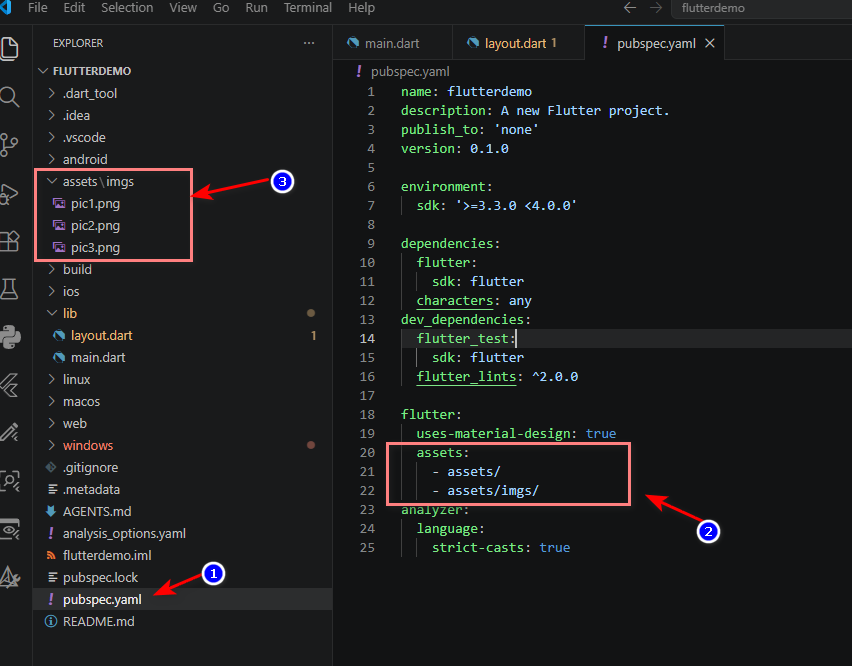
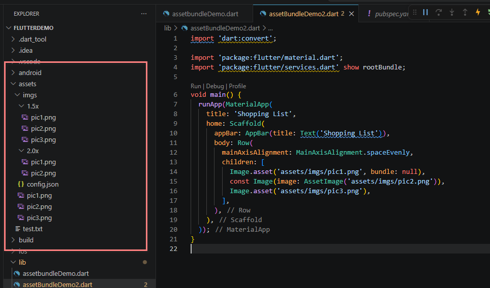
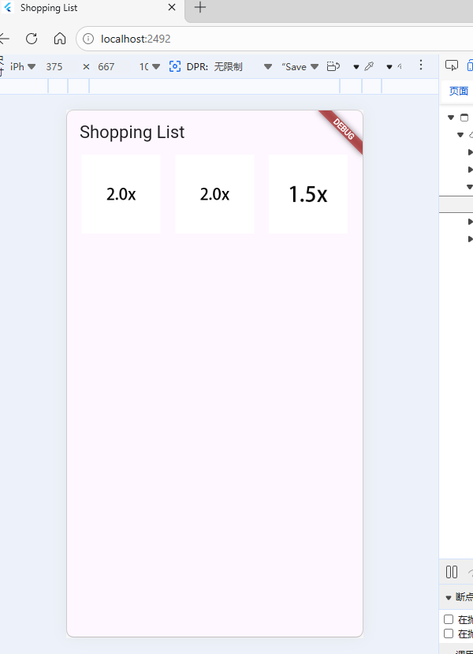
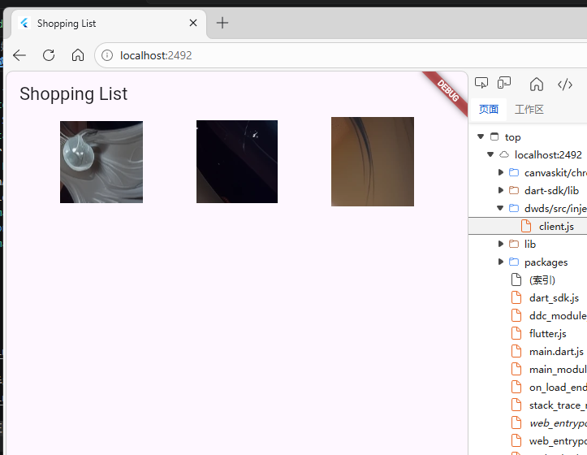
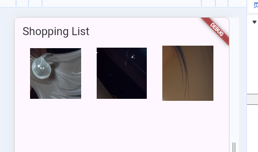
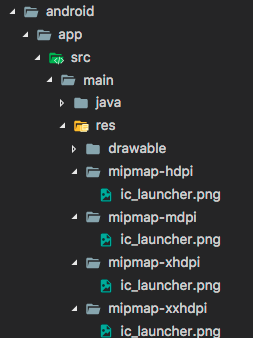
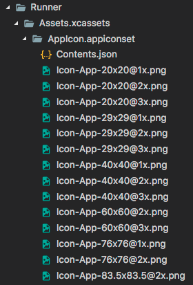
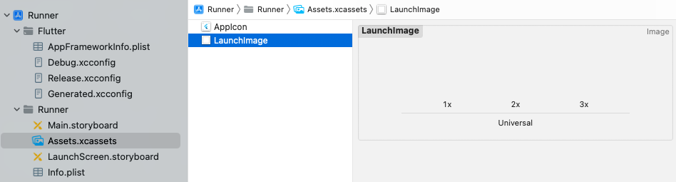

# 参考链接
[添加资源和图片——Flutter官方文档](https://docs.flutter.cn/ui/assets/assets-and-images)

# 资源文件的注册

必须先在`pubspec.yaml`文件中配置相应的资源路径，可以使用文件的路径，也可以只配置目标目录路径，则表示注册此目录下所有文件

```yaml
flutter:
  assets:
    - assets/imgs/pic1.png
```

指定目标目录，必须要注意，flutter只会加载目标目录的一级子文件，如果有子文件夹下的文件，是不会加载的。所以你看到下面的`assets/imgs/`还要单独再列一行进行配置
```yaml
flutter:
  assets:
    - assets/
    - assets/imgs/
```

资源文件的放置，必须放在和`pubspec.yaml`的同一级（即项目根目录），如下图所示。


# 分辨率自适应资源

`.../[N]x/my_icon.png`其中N是数字标识符用于区分图像分辨率

```
    .../my_icon.png       (mdpi baseline)
    .../1.5x/my_icon.png  (hdpi)
    .../2.0x/my_icon.png  (xhdpi)
    .../3.0x/my_icon.png  (xxhdpi)
    .../4.0x/my_icon.png  (xxxhdpi)
```

配置在`pubsec.yaml`
```yaml
flutter:
  assets:
    - assets/
    - assets/imgs/
    - assets/imgs/1.5x/
    - assets/imgs/2.0x/
```
也可以直接文件路径注册

```yaml
flutter:
  assets:
    - assets/imgs/pic1.png
    - assets/imgs/1.5x/pic1.png
    - assets/imgs/2.0x/pic1.png
```

但是实际调用，必须指定用mdpi分辨率的那个文件路径，系统会自动判断当前设备的图像分辨率

代码示例，可看到路径是mdpi分辨率的那个文件路径
```dart 
import 'dart:convert';

import 'package:flutter/material.dart';
import 'package:flutter/services.dart' show rootBundle;

void main() {
  runApp(MaterialApp(
    title: 'Shopping List',
    home: Scaffold(
      appBar: AppBar(title: Text('Shopping List')),
      body: Row(
        mainAxisAlignment: MainAxisAlignment.spaceEvenly,
        children: [
          Image.asset('assets/imgs/pic1.png', bundle: null),
          const Image(image: AssetImage('assets/imgs/pic2.png')),
          Image.asset('assets/imgs/pic3.png'),
        ],
      ),
    ),
  ));
}

```

要注意，我这里特意在`2.0x`中少放了个`pic3.png`，所以系统在找到对应分辨率时，会自动降低一个级别的分辨率选择了`1.5x`中的`pic3.png`，*如果widget没有指定宽高，那么系统会自动使用mdpi中的图片大小作为widget的宽高（这里指逻辑像素作为单位，因为各个设备的分辨率像素点都不一样）*



在Web上使用手机分辨率测试如下：


在web界面上正常的分辨率：



# 图片文件的加载

直接`Image.asset`直接指定文件路径即可
```dart
import 'package:flutter/material.dart';

void main() {
  runApp(MaterialApp(
    title: 'Shopping List',
    home: Scaffold(
      appBar: AppBar(title: Text('Shopping List')),
      body: Row(
        mainAxisAlignment: MainAxisAlignment.spaceEvenly,
        children: [
          Image.asset('assets/imgs/pic1.png'),
          Image.asset('assets/imgs/pic2.png'),
          Image.asset('assets/imgs/pic3.png'),
        ],
      ),
    ),
  ));
}
```



也可以使用`AssetImage`加载图片资源 

```dart
return const Image(image: AssetImage('assets/background.png'));
```

# 通用资源文件加载方法

对于其他类型文件的加载，可以使用`AssetsBundle`这个类，但是这个是异步加载，也就是widget可能会资源文件之前先一步被渲染完，所以一定要使用`StatefulWidget`来创建widget，并在加载完资源文件后调用`setState`，否则你可能看不到资源文件的加载结果。

这个示例是点击后加载资源文件
```dart

import 'package:flutter/material.dart';

void main() {
  runApp(MaterialApp(
    title: 'Shopping List',
    home: Scaffold(
      appBar: AppBar(title: Text('Shopping List')),
      body: Row(
        mainAxisAlignment: MainAxisAlignment.spaceEvenly,
        children: [
          Image.asset('assets/imgs/pic1.png',bundle: null),
          // Image.asset('assets/imgs/pic2.png'),
          // Image.asset('assets/imgs/pic3.png'),
          MyText()//之前试过想在StatelessWidget中使用assetbundle，但是发现，没有加载出来，后面发现是AssetBundle是异步加载的
        ],
      ),
    ),
  ));
}

class MyText extends StatefulWidget {
  @override
  State<StatefulWidget> createState() => _MyTextState();
}

class _MyTextState extends State<MyText> {
  String? text;
  void _loadData() {
    var assetBundle = DefaultAssetBundle.of(context);
    assetBundle.loadString('assets/test.txt').then((value) {
      setState(() {
        text = value;
      });
    });
  }

  @override
  Widget build(BuildContext context) {
    return ElevatedButton(onPressed: _loadData, child: Text("加载后的文本内容：$text"));
  }
}

```


有一点需要提醒Image.asset默认是使用同步加载asset资源的，当只有你指定了`AssetBundle`，直接设置bundle变量为null时(变量为null会默认使用`DefaultAssetBundle`)，才会使用AssetBundle的方式加载image

不过我至今也没搞明白，为什么Image指定了AssetBundle后还能保证图片在UI渲染完成之后加载，因为每次刷新都发现图片能够正常加载。

```dart
Image.asset('assets/imgs/pic1.png',bundle:null)
```

# rootBundle加载资源文件

每个 Flutter 应用程序都有一个 rootBundle 对象，可以轻松访问主资源 bundle 。还可以直接使用 package:flutter/services.dart 中全局静态的 rootBundle 来加载资源。

但是，如果获取当前 BuildContext 的 AssetBundle，建议使用 DefaultAssetBundle。这种方式不是使用应用程序构建的默认资源 bundle，而是让父级 widget 在运行时替换的不同的 AssetBundle，这对于本地化或测试场景很有用。

通常，你可以从应用程序运行时的 rootBundle 中，间接使用 DefaultAssetBundle.of() 来加载资源（例如 JSON 文件）。

在 Widget 上下文之外，或 AssetBundle 的句柄不可用时，你可以使用 rootBundle 直接加载这些 assets，例如：
```dart
import 'package:flutter/services.dart' show rootBundle;

Future<String> loadAsset() async {
  return await rootBundle.loadString('assets/config.json');
}
```


# 加载依赖包中的资源文件

假如你依赖包中的目录结构如下：
```yaml
.../pubspec.yaml
.../icons/heart.png
.../icons/1.5x/heart.png
.../icons/2.0x/heart.png
...etc.
```
那调用方式，需要指定package参数，并指定相应路径：
```dart
return const AssetImage('icons/heart.png', package: 'my_icons');

```

# 打包assets

如果期望的资源文件被指定在 package 的 pubspec.yaml 文件中，它会被自动打包到应用程序中。特别是，package 本身使用的资源必须在 pubspec.yaml 中指定。

package 也可以选择在其 lib/ 文件夹中包含未在 pubspec.yaml 文件中声明的资源。在这种情况下，对于要打包的图片，应用程序必须在 pubspec.yaml 中指定包含哪些图像。例如，一个名为 fancy_backgrounds 的包，可能包含以下文件：

```
.../lib/backgrounds/background1.png
.../lib/backgrounds/background2.png
.../lib/backgrounds/background3.png
```

总而言之，要包含第一张图像，必须在 pubspec.yaml 的 assets 部分中声明它：

```yaml
flutter:
  assets:
    - packages/fancy_backgrounds/backgrounds/background1.png
```

lib/ 是隐含的，所以它不应该包含在资源路径中。

如果你正在开发 package，想要从 package 中加载资源，首先要在 pubspec.yaml 中定义：

```yaml
flutter:
  assets:
    - assets/images/
```
在 package 中加载图片，按以下方式：

```dart
return const AssetImage('packages/fancy_backgrounds/backgrounds/background1.png');
```

# 平台共享assets

在不同平台读取 Flutter assets， Android 是通过 `AssetManager`，iOS 是 `NSBundle`。

todo


# 更改应用图标

## 更改Android应用图标

需要在flutter目录下将`ic_launcher.png`全部替换成你自己的图标，并遵守每种屏幕分辨率的建议图标大小标准



** 如果你重命名了 .png 文件，则还必须在 AndroidManifest.xml 中 `<application>` 标签的 android:icon 属性中更新名称。**

## 更新IOS应用图标

在你的 Flutter 项目的根目录中，导航到 .../ios/Runner 路径。该目录中 Assets.xcassets/AppIcon.appiconset已经包含占位符图片，只需将它们替换为适当大小的图片，并且根据 iOS 开发指南，文件名称保持不变。



# 更新应用启动图

flutter会启用原生平台的机制绘制启动页，此启动页的显示将持续到，flutter应用的渲染的第一帧。我记得我以前安卓JAVA开发的时候，就设计启动页，启动页显示时应用程序实际并未运行，虽然应用配置了启动页，但是却像告诉系统，我的应用程序开始执行前请显示这张图片，让感觉启动速度的流畅

我当时在安卓的style中指定了主题类，并指定了启动页
```xml
    <style name="SplashTheme" parent="Theme.AppCompat.DayNight.NoActionBar">
        <item name="android:windowBackground">@drawable/splash_bg</item>
        <item name="android:windowIsTranslucent">false</item>
    </style>
```
又在Manifest.xml中为WelcomeAbility,指定了这个主题（是我的用来做闪屏的，类似用户指引）
```xml
<activity
    android:name=".project.WelcomeActivity"
    android:theme="@style/SplashTheme">
    <intent-filter>
        <action android:name="android.intent.action.MAIN" />

        <category android:name="android.intent.category.LAUNCHER" />
    </intent-filter>
</activity>
```

上面简单讲了为什么启动页需要原来平台来的机制来绘制，因为是系统层面的配置。
## 更改Android的启动页
看来官方也要按照修改Manifest.xml来改启动页
> 将启动屏幕「splash screen」添加到你的 Flutter 应用程序，请导航至 .../android/app/src/main 路径。在 res/drawable/launch_background.xml 文件中，通过使用 [图层列表](https://developer.android.google.cn/guide/topics/resources/drawable-resource#LayerList) XML 来实现自定义启动页。现有模板提供了一个示例，用于将图片添加到白色启动页的中间（注释代码中）。你也可以取消注释使用 [可绘制对象资源](https://developer.android.google.cn/guide/topics/resources/drawable-resource) 来实现预期效果。

## 更改IOS的启动页

> 将图片添加到启动屏幕「splash screen」的中心，请导航至 .../ios/Runner 路径。在 Assets.xcassets/LaunchImage.imageset ，拖入图片，并命名为 LaunchImage.png， LaunchImage@2x.png，LaunchImage@3x.png。如果你使用不同的文件名，那你还必须更新同一目录中的 Contents.json 文件中对应的名称。

> 你也可以通过打开 .../ios/Runner.xcworkspace ，完全自定义 storyboard。在 Project Navigator 中导航到 Runner/Runner ，然后打开 Assets.xcassets 拖入图片，或者在 LaunchScreen.storyboard 中使用 Interface Builder 进行自定义。
