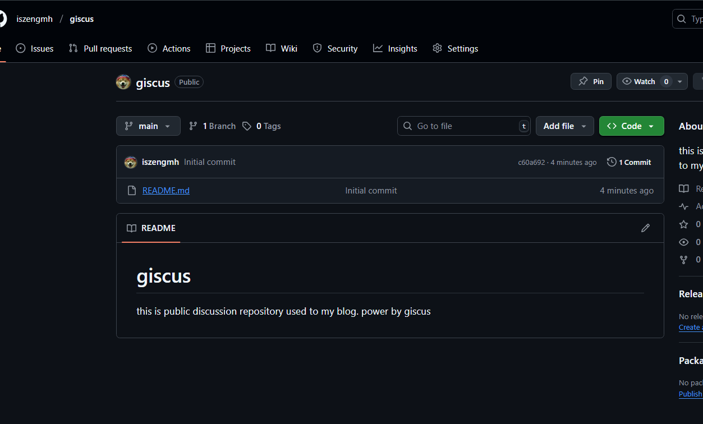
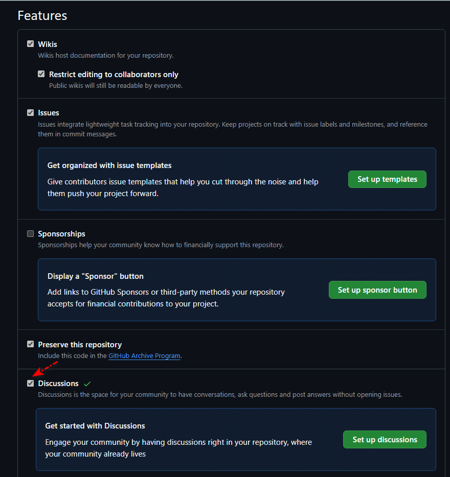
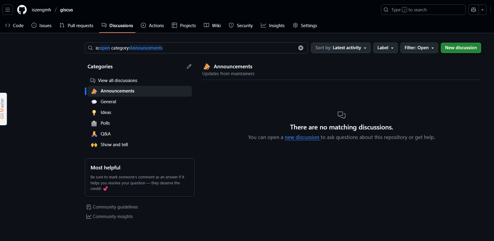
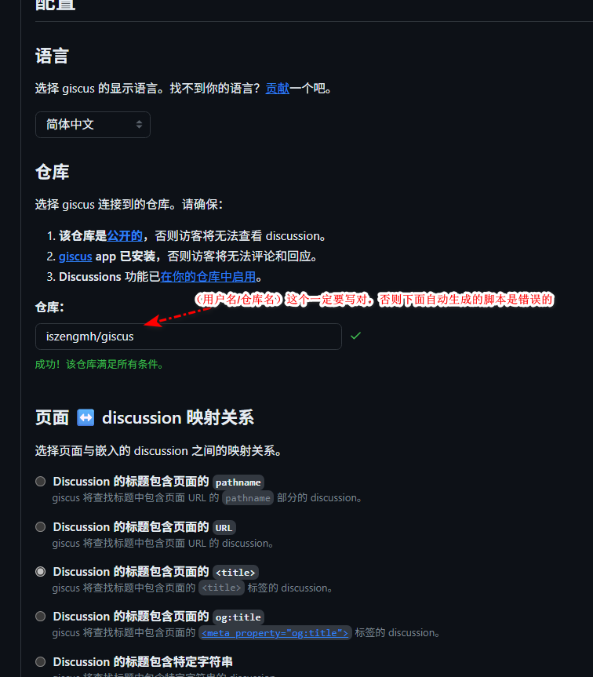
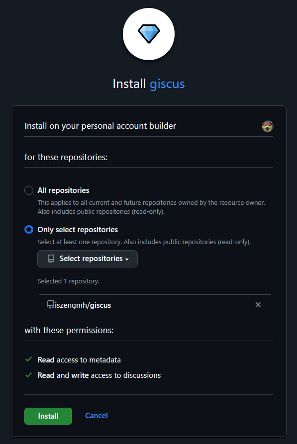
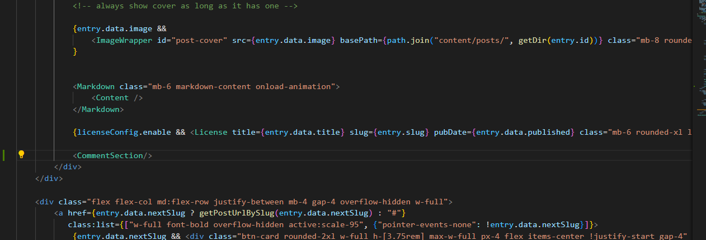
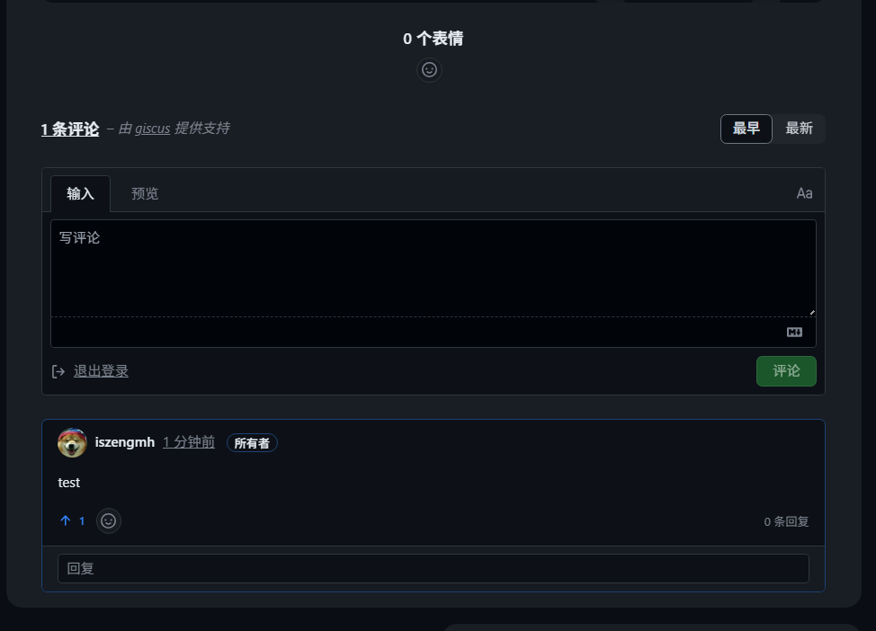

# 参考链接

[Giscus官网](https://giscus.app/)

[Fuwari添加giscus评论——半入烟云](https://calabchen.github.io/posts/guide/index2/)

[Github Discussions使用指南（建议收藏） —— CSDN@Liekkas Kono](https://blog.csdn.net/shiwanghualuo/article/details/139511591)

# fuwari如何添加评论系统
## 创建github仓库并开启discussions模块
1. 创建一个仓库，并开启discussions模块，并设置discussions模块为公开。这个不再赘述。




2.在仓库中进入`settings > Features`勾选`Discussions`





## 嵌入giscus评论脚本

1. 访问giscus官网，创建一个giscus实例
建议不要选择与URL的映射关系，我曾经用liveRe评论系统，后面更换域名时，发现评论全消失了，原来是映射关系问题，评论与URL绑定在一起了。



2.点击蓝色链接，进入giscus的授权页面，然后点击install授权giscus访问你仓库，弹出的github页面可以选择授权全部仓库，也可以只授权一个仓库（不过这个giscus真是有点搞笑，我以为安装是说把代码嵌入到你的博客中，原来是要点开这个链接去授权）





3.选完相应的选项后，底部会生成一个嵌入脚本，如果你在网页中成功授权了giscus并且仓库也是正确就可以直接复制不用修改

```
<script src="https://giscus.app/client.js"
        data-repo="<your github username>/your-github-repo"
        data-repo-id="<your repo id>"
        data-category="Announcements"
        data-category-id="DIC_kwDOFPp0Jc4CcjOR"
        data-mapping="title"
        data-strict="0"
        data-reactions-enabled="1"
        data-emit-metadata="0"
        data-input-position="bottom"
        data-theme="preferred_color_scheme"
        data-lang="zh-CN"
        data-loading="lazy"
        crossorigin="anonymous"
        async>
</script>
```

4.在`src\components\`下创建一个`CommentSection.astro`的文件，将脚本复制进去

5.在Fuwari主题中，其应该在`src->pages->posts->[...slug].astro`，对其进行修改，我将它放在license下面



## 嵌入成功
