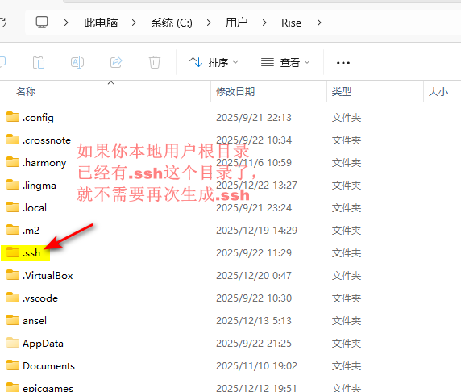
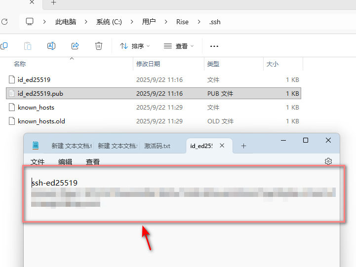
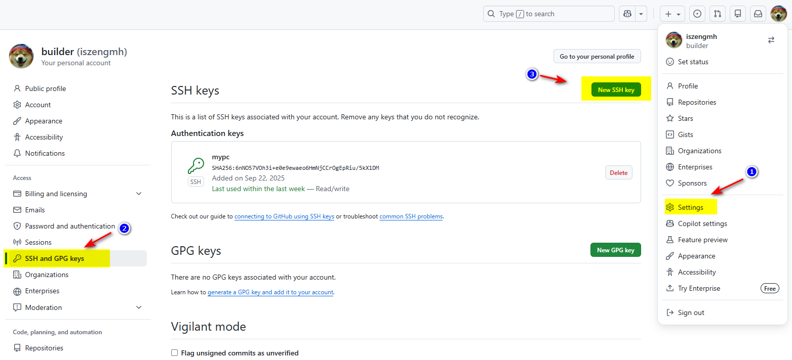
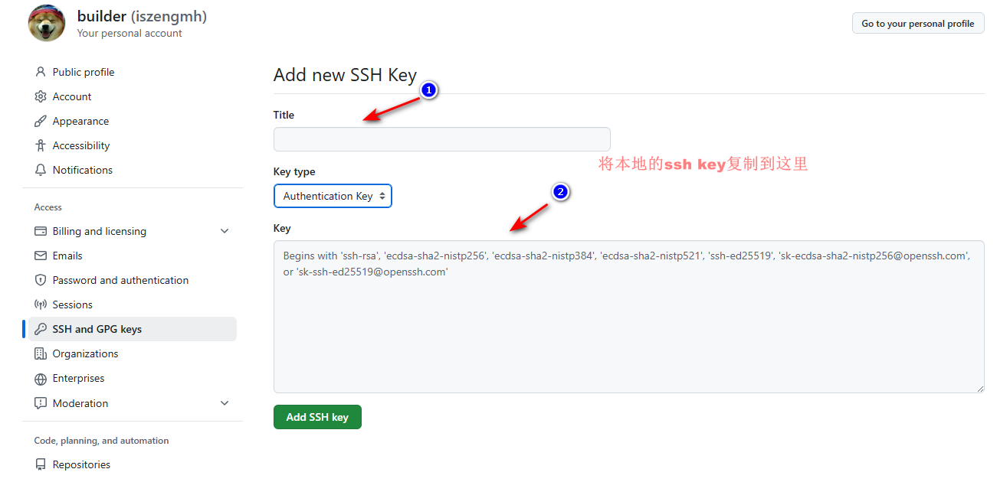
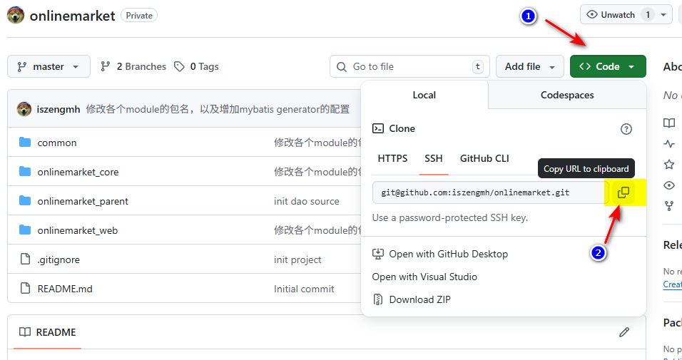
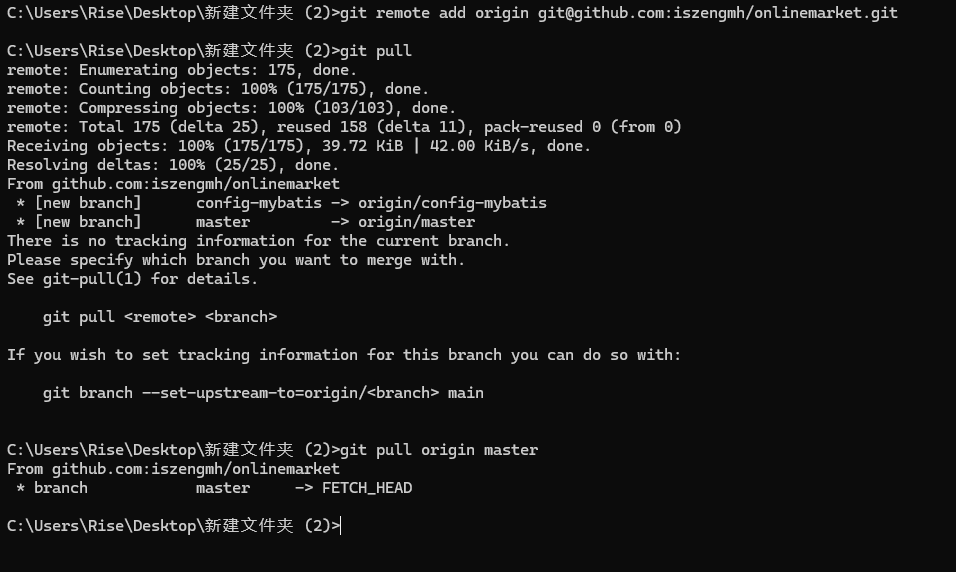

# 参考链接
[Set up Git--Github  ](https://docs.github.com/en/github/getting-started-with-github/set-up-git)

[Setting your username in Git--Github  ](https://docs.github.com/en/github/using-git/setting-your-username-in-git)

[Setting your commit email address--Github  ](https://docs.github.com/en/github/setting-up-and-managing-your-github-user-account/setting-your-commit-email-address)

[generate SSH keys--Github](https://docs.github.com/en/articles/generating-a-new-ssh-key-and-adding-it-to-the-ssh-agent)

# 在Git设置你的用户名

在git中的设置的用户名，与你的Github用户名不是同一个东西，它只是作为在提交过程中标识提交的用户，如果你想隐藏你的真实名，你可以设置与Github不一样的名字的匿名。

你可以用 `git config` 来配置git用户名，这不会修改你之前提交过commit中的用户名，之后你如果你要提交，则会以你配置的用户名提交。

## 为所有仓库配置固定的用户名（全局）

```bash
# 配置你的git用户名
git config --global user.name "Mona Lisa"
# 查询你已经配置好的用户名
git config --global user.name
```

## 单独为一个仓库配置用户名
1. 先进入你仓库的目录
2. 右键点击 Git Bash进入git终端
3. 输入以下命令

```bash
git config user.name "Mona Lisa"
```

4. 在当前目录输入以下命令确认你修改好的用户名

```bash
git config user.name
```

# 修改你提交的邮箱
你在commit过程中提交的邮箱，是Github用于关联Github账户和你的提交。如果你需要保持你的邮箱隐匿，你可以使用Github提供的 `noreply` 邮箱，具体参考[Setting your commit email address--Github](https://docs.github.com/en/github/setting-up-and-managing-your-github-user-account/setting-your-commit-email-address)。你在你修改邮箱之前，你的已经存在的提交仍然与你之前的邮箱关联。你也可以阻止 `push` 的提交暴露你的邮箱，详细请看[Blocking command line pushes that expose your personal email](https://docs.github.com/en/articles/blocking-command-line-pushes-that-expose-your-personal-email-address)。


你可以选择全局配置，也可以选择为指定仓库配置

## 全局配置邮箱
```bash
# 在git中配置你的邮箱，可以是Github的noreply邮箱，也可以是任意的邮箱
git config --global user.email "email@example.com"
# 查询已经配置的邮箱
git config --global user.email
```

## 为单个仓库配置邮箱

+ 先进入你仓库的目录
+ 右键点击 Git Bash进入git终端
+ 输入以下命令

```bash
# 在git中配置你的邮箱，可以是Github的noreply邮箱，也可以是任意的邮箱
 git config user.email "email@example.com"
# 查询已经配置的邮箱
git config user.email
```

# 从Git授权Github

## 使用HTTPS连接Github

```bash
git config --global credential.helper wincred
```

## 确认是否已经发布SSH key

检查是否已经配置SSH key

```bash
# linux环境下请使用以下命令
ls -al ~/.ssh
```

window下请查询C:\Users\<你的windows用户名>\.ssh

public key遵循以下命名，请确认.ssh目录是否有以下其中之一的文件 `id_rsa.pub` 、 `id_ecdsa.pub` 、 `id_ed25519.pub` 



## 发布SSH key

如果本地用户根目录没有.ssh，说明是首次配置Git，需要按下面的方法配置key


```bash
ssh-keygen -t ed25519 -C "your_email@example.com"
# 如果使用的是一个旧系统，不支持Ed25519算法，则使用以下命令
ssh-keygen -t rsa -b 4096 -C "your_email@example.com"
```

如果提示“Enter file in which to save the key”，可以直接回车，他会在默认的地址保存key，如果提示“Enter passphrase (empty for no passphrase)”，也可以直接回车，表示不设置密码，则每次push不会要求密码。

## 配置key到github仓库

window下C:\Users\<你的windows用户名>\.ssh，找到后缀为`.pub`的文件，复制里面的内容



接下来进入github，通过在github中新建一个ssh key的方式，配置ssh本地的ssh key到github





## 提交代码到github

找到你创建的仓库，复制ssh url



其次，如果本地还未有初始化的仓库，先进入到本地想要创建仓库的目录，再执行以下命令

```bash
git init
```

接下需要配置提交的远程仓库，把ssh url替换到以下命令并执行
```bash
git remote add origin git@github.com:iszengmh/onlinemarket.git
```

做完，作为首次初始化仓库需要，先执行以下命令，拉取远程仓库的文件，将远程仓库history与本地对接，把本地代码直接提交有可能出其他问题，要解决比较麻烦，也是另外一种提交方式吧，不过我这种最简单，首次执行需要在命令加`<remote> <branch>`，以后就只需要`git pull`即可
```bash
#模板
git pull <remote> <branch>

#示例 
git pull origin master
```



正常提交需要的命令（当然，如果很多客户端软件，有集成的功能一键搞定，像idea和vscode及官方的Github客户端）

```bash

#拉取最新修改 
git pull 
# 添加所有修改到暂存区（好像旧版本只规定新文件需要每次保存暂存区，但是我发现最新版本好像修改文件也需要我提交到暂存区了）
git add .
# 提交代码到本地history
git commit -m "本次提交的备注内容"
# 首次push需要加上 origin master
git push origin master
```

