# 参考链接

[Java 9 新特性概览——Github@Snailclimb](https://github.com/Snailclimb/JavaGuide/blob/main/docs/java/new-features/java9.md)

[JEP 222: Java Shell Tool (JShell)](https://openjdk.org/jeps/222)

[Java11新特性（三）——JShell使用教程&指南——CSDN@TechBro华仔](https://blog.csdn.net/Hello_World_QWP/article/details/88836823)

[JEP 261: Module System (模块化系统)](https://openjdk.org/jeps/261)

[JEP 248: G1 Becomes the Default Garbage Collector (G1 成为默认垃圾回收器)](https://openjdk.org/jeps/248)

[JEP 254: Compact Strings (紧凑字符串)](https://openjdk.org/jeps/254)

[JEP 193: Variable Handles (变量句柄)](https://openjdk.org/jeps/193)


# 我的其他文章

这是我的写过jdk9的另外一个新特性

[java之AOT编译](https://iszengmh.pages.dev/posts/java%E4%B9%8Baot%E7%BC%96%E8%AF%91/)


# 引言

> Java 9 发布于 2017 年 9 月 21 日。作为 Java 8 之后 3 年半才发布的新版本，Java 9 > 带来了很多重大的变化其中最重要的改动是 Java 平台模块系统的引入，其他还有诸如集合、> Stream 流……


# JEP 222: Java Shell Tool (JShell)

简单说就是一个可以和python、shell一样直接在终端上，执行可交互式式命令，但是执行的java程序，jshell会将其编译并运行

在终端上，直接输入jshell可以

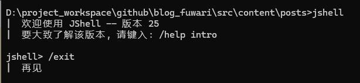

## 执行的结果和错误都会立即显示在控制台上

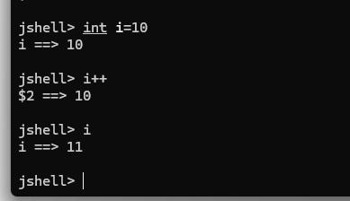

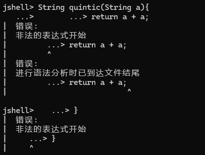

## 可以直接创建一个方法并调用

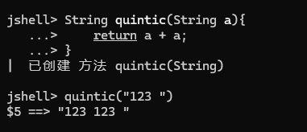

## 可以覆盖方法

```shell

jshell> String quintic(String a){
   ...> return "Know:" + a;
   ...> }
|  已修改 方法 quintic(String)
|    更新已覆盖 方法 quintic(String)
 
jshell> quintic("Base");

$9 ==> "Know:Base"
|  已创建暂存变量 $9 : String
 
jshell>

```

# JEP 261: Module System (模块化系统)

## 模块化系统是目的

以下我对相关资料的理解和总结，仅代表个人理解

* 为了使jar相互之前依赖有限制，虽然java已经有public、private、protected、default修饰符保证类的可见性，但是对于jar来说，相互之间的依赖基本是开放的，为了使一个项目依赖有限制，Java 9引入了模块化系统。即使是public的类，没有export时，也是无法被其他jar访问的
* 模块化可以解决循环依赖偶合的问题
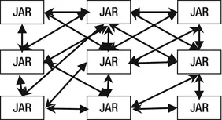

* 我们一定遇到过，想要引入一个类时，两个jar中包含了有相同的类（也有相同的包名），大多数的编译器可能会报错，但是我也遇到没有报错的情况，所以你import的类，有可能不是你想要的那个，这种情况我也是遇到过的，我没有仔细研究过这个问题，可能和jvm有关系，模块化也可以解决这个重复问题。

* 解决运行时才报类找不到的问题，这种情况虽然大部分集成开发环境都有编译错误，但是难保一种情况就是你提交到生产环境时忘记提交关键的jar包，导致运行时找不到类。你们一定遇到过，启动时不报错，但是调到那个功能时才报错的情况。这种可以算是重大失误，因为重大项目的生产环境的部署是需要多个经理批准的，如果因为这种人为失误导致，需要重新提交release批准，那可麻烦了。

## quick start

### 申明一个模块,"com.greetings"是模块的名字

总觉得“com.greetings”作为模块名不太合适，官方应该是为了方便标识暂时定义的，否则com.greetings作为模块名，又在包名中作为一个单独的文件夹名来说很奇怪。

目录： src/com.greetings/module-info.java

```java
module com.greetings { }
```

目录： com/com.greetings/com/greetings/Main.java

```java
 package com.greetings;
    public class Main {
        public static void main(String[] args) {
            System.out.println("Greetings!");
        }
    }
```

### 编译模块

将编译内容输出文件夹mods

```bash

javac -d mods/com.greetings \
        src/com.greetings/module-info.java \
        src/com.greetings/com/greetings/Main.java

```

window下请用^分隔


### 运行模块

```bash
java --module-path mods -m com.greetings/com.greetings.Main
``` 
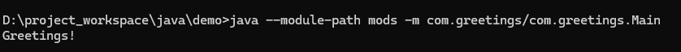

## 模块之间的引入和导出

我们将之前的包结构再增加一个模块叫“org.astro”

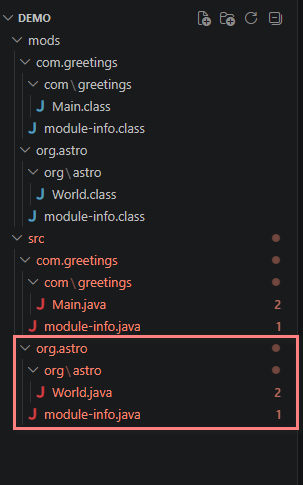


### 创建模块Main类
demo\src\org.astro\org\astro\World.java
```java
package org.astro;
    public class World {
        public static String name() {
                return "world";
        }
    }
 
```
### 申明模块并导出

demo\src\org.astro\module-info.java
```java
module org.astro {
        exports org.astro;
}
```

### 修改之前的com.greetings模块，引入模块org.astro

demo\src\com.greetings\module-info.java

```java
module com.greetings { 
    requires org.astro;
}
```
### 修改之前的com.greetings模块中的Main类，并导入org.astro包

    demo\src\com.greetings\com\greetings\Main.java
```java
 package com.greetings;
 import org.astro.World;
    public class Main {
        public static void main(String[] args) {
            System.out.format("Greetings %s!%n", World.name());
        }
    }
```

### 重新编译并运行

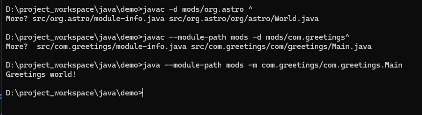

## 一次编译多个模块

```bash

javac -d mods --module-source-path src  src/org.astro/module-info.java ^
src/org.astro/org/astro/World.java ^
 src/com.greetings/module-info.java ^
 src/com.greetings/com/greetings/Main.java
```

如果在klinux bash环境中更好，直接用命令组合一次编译所有java模块

```bash
javac -d mods --module-source-path src $(find src -name "*.java")
```

## 生成modular jar

指定编译目录和输出jar的目录

```bash
jar --create --file=mlib/org.astro@1.0.jar  --module-version=1.0 -C mods/org.astro .

jar --create --file=mlib/com.greetings.jar  --main-class=com.greetings.Main -C mods/com.greetings .
```

可以直接执行jar而不需要指定main class

```bash
 java -p mlib -m com.greetings
```


可以通过命令看到模块jar的信息
```bash
jar --describe-module --file=mlib/org.astro@1.0.jar
```
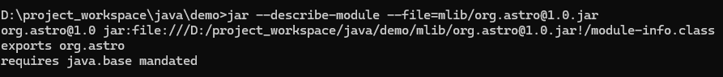

## 没有exports和requires的申明会怎么样呢？

### 没有exports和requires的申明
当编译模块时，会提示错误
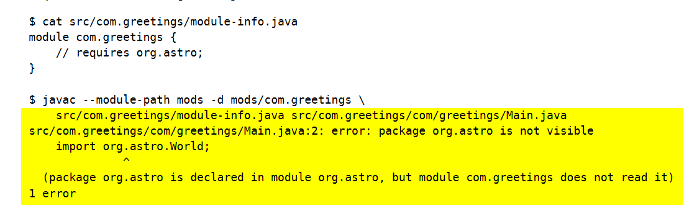

### 保留requires但没有exports时

因为模块没有导出指定的包，所以导入会失败，会提示is not visible，这和传统引入依赖不一样的报错，传统报错会提示包不存在
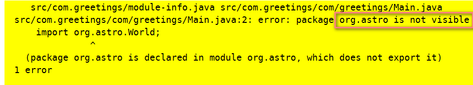

## 模块中的服务(Services)

这次的示例会创建"com.socket"和"com.fastsocket"两个模块，来展示模块中服务的应用，并通过"org.greetings"模块来调用"com.socket"和"com.fastsocket"中的服务。
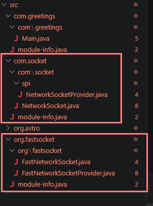

简单来说，有点像MVC模式，MVC模式中，M是model，V是view，C是controller，而MVC模式中，M是service，V是UI，C是controller。以前的实现是直接一个包里面使用接口加实现类的方式，实现一个服务功能，但是模块化之后，抽象和实现分离，分别作为两个不同模块，抽象作为API用于controller调用，controller也可以是一个模块，或者main方法入口吧。

### 创建org.socket模块，作为service consumer，用于导出API


cat src/com.socket/module-info.java
```java
    module com.socket {
        exports com.socket;
        exports com.socket.spi;
        uses com.socket.spi.NetworkSocketProvider;
    }
```
cat src/com.socket/com/socket/NetworkSocket.java

```java
    package com.socket;

    import java.io.Closeable;
    import java.util.Iterator;
    import java.util.ServiceLoader;

    import com.socket.spi.NetworkSocketProvider;

    public abstract class NetworkSocket implements Closeable {
        protected NetworkSocket() { }

        public static NetworkSocket open() {
            ServiceLoader<NetworkSocketProvider> sl
                = ServiceLoader.load(NetworkSocketProvider.class);
            Iterator<NetworkSocketProvider> iter = sl.iterator();
            if (!iter.hasNext())
                throw new RuntimeException("No service providers found!");
            NetworkSocketProvider provider = iter.next();
            return provider.openNetworkSocket();
        }
    }
```

cat src/com.socket/com/socket/spi/NetworkSocketProvider.java
```java    
    package com.socket.spi;

    import com.socket.NetworkSocket;

    public abstract class NetworkSocketProvider {
        protected NetworkSocketProvider() { }

        public abstract NetworkSocket openNetworkSocket();
    }
```

### 创建org.fastsocket 作为service privider module
org.fastsocket 作为service privider module，用于作为服务提供者，也可称为服务的实现方法

cat src/org.fastsocket/module-info.java
```java 
    module org.fastsocket {
        requires com.socket;
        provides com.socket.spi.NetworkSocketProvider
            with org.fastsocket.FastNetworkSocketProvider;
    }
```


cat src/org.fastsocket/org/fastsocket/FastNetworkSocketProvider.java

```java
    package org.fastsocket;

    import com.socket.NetworkSocket;
    import com.socket.spi.NetworkSocketProvider;

    public class FastNetworkSocketProvider extends NetworkSocketProvider {
        public FastNetworkSocketProvider() { }

        @Override
        public NetworkSocket openNetworkSocket() {
            return new FastNetworkSocket();
        }
    }
```

cat src/org.fastsocket/org/fastsocket/FastNetworkSocket.java
```java
    package org.fastsocket;

    import com.socket.NetworkSocket;

    class FastNetworkSocket extends NetworkSocket {
        FastNetworkSocket() { }
        public void close() { }
    }
```


### org.greeting去导入org.socket，并执行


cat src/com.greetings/module-info.java
```java
    module com.greetings {
        requires com.socket;
    }
```

cat src/com.greetings/com/greetings/Main.java
```java
    package com.greetings;

    import com.socket.NetworkSocket;

    public class Main {
        public static void main(String[] args) {
            NetworkSocket s = NetworkSocket.open();
            System.out.println(s.getClass());
        }
    }
```

```bash
    $ mkdir mods
    $ javac -d mods --module-source-path src $(find src -name "*.java")
```


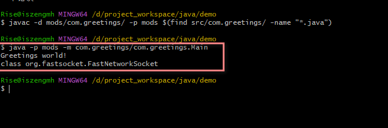


## jlink

jlink是JDK9提供的一个工具，用于生成一个自定义模块化的镜像，主要用于链接多个模块，并用于包含传递式依赖(如果有在生产环境手动运行过jar的朋友，应该会遇到需要命令行中引入多个jar，让在运行时可以互相找到对应jar包中的依赖)。

这个工具要求模块必须在模块路径中，并且被打包作为模块化JAR，或者JMOD模式。JDK在JMOD格式打包标准并且是JDK指定的模块。


```bash
# $JAVA_HOME/jmods是固定语句，是一个路径，用于包含模块化系统的jar包。本质上模块化系统的基础也是java实现的。需要一起整合。（ 里面有java.base.jmod 和其他标准包或者JDK模块）
# mlib是你的模块路径，里面有你编译打包好的多模块
# 但是我这里--add-modules后面只指定一个模块，由于这个模块依赖了org.astro所以生成镜像时也会包含相关的依赖模块
#  --output是输出路径
jlink --module-path $JAVA_HOME/jmods:mlib --add-modules com.greetings --output greetingsapp

# 因为我的JAVA_HOME路径有空格，必须要用双引号包裹，而且由于我的环境是windows，所以分隔符必须用;
 jlink --module-path "$JAVA_HOME/jmods;mlib" --add-modules com.greetings --output greetingsapp
```


生成的应用，生成应用可以独立运行，无需安装 JDK
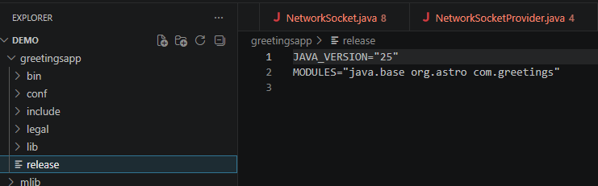

## --patch-module

这个应用是说可以对已经导出的模块进行修改，从名字也可以看到是打补丁的意思，这个不多描述了。
Developers that checkout java.util.concurrent classes from Doug Lea's CVS will be used to compiling the source files and deploying those classes with -Xbootclasspath/p.
-Xbootclasspath/p has been removed, its module replacement is the option --patch-module to override classes in a module. It can also be used to augment the contents of module. The --patch-module option is also supported by javac to compile code "as if" part of the module.

Here's an example that compiles a new version of java.util.concurrent.ConcurrentHashMap and uses it at run-time:

    javac --patch-module java.base=src -d mypatches/java.base \
        src/java.base/java/util/concurrent/ConcurrentHashMap.java

    java --patch-module java.base=mypatches/java.base ...

# JEP 248: G1 Becomes the Default Garbage Collector (G1 成为默认垃圾回收器)

> 在 Java 8 的时候，默认垃圾回收器是 Parallel Scavenge（新生代）+Parallel Old（老年代）。到了 Java 9, CMS 垃圾回收器被废弃了，G1（Garbage-First Garbage Collector） 成为了默认垃圾回收器。
>　G1 还是在 Java 7 中被引入的，经过两个版本优异的表现成为默认垃圾回收器。

# JEP 193: Variable Handles (变量句柄)

> 变量句柄是一个变量或一组变量的引用，包括静态域，非静态域，数组元素和堆外数据结构中的组成部分等。
> 变量句柄的含义类似于已有的方法句柄 MethodHandle ，由 Java 类 java.lang.invoke.VarHandle 来表示，可以使用类 java.lang.invoke.MethodHandles.Lookup 中的静态工厂方法来创建 VarHandle 对象。
> VarHandle 的出现替代了 java.util.concurrent.atomic 和 sun.misc.Unsafe 的部分操作。并且提供了一系列标准的内存屏障操作，用于更加细粒度的控制内存排序。在安全性、可用性、性能上都要优于现有的 API。

# API 增强

## 集合

* 增加了List.of()、Set.of()、Map.of() 和 Map.ofEntries()等工厂方法来创建不可变集合（有点参考 Guava 的味道）：

```java
List.of("Java", "C++");
Set.of("Java", "C++");
Map.of("Java", 1, "C++", 2);
```
使用 of() 创建的集合为不可变集合，不能进行添加、删除、替换、 排序等操作，不然会报 java.lang.UnsupportedOperationException 异常。

## Stream 增强

ream 中增加了新的方法 ofNullable()、dropWhile()、takeWhile() 以及 iterate() 方法的重载方法。

Java 9 中的 ofNullable() 方 法允许我们创建一个单元素的 Stream，可以包含一个非空元素，也可以创建一个空 Stream 。 而在 Java 8 中则不可以创建空的 Stream 。
```java
Stream<String> stringStream = Stream.ofNullable("Java");
System.out.println(stringStream.count());// 1
Stream<String> nullStream = Stream.ofNullable(null);
System.out.println(nullStream.count());//0
```
takeWhile() 方法可以从 Stream 中依次获取满足条件的元素，直到不满足条件为止结束获取。
```java
List<Integer> integerList = List.of(11, 33, 66, 8, 9, 13);
integerList.stream().takeWhile(x -> x < 50).forEach(System.out::println);// 11 33
```
dropWhile() 方法的效果和 takeWhile() 相反。
```java
List<Integer> integerList2 = List.of(11, 33, 66, 8, 9, 13);
integerList2.stream().dropWhile(x -> x < 50).forEach(System.out::println);// 66 8 9 13
```
iterate() 方法的新重载方法提供了一个 Predicate 参数 (判断条件)来决定什么时候结束迭代

```java
public static<T> Stream<T> iterate(final T seed, final UnaryOperator<T> f) {
}
// 新增加的重载方法
public static<T> Stream<T> iterate(T seed, Predicate<? super T> hasNext, UnaryOperator<T> next) {

}
```
两者的使用对比如下，新的 iterate() 重载方法更加灵活一些。
```java
// 使用原始 iterate() 方法输出数字 1~10
Stream.iterate(1, i -> i + 1).limit(10).forEach(System.out::println);
// 使用新的 iterate() 重载方法输出数字 1~10
Stream.iterate(1, i -> i <= 10, i -> i + 1).forEach(System.out::println);
```
## Optional 增强
Optional 类中新增了 ifPresentOrElse()、or() 和 stream() 等方法

ifPresentOrElse() 方法接受两个参数 Consumer 和 Runnable ，如果 Optional 不为空调用 Consumer 参数，为空则调用 Runnable 参数。
```java
public void ifPresentOrElse(Consumer<? super T> action, Runnable emptyAction)

Optional<Object> objectOptional = Optional.empty();
objectOptional.ifPresentOrElse(System.out::println, () -> System.out.println("Empty!!!"));// Empty!!!
```

or() 方法接受一个 Supplier 参数 ，如果 Optional 为空则返回 Supplier 参数指定的 Optional 值。

```java
public Optional<T> or(Supplier<? extends Optional<? extends T>> supplier)

Optional<Object> objectOptional = Optional.empty();
objectOptional.or(() -> Optional.of("java")).ifPresent(System.out::println);//java
```

## String 增强
Java 8 及之前的版本，String 一直是用 char[] 存储。在 Java 9 之后，String 的实现改用 byte[] 数组存储字符串，节省了空间。

```java
public final class String implements java.io.Serializable,Comparable<String>, CharSequence {
    // @Stable 注解表示变量最多被修改一次，称为"稳定的"。
    @Stable
    private final byte[] value;
}
```

## 接口增强
Java 9 允许在接口中使用私有方法。这样的话，接口的使用就更加灵活了，有点像是一个简化版的抽象类。

```java
public interface MyInterface {
    private void methodPrivate(){
    }
}
```

## IO 增强
在 Java 9 之前，我们只能在 try-with-resources 块中声明变量：

```java
try (Scanner scanner = new Scanner(new File("testRead.txt"));
    PrintWriter writer = new PrintWriter(new File("testWrite.txt"))) {
    // omitted
}
```
在 Java 9 之后，在 try-with-resources 语句中可以使用 effectively-final 变量。

```java
final Scanner scanner = new Scanner(new File("testRead.txt"));
PrintWriter writer = new PrintWriter(new File("testWrite.txt"));
try (scanner; writer) {
    // omitted
}
```

什么是 effectively-final 变量？ 简单来说就是没有被 final 修饰但是值在初始化后从未更改的变量。

正如上面的代码所演示的那样，即使 writer 变量没有被显示声明为 final，但它在第一次被赋值后就不会改变了，因此，它就是 effectively-final 变量。

进程 API
Java 9 增加了 java.lang.ProcessHandle 接口来实现对原生进程进行管理，尤其适合于管理长时间运行的进程。

```java
// 获取当前正在运行的 JVM 的进程
ProcessHandle currentProcess = ProcessHandle.current();
// 输出进程的 id
System.out.println(currentProcess.pid());
// 输出进程的信息
System.out.println(currentProcess.info());
```

ProcessHandle 接口概览：

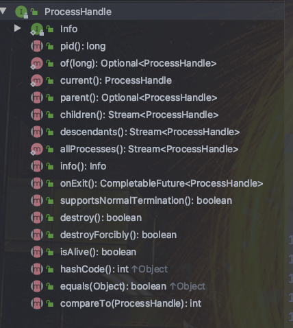