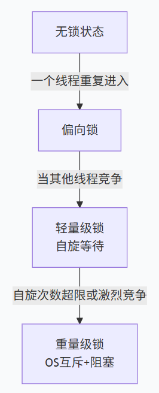

# synchronized锁升级过程

## synchronized本质

synchronized的锁：偏向锁、轻量锁、重量级锁

JDK1.6会提升线程锁的性能和效率，加入了锁升级特性，锁升级的本质其实就是能不加锁就不加锁，能不阻塞就不阻塞，以提升程序执行的效率。

* 偏向锁
当一个线程进入同步代码块时，synchronized会由无锁状态转向偏向锁状态，CAS会在对象头MarkWord（synchronized标示的持有资源处）创建标记锁对象为当前进入线程的ID，下次重新进来也不需要标记，直接放行

* 轻量锁（自旋锁）
当一个线程在进入对象头且未释放锁时，又有另一个线程进入，会在自己的线程栈帧生成锁记录（Lock Record），用CAS尝试把对象头指向自己的记录，此时抢不到时会自旋（循环重试）不进入阻塞。多个线程交替时以此机制类推
注：循环重试代表仍然消耗CPU资源，但是阻塞的意思表示放开CPU占用，直接等待。（既然自旋需要消耗CPU资源，为什么还要锁升级呢，因为阻塞时线程的唤醒开销比自旋的大）

简要概述：轻量锁靠CAS+自旋+不阻塞线程+循环重新抢锁

* 重量级锁（OS互斥）
自旋的次数是有限制，一直抢不到锁，此时锁会升级操作系统级的互斥锁，抢不到的线程会直接进入阻塞，CPU不再空转，但是线程唤醒开销大

## 锁能降级吗？

锁不能降级，JVM认为如果锁升级，那说明竞争一直存在。但是当前最后一个线程不再持有锁时，锁会被撤销，当一个新的线程重新进入时会在对象头创建一个全新的锁，进入新生命周期（进入新锁升级过程），所以大家不要进入误区，以为升级了，JVM永远处于高消耗状态

## 轻量锁是根据什么条件升级到OS互斥锁的？

答案是没有一个固定的数值，没有固定说自旋次数多少时会升级到OS互斥锁，但是JDK1.6之前，其实是是固定自旋次数为10，超时10次会升级为OS互斥锁
## 锁升级的过程

