# 参考资料
《51单片机C语言程序设计经典实例》——陈志平著

 
# keil的下载
 
直接到官网下载，但是注意，如果未认证的的授权，只编写的程序无法超过100k，但是作为初学者应该是够用的。

[https://www.keil.com/](https://www.keil.com/)


这里多个各类的keil IDE，可以只下载C51的


这里需要填写相关信息，不必是真实信息然后点击submit即可


打开安装包安装到相应的位置即可


# 创建工程编写程序

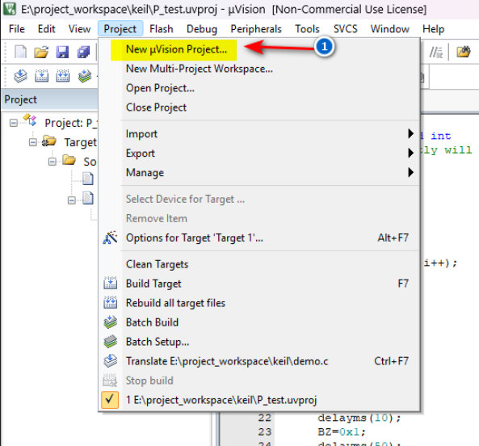

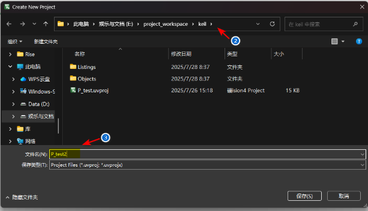

接下来会弹出一个新工作空间，还有一个弹窗，这里需要注意了keil中是没有STC单片机的型号的，但是可以将其当作Intel公司的8052/87 C 52/87 C 54/87 C 58，或者Atmel公司的AT89C/5152/55/55WD等，或者NXP公司的P87C52/087C54/P87C58/P87C51RD+就可以，**我这里的选择的是AT89C51RC**（据说STC51单片机是MCS-51单片机的派生产品，是中国本地企业的完全自主版权，而keil是外国企业开发的IDE，STC51在国外使用不多，并没有集成在keil类型中）

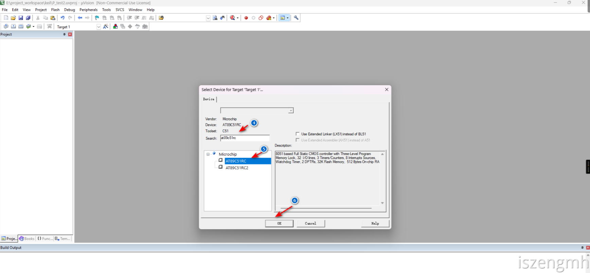

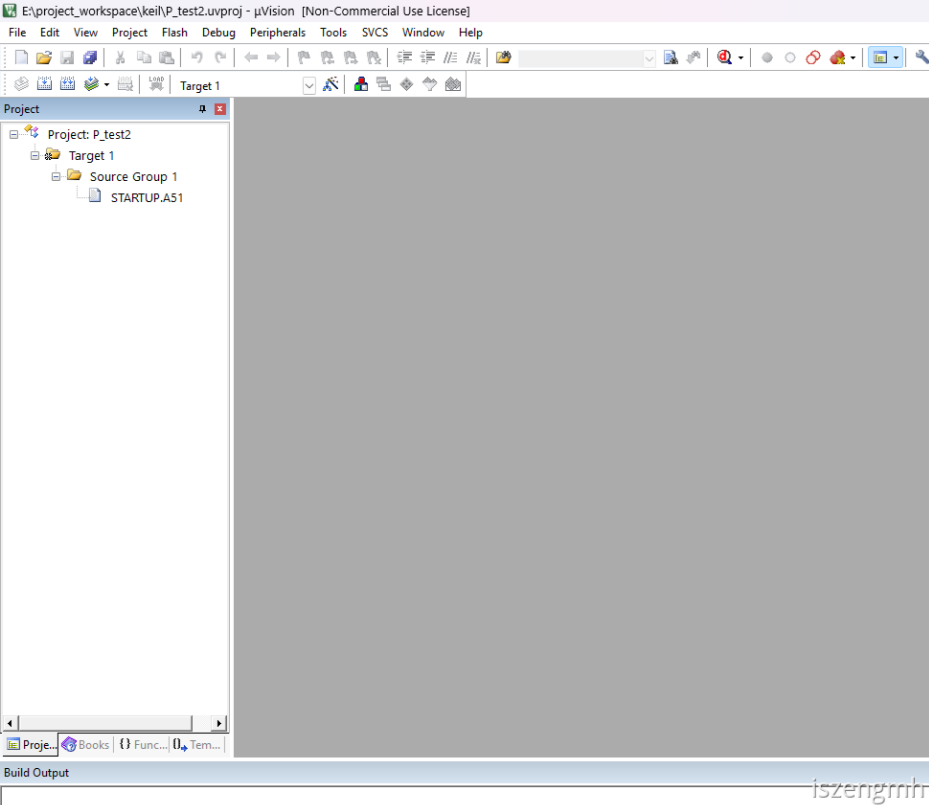

# 新建程序文件
 
 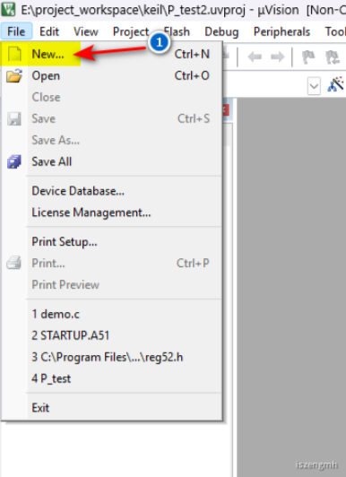

并复制以下程序在文件中，可能有中文乱码，请将中文删除

```c
#include "reg52.h"
#define uint unsigned int
//sbit是51单片机封装的类型，是可寻地址位，也就是当前赋值给某一个变量时，其实引用寄存器地址，所以你会看到下面直接的赋值会对直接实现操作电压
//LED灯，我的单片机总共3 四个LED，可编程有三个，P3^5\P3^6\P3^7分别对应了D1,D2,D3的LED灯
sbit BZ=P3^7;
//P2^0代表P2.0这个引脚，申明一个变量并P2^0赋值，代表key引用了P2.0的寄存器地址，我的P2.0引脚连接了可编程按钮k1
sbit key=P2^0;

//粗略的延时函数
void delayms(uint ms)
{
    uint i;
    while(ms--)
    {
        for (i=0; i<120; i++);
    }
}

void main(void)
{
    while(1)
    {
        //当key等于0时，二进制0代表逻辑低电压,说明P2.0的按钮被按下，此时D3的LED灯会闪烁，长按还会一直闪烁
        if(key==0)
        {
            BZ=0x0; //赋值二进制0，代表输出低电平，LED灯会亮
            delayms(10);
            BZ=0x1;//赋值二进制1，代表输出高电平，LED灯会熄灭，由于有延时函数的关系，LED表现为闪烁现象
            delayms(50);
            P3=0xFF;//0xFF是十六进制，代表八位二进制为“11111111”，由于1代表高电平，说明这里表示将P3所有的引脚输出为高电平，如果有相应可编程元件还会有相应效果，因为我的D1,D2,D3是在P3.5、P3.6和P3.7上，此三个LED无论之前的状态如何，此时都会表现为熄灭的状态
        }
        else
        {
            P3= ~P3;//因为每个P的端口有8位，所以~P3是将P3的8位二进制取反值，二进制可能表现为“00000000”或者“11111111”，由于在循环里面，循环反复取反值会表现为D1,D2,D3不停地闪烁
            delayms(500);
        }
    }
}

```
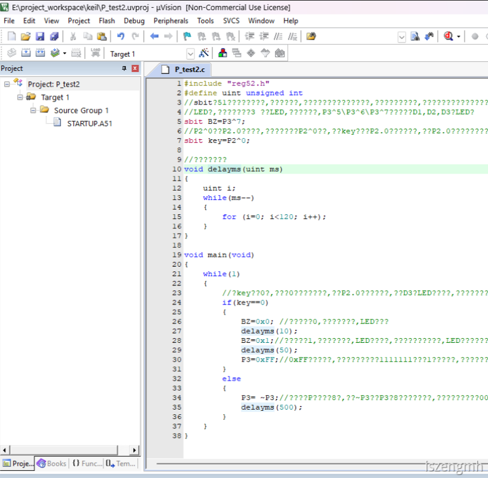

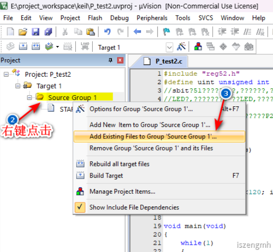

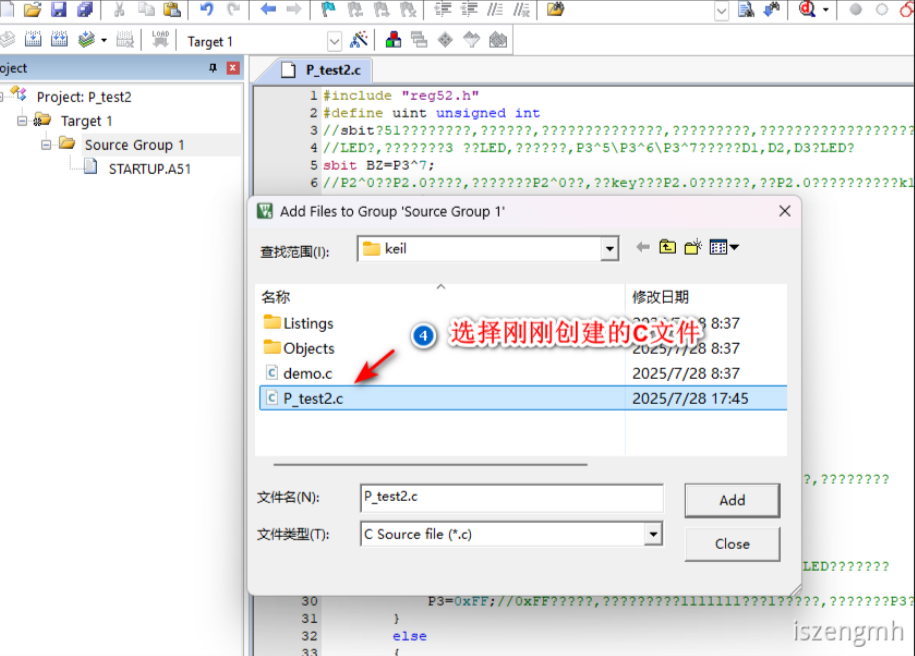

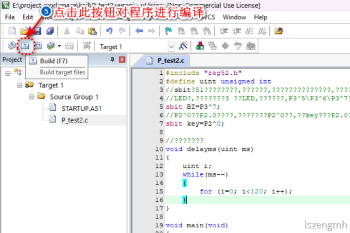

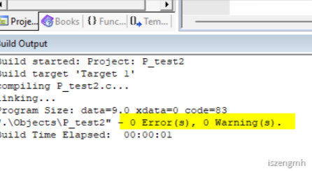

# HEX文件的生成
 
HEX是用于下载到单片机的文件格式，所以必须设置并生成

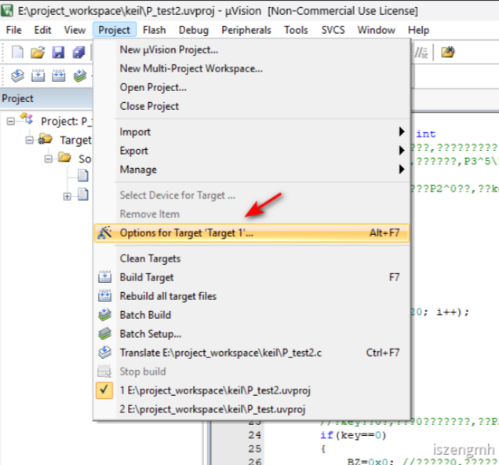

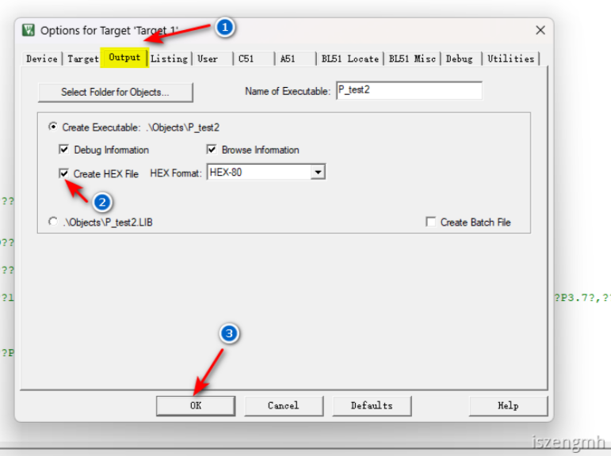


重新点击编译，你会发现日志已经有提示成功创建HEX文件

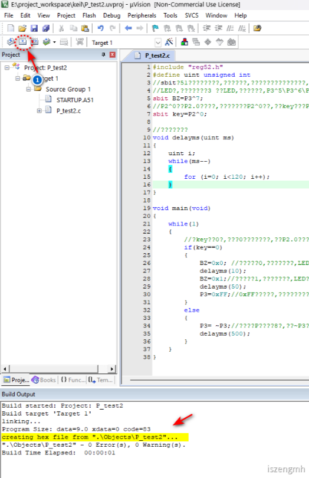

# debug运行
 
 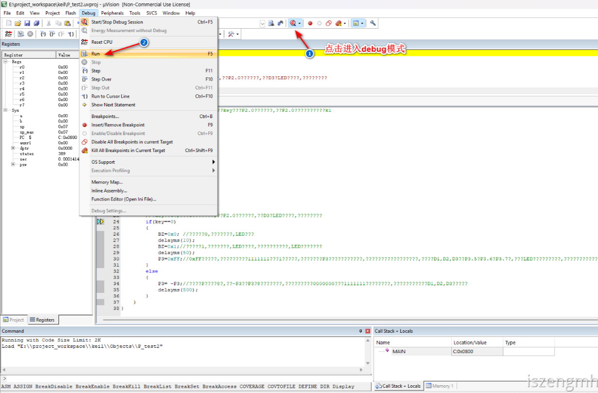

即可在debug模式中运行


