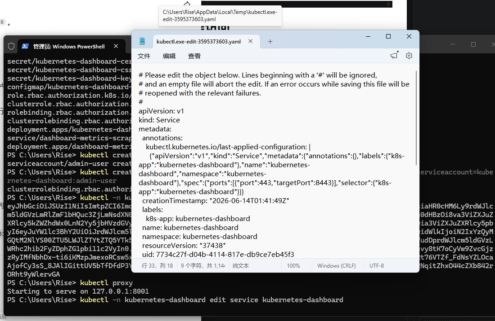

# kubernetes之如何创建dashboard可视化管理界面

## deploy kubernetes-dashboard

```bash
kubectl apply -f https://raw.githubusercontent.com/AliyunContainerService/k8s-for-docker-desktop/master/kubernetes-dashboard.yaml
```

这个文件是 denverdino/k8s-for-docker-desktop 项目中的一个核心配置文件。它的主要作用是帮助国内用户快速部署 Kubernetes Dashboard，核心价值是解决了官方镜像因网络问题无法下载的痛点。

## 创建管理员账号

```bash
kubectl create serviceaccount admin-user -n kubernetes-dashboard
kubectl create clusterrolebinding admin-user-binding --clusterrole=cluster-admin --serviceaccount=kubernetes-dashboard:admin-user
```
## 获取登录令牌

```bash
kubectl -n kubernetes-dashboard create token admin-user
```

终端会生成类似的输出

```
PS C:\Users\Rise> kubectl -n kubernetes-dashboard create token admin-user
eyJhbGciOiJSUzI1NiIsImtpZCI6Imdfb05rUkhmVjlyLTFwNWIzcUJHci1HZ2lXWXlLTDZoV0FwelJXaWI3SDAifQ.eyJhdWQiOlsiaHR0cHM6Ly9rdWJlcm5ldGVzLmRlZmF1bHQuc3ZjLmNsdXN0ZXIubG9jYWwiXSwiZXhwIjoxNzgxNDA0OTM3LCJpYXQiOjE3ODE0MDEzMzcsImlzcyI6Imh0dHBzOi8va3ViZXJuZXRlcy5kZWZhdWx0LnN2Yy5jbHVzdGVyLmxvY2FsIiwianRpIjoiNmIwYTlmMWUtNzUwZS00MTY4LWExYWQtYzQ1N2NhZjY4MWU0Iiwia3ViZXJuZXRlcy5pbyI6eyJuYW1lc3BhY2UiOiJrdWJlcm5ldGVzLWRhc2hib2FyZCIsInNlcnZpY2VhY2NvdW50Ijp7Im5hbWUiOiJhZG1pbi11c2VyIiwidWlkIjoiN2IxYzQyMGQtM2NlYS00ZTU5LWJlZTYtZTQ5YTk5NjJlOWNlIn19LCJuYmYiOjE3ODE0MDEzMzcsInN1YiI6InN5c3RlbTpzZXJ2aWNlYWNjb3VudDprdWJlcm5ldGVzLWRhc2hib2FyZDphZG1pbi11c2VyIn0.rKqnpMk_NU4TQ5Tt6SMZIzIMgVNpweBPApjBt1tJfDo7lL2NaZGY6U3bcjrNX4Pyjd8H-1hvy8tK7oCyVw9ZvcGjzzRyIMfNbhDx-ti6iKMzpJmexoRCsw5x5tMOF9tVaHaUM9EYPUnsVkkmgRAbJjKM8DapyCv8gJE4YQ8TxDt70PzZIukf58d0P5iUMSRt76VTZf_FdNsYZLOcaAjofCy3sS_8JAlIGittUV5bTfDfdP3YE8X5MsMpx2PyywIHNi1zC7NpT9PhbwVjVV18YGSbogKPkVPGRCVaMDWkUx6877e9Nfs5zqRNqitZhxO44cZXb842rORht9yWlervGA
```

## 用本地代理访问

```bash

kubectl proxy

```

命令输出会打印类似：
```
PS C:\Users\Rise> kubectl proxy
Starting to serve on 127.0.0.1:8001
```
直接浏览器访问`http://localhost:8001/api/v1/namespaces/kubernetes-dashboard/services/https:kubernetes-dashboard:/proxy/`即可


## 为了更方便地访问，使用NodePort形式

每次都要开启代理，非常麻烦，可以将dashboard的服务类型改变NodePort，这样就不用每次都执行 kubectl proxy 了。


### 编辑dashboard服务（docker k8s下这方法是失败的）

```bash
kubectl -n kubernetes-dashboard edit service kubernetes-dashboard
```

程序会立即打印一个编辑器，将` type: ClusterIP`改为` type: NodePort`，并退出编辑器



命令会监测到你退出了编辑，并读取你的修改内存，重新部署pod
```
PS C:\Users\Rise> kubectl -n kubernetes-dashboard edit service kubernetes-dashboard
service/kubernetes-dashboard edited
```


查看随机端口
```bash
kubectl get svc -n kubernetes-dashboard
```

会输出：
```
PS C:\Users\Rise> kubectl get svc -n kubernetes-dashboard
NAME                        TYPE        CLUSTER-IP      EXTERNAL-IP   PORT(S)         AGE
dashboard-metrics-scraper   ClusterIP   10.96.168.243   <none>        8000/TCP        175m
kubernetes-dashboard        NodePort    10.96.127.12    <none>        443:30569/TCP   175m
```

选择Type为NodePort的IP和443在浏览器访问


注意： docker k8s下这方法是失败的，似乎是docker中k8s和宿主机可能网络代理原因