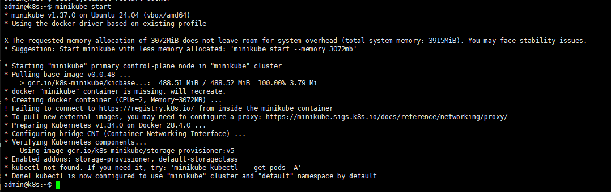

# 简述

首先要说的第一点是，生产环境和自己开发环境是不一样的，一般k8s是一个服务于集群的容器化技术，我们不可能在本地搭建多个节点的k8s，所以官方为了方便开发者学习和测试，开发一个叫minikube的安装软件，可用于安装本地的单节点的k8s。

# 安装命令

minikube 支持 Mac、Windows、Linux 这三种主流平台，你可以在它的官网（https://minikube.sigs.k8s.io）找到详细的安装说明，当然在我们这里就只用虚拟机里的 Linux 了。


英特尔和AMD的CPU应该是选择amd64的架构

```shell
curl -LO https://github.com/kubernetes/minikube/releases/latest/download/minikube-linux-amd64

sudo install minikube-linux-amd64 /usr/local/bin/minikube && rm minikube-linux-amd64

minikube start # 会自动摘取k8s的最新版本及相关依赖
```



还需要kubectl这个工具，这个必须要通过minikube作为前缀执行，第一次请执行任意一个命令，minikube会自动升级

```shell
admin@k8s:~$ minikube kubectl version
Client Version: v1.34.0
Kustomize Version: v5.7.1
Server Version: v1.34.0
```

# 报错解决

不过你大概会遇到下面这个，说是找不到kicbase可以直接镜像查查，是不是真的没有这个版本，k8s依赖kicbase，有可能k8s版本有，但是对应的kicbase没有，我的情况就这样，所以我直接开了代理，干脆从docker源直接下载

```
admin@k8s:~$ minikube start
* minikube v1.37.0 on Ubuntu 24.04 (vbox/amd64)
* Automatically selected the docker driver. Other choices: none, ssh

X The requested memory allocation of 3072MiB does not leave room for system overhead (total system memory: 3915MiB). You may face stability issues.
* Suggestion: Start minikube with less memory allocated: 'minikube start --memory=3072mb'

* Using Docker driver with root privileges
* Starting "minikube" primary control-plane node in "minikube" cluster
* Pulling base image v0.0.48 ...
* Downloading Kubernetes v1.34.0 preload ...
    > preloaded-images-k8s-v18-v1...:  124.30 MiB / 337.07 MiB  36.88% 3.95 MiB! minikube cannot pull kicbase image from any docker registry, and is trying to download kicbase tarball from github release page via HTTP.
! It's very likely that you have an internet issue. Please ensure that you can access the internet at least via HTTP, directly or with proxy. Currently your proxy configure is:

    > preloaded-images-k8s-v18-v1...:  337.07 MiB / 337.07 MiB  100.00% 3.58 Mi
    > kicbase-v0.0.48-amd64.tar:  500.00 MiB / 1.22 GiB  39.88% 1.68 MiB p/s 4m
E0922 10:03:33.249806    3383 cache.go:227] Error downloading kic artifacts:  failed to download kic base image or any fallback image
* Creating docker container (CPUs=2, Memory=3072MB) ...
! StartHost failed, but will try again: creating host: create: creating: setting up container node: preparing volume for minikube container: docker run --rm --name minikube-preload-sidecar --label created_by.minikube.sigs.k8s.io=true --label name.minikube.sigs.k8s.io=minikube --entrypoint /usr/bin/test -v minikube:/var gcr.io/k8s-minikube/kicbase:v0.0.48@sha256:7171c97a51623558720f8e5878e4f4637da093e2f2ed589997bedc6c1549b2b1 -d /var/lib: exit status 125
stdout:

stderr:
Unable to find image 'gcr.io/k8s-minikube/kicbase:v0.0.48@sha256:7171c97a51623558720f8e5878e4f4637da093e2f2ed589997bedc6c1549b2b1' locally
docker: Error response from daemon: Get "https://gcr.io/v2/": net/http: request canceled while waiting for connection (Client.Timeout exceeded while awaiting headers).
See 'docker run --help'.

* docker "minikube" container is missing, will recreate.
* Creating docker container (CPUs=2, Memory=3072MB) ...
* Failed to start docker container. Running "minikube delete" may fix it: recreate: creating host: create: creating: setting up container node: preparing volume for minikube container: docker run --rm --name minikube-preload-sidecar --label created_by.minikube.sigs.k8s.io=true --label name.minikube.sigs.k8s.io=minikube --entrypoint /usr/bin/test -v minikube:/var gcr.io/k8s-minikube/kicbase:v0.0.48@sha256:7171c97a51623558720f8e5878e4f4637da093e2f2ed589997bedc6c1549b2b1 -d /var/lib: exit status 125
stdout:

stderr:
Unable to find image 'gcr.io/k8s-minikube/kicbase:v0.0.48@sha256:7171c97a51623558720f8e5878e4f4637da093e2f2ed589997bedc6c1549b2b1' locally
docker: Error response from daemon: Get "https://gcr.io/v2/": net/http: request canceled while waiting for connection (Client.Timeout exceeded while awaiting headers).
See 'docker run --help'.


X Exiting due to GUEST_PROVISION: error provisioning guest: Failed to start host: recreate: creating host: create: creating: setting up container node: preparing volume for minikube container: docker run --rm --name minikube-preload-sidecar --label created_by.minikube.sigs.k8s.io=true --label name.minikube.sigs.k8s.io=minikube --entrypoint /usr/bin/test -v minikube:/var gcr.io/k8s-minikube/kicbase:v0.0.48@sha256:7171c97a51623558720f8e5878e4f4637da093e2f2ed589997bedc6c1549b2b1 -d /var/lib: exit status 125
stdout:

stderr:
Unable to find image 'gcr.io/k8s-minikube/kicbase:v0.0.48@sha256:7171c97a51623558720f8e5878e4f4637da093e2f2ed589997bedc6c1549b2b1' locally
docker: Error response from daemon: Get "https://gcr.io/v2/": net/http: request canceled while waiting for connection (Client.Timeout exceeded while awaiting headers).
See 'docker run --help'.

* 
╭─────────────────────────────────────────────────────────────────────────────────────────────╮
│                                                                                             │
│    * If the above advice does not help, please let us know:                                 │
│      https://github.com/kubernetes/minikube/issues/new/choose                               │
│                                                                                             │
│    * Please run `minikube logs --file=logs.txt` and attach logs.txt to the GitHub issue.    │
│                                                                                             │
╰─────────────────────────────────────────────────────────────────────────────────────────────╯

admin@k8s:~$ 

```

