# 参考链接
[Kubernetes 入门实战课——极客时间@罗剑峰](https://time.geekbang.org/column/article/529800)

[Kubernetes 文档 ——Kubernetes](https://kubernetes.io/zh-cn/docs/concepts/overview/#why-you-need-kubernetes-and-what-can-it-do)


# kubernetes优点

> + **服务发现和负载均衡**
>
> Kubernetes 可以使用 DNS 名称或自己的 IP 地址来暴露容器。 如果进入容器的流量很大， Kubernetes 可以负载均衡并分配网络流量，从而使部署稳定。
>
> + **存储编排**
>
> Kubernetes 允许你自动挂载你选择的存储系统，例如本地存储、公共云提供商等。
>
> + **自动部署和回滚**
>
> 你可以使用 Kubernetes 描述已部署容器的所需状态， 它可以以受控的速率将实际状态更改为期望状态。 例如，你可以自动化 Kubernetes 来为你的部署创建新容器， 删除现有容器并将它们的所有资源用于新容器。
>
> + **自动完成装箱计算**
>
> 你为 Kubernetes 提供许多节点组成的集群，在这个集群上运行容器化的任务。 你告诉 Kubernetes 每个容器需要多少 CPU 和内存 (RAM)。 Kubernetes 可以将这些容器按实际情况调度到你的节点上，以最佳方式利用你的资源。
>
> + **自我修复**
>
> Kubernetes 将重新启动失败的容器、替换容器、杀死不响应用户定义的运行状况检查的容器， 并且在准备好服务之前不将其通告给客户端。
>
> + **密钥与配置管理**
>
> Kubernetes 允许你存储和管理敏感信息，例如密码、OAuth 令牌和 SSH 密钥。 你可以在不重建容器镜像的情况下部署和更新密钥和应用程序配置，也无需在堆栈配置中暴露密钥。
>
> + **批处理执行** 除了服务外，Kubernetes 还可以管理你的批处理和 CI（持续集成）工作负载，如有需要，可以替换失败的容器。
> + **水平扩缩** 使用简单的命令、用户界面或根据 CPU 使用率自动对你的应用进行扩缩。
> + **IPv4/IPv6 双栈** 为 Pod（容器组）和 Service（服务）分配 IPv4 和 IPv6 地址。
> + **为可扩展性设计** 在不改变上游源代码的情况下为你的 Kubernetes 集群添加功能。
>


# 容器的发展

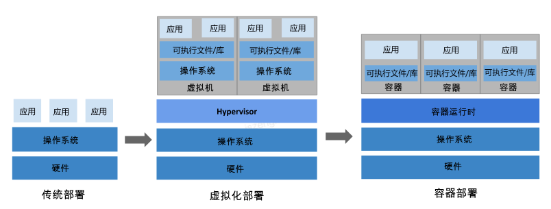


# kubernetes组件信息
## 组件关系（来源kubernetes官网）

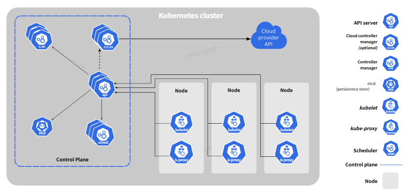

## 组件关系（来源极客时间）
### 示意图 

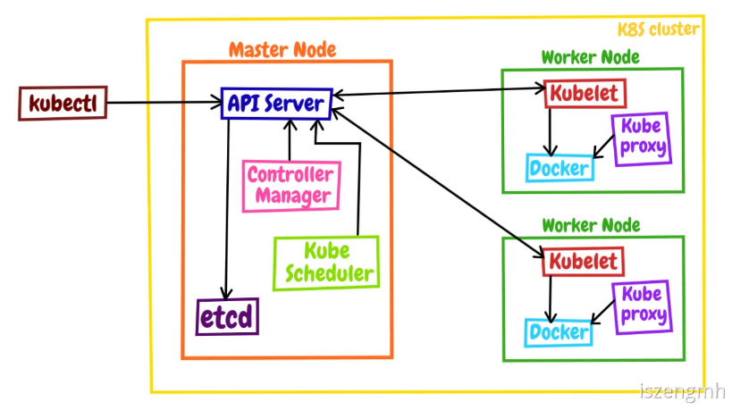

### 组件详情 

control-plane即是master node也可以成为你的work node，从图片中可以看到master node比其他节点要多几个component，分别是api server,controller manager,etcd,kube scheduler

而子节点只有kubelet, docker(其实应该叫container-runtime，因为k8s可以使用容器化技术不止一种，可以是containerd、CRI-O,docker 等),kube proxy

> 1. apiserver 是 Master 节点——同时也是整个 Kubernetes 系统的唯一入口，它对外公开了一系列的 **RESTful API**，并且加上了验证、授权等功能，所有其他组件都只能和它直接通信，可以说是 Kubernetes 里的联络员。
> 2. etcd 是一个高可用的分布式 **Key-Value 数据库**，用来持久化存储系统里的各种资源对象和状态，相当于 Kubernetes 里的配置管理员。注意它只与 apiserver 有直接联系，也就是说任何其他组件想要读写 etcd 里的数据都必须经过 apiserver。
> 3. scheduler **负责容器的编排工作**，检查节点的资源状态，把 Pod 调度到最适合的节点上运行，相当于部署人员。因为节点状态和 Pod 信息都存储在 etcd 里，所以 scheduler 必须通过 apiserver 才能获得。
> 4. controller-manager **负责维护容器和节点等资源的状态**，实现故障检测、服务迁移、应用伸缩等功能，相当于监控运维人员。同样地，它也必须通过 apiserver 获得存储在 etcd 里的信息，才能够实现对资源的各种操作。
>

以上四个conponent都被容器化了，可以通过以下命令查看状态

```shell
kubectl get pod -n kube-system
```

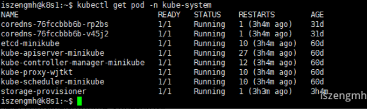

-n kube-system表示查询namespace为kube-system所属的容器

节点中的kubelet,container-runtime, kube-proxy

三个组件中只有kube-proxy，需要使用docker ps来查找其运行的状态

```shell
minikube ssh 
docker ps | grep kube-proxy
```

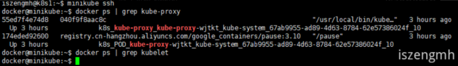


kubelet要查找它的运行状态的话，就只能在进入节点中，直接以查找进程的方式打印运行状态

```shell
minikube ssh 
ps -ef | grep kubelet
```

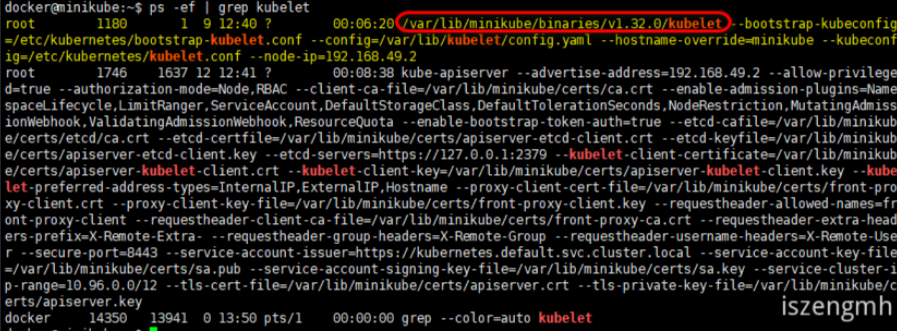

### 组件的交互模式

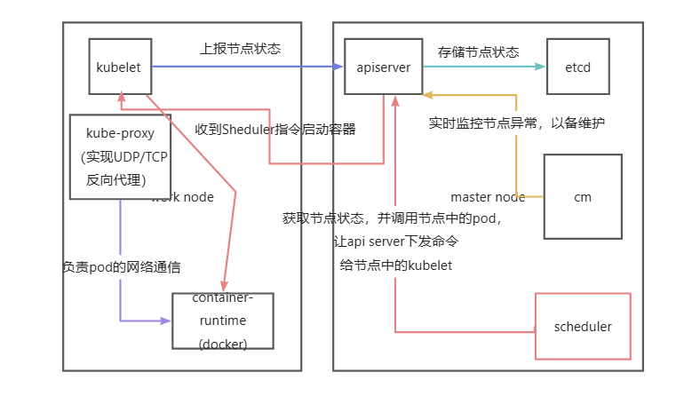

## 插件

插件中我个人认为比较重要的有两个：DNS 和 Dashboard。可以使用以下命令查看现有的插件

```shell
minikube addons list
```

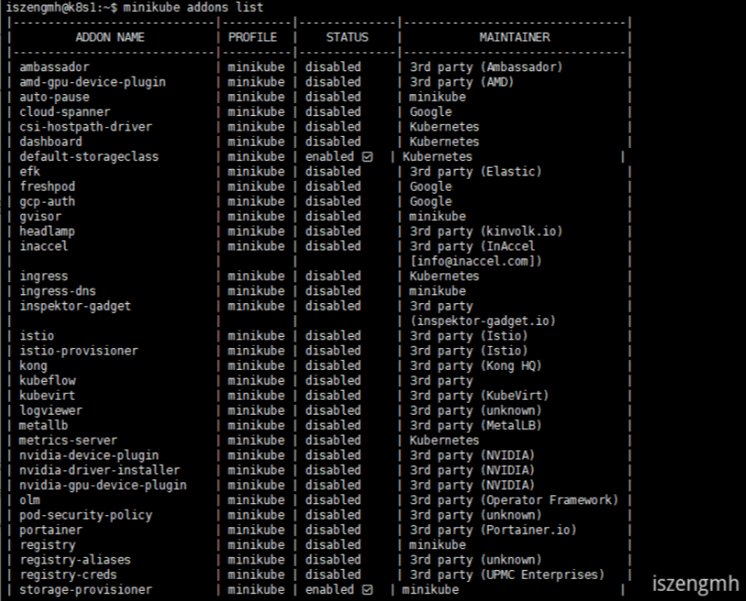


# minikube和kubectl的区别

Kubernetes 一般都运行在大规模的计算集群上，管理很严格，这就对我们个人来说造成了一定的障碍，好在 Kubernetes 充分考虑到了这方面的需求，提供了一些快速搭建 Kubernetes 环境的工具，在官网（https://kubernetes.io/zh/docs/tasks/tools/）上推荐的有两个：**kind** 和 **minikube**，它们都可以在本机上运行完整的 Kubernetes 环境。

kind 基于 Docker，意思是“Kubernetes in Docker”。它功能少，用法简单，也因此运行速度快，容易上手。不过它缺少很多 Kubernetes 的标准功能，例如仪表盘、网络插件，也很难定制化，所以我认为它比较适合有经验的 Kubernetes 用户做快速开发测试，不太适合学习研究。

不选 kind 还有一个原因，它的名字与 Kubernetes YAML 配置里的字段 kind 重名，会对初学者造成误解，干扰学习。再来看 minikube，从名字就能够看出来，它是一个“迷你”版本的 Kubernetes，自从 2016 年发布以来一直在积极地开发维护，紧跟 Kubernetes 的版本更新，同时也兼容较旧的版本（最多只到之前的 6 个小版本）。minikube 最大特点就是“小而美”，可执行文件仅有不到 100MB，运行镜像也不过 1GB，但就在这么小的空间里却集成了 Kubernetes 的绝大多数功能特性，不仅有核心的容器编排功能，还有丰富的插件，例如 Dashboard、GPU、Ingress、Istio、Kong、Registry 等等，综合来看非常完善。所以，我建议你在这个专栏里选择 minikube 来学习 Kubernetes。

minikube是k8s用来搭建k8s环境的，如果要操作k8s，还需要kubectl


不过每次调用kubectl都需要在前缀指定minikube命令

```shell
minikube kubectl
```


如果嫌麻烦可以使用 Linux 的“alias”功能，为它创建一个别名，写到当前用户目录下的 .bashrc 里，也就是这样：

```shell
alias kubectl="minikube kubectl --"
```

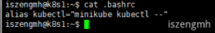

# 什么是api对象

其实就是k8s把一些对k8s的操作封装成的命令，命令执行后其实就是执行一些https api的操作。

使用以下命令就可以查询k8s里面所有的api对象

```shell

kubectl api-resources

```

# 如何使用dashboard管理kubernetes


有一些教程说是可以使用以下这个命令，但是我看官网说现在仅支持helm安装，我用这个命令确实也失败的

```batch
minikube dashboard
```

## 安装helm

执行后自动安装helm

```batch
curl -fsSL -o get_helm.sh https://raw.githubusercontent.com/helm/helm/main/scripts/get-helm-3
chmod 700 get_helm.sh
./get_helm.sh
```

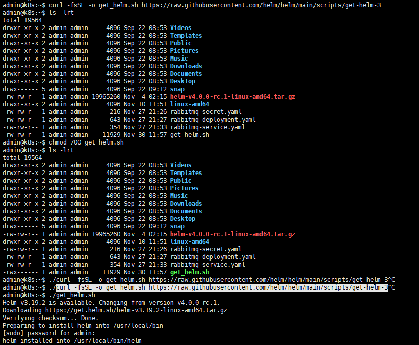

## 使用helm安装dashboard

```batch
# 添加一个官方的仓库
helm repo add kubernetes-dashboard https://kubernetes.github.io/dashboard/
# 指定仓库并安装dashboard
helm upgrade --install kubernetes-dashboard kubernetes-dashboard/kubernetes-dashboard --create-namespace --namespace kubernetes-dashboard
```

可能之前安装过一次不完整的，所以现在使用helm会报错，所以需要先执行一下

```batch
kubectl delete secret kubernetes-dashboard-csrf -n kubernetes-dashboard
```
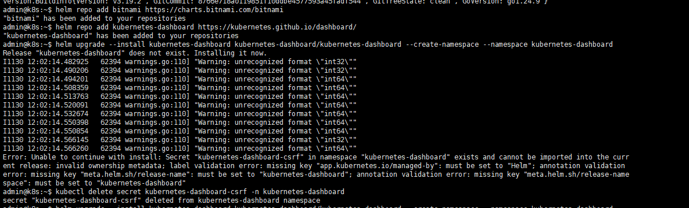

## 安装成功

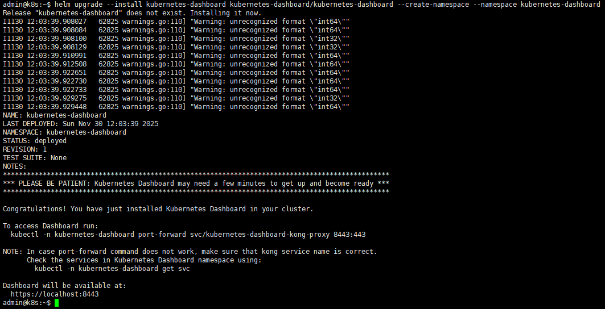


# 命令式和声明式

## 命令式和声明式
命令式，很多文章在描述这个太啰嗦了，我觉得就是即行执行一些命令。

声明式，就是把命令封装在一个yaml文件，方便项目的持续集成与部署，也就是yaml里面写项目应该要怎么编译、怎么部署、部署后要做什么。这种声明式的优点很明显，配置文件可以重复使用，还可以集成在一些持续集成与部署的软件中（例如jenkins），一键执行，yaml文本标记语言的格式及优点就不再介绍了。很系统或软件在配置文件方面都喜欢用yaml配置，这有它的优点。

下面是一个声明式的例子

```yaml

# 复杂的例子，组合数组和对象
Kubernetes:
  master:
    - apiserver: running
    - etcd: running
  node:
    - kubelet: running
    - kube-proxy: down
    - container-runtime: [docker, containerd, cri-o]

```

## 如何使用声明式

之前使用命令式是像这样子的

```

kubectl run ngx --image=nginx:alpine

```

但是我们也可以使用声明式，使用yaml文件来创建pod，像下面这么复杂的参数，使用命令式显然是不可能的。

```yaml

apiVersion: v1
kind: Pod
metadata:
  name: ngx-pod
  labels:
    env: demo
    owner: iszengmh

spec:
  containers:
  - image: nginx:alpine
    name: ngx
    ports:
    - containerPort: 80

```

那么如果用yaml这个配置文件来创建pod呢，可以用下面的命令

```

kubectl apply -f ngx-pod.yml
kubectl delete -f ngx-pod.yml

```

## 反向生成yaml文件

如果我们已经有一个pod，那么我们可以用这两个参数`--dry-run=client` 和 `-o yaml` 来反向生成yaml文件

```shell

kubectl run ngx --image=nginx:alpine --dry-run=client -o yaml

```

就会生成一个绝对正确的yaml文件

```yaml

apiVersion: v1
kind: Pod
metadata:
  creationTimestamp: null
  labels:
    run: ngx
  name: ngx
spec:
  containers:
  - image: nginx:alpine
    name: ngx
    resources: {}
  dnsPolicy: ClusterFirst
  restartPolicy: Always
status: {}

```

还可以升级一下写法，比如将参数定义成shell变量，这样遇到需要在shell里面复用参数时，就很方便
```shell

export out="--dry-run=client -o yaml"
kubectl run ngx --image=nginx:alpine $out

```


## 如何用yaml描述pod


* spec 节点下可以定义多个容器，每个容器都可以定义多个环境变量，每个容器都可以定义多个命令行参数
* imagePullPolicy 表示镜像拉取策略，可选值有Always、IfNotPresent、Never
* env 表示环境变量，从args的引用也可以看出，${}引用了这些环境变量
* command和args表示这个容器的启动命令，args表示这个容器的启动参数

```yaml

spec:
  containers:
  - image: busybox:latest
    name: busy
    imagePullPolicy: IfNotPresent
    env:
      - name: os
        value: "ubuntu"
      - name: debug
        value: "on"
    command:
      - /bin/echo
    args:
      - "$(os), $(debug)"

```

但是你如果直接引用上面yaml，就会报错，因为没有指定apiVersion和kind，报如下错误

error: error validating "busy-pod.xml": error validating data: [apiVersion not set, kind not set]; if you choose to ignore these errors, turn validation off with --validate=false

所以要加上，这样kubernetes可以识别这个yaml文件是用于做什么的

```yaml
apiVersion: v1
kind: Pod
metadata:
  name: busy-pod
  labels:
    env: demo
    owner: iszengmh
spec:
  containers:
  - image: busybox:latest
    name: busy
    imagePullPolicy: IfNotPresent
    env:
      - name: os
        value: "ubuntu"
      - name: debug
        value: "on"
    command:
      - /bin/echo
    args:
      - "$(os), $(debug)"

```

# Job/cronjob处理定时任务

## 临时任务 （普通的Job）

yaml中又要如何创建job呢？下面是几个必要的关键文件头部信息

* apiVersion 不是 v1，而是 batch/v1。
* kind 是 Job，这个和对象的名字是一致的。
* metadata 里仍然要有 name 标记名字，也可以用 labels 添加任意的标签。


如果记不住这些也不要紧，你还可以使用命令 `kubectl explain job` 来看它的字段说明。不过想要生成 YAML 样板文件的话不能使用 `kubectl run`，因为 `kubectl run` 只能创建 Pod，要创建 Pod 以外的其他 API 对象，需要使用命令 `kubectl create`，再加上对象的类型名。


```shell

export out="--dry-run=client -o yaml"
kubectl create job echo-job --image=busybox $out

```

上面的命令会输出下面的结果，我们可以将内容保存一下，再做一些修改

```yaml

apiVersion: batch/v1
kind: Job
metadata:
  creationTimestamp: null
  name: echo-job
spec:
  template:
    metadata:
      creationTimestamp: null
    spec:
      containers:
      - image: busybox
        name: echo-job
        resources: {}
      restartPolicy: Never
status: {}

```

修改后：

```yaml

apiVersion: batch/v1
kind: Job
metadata:
  name: echo-job

spec:
  template:
    spec:
      restartPolicy: OnFailure
      containers:
      - image: busybox
        name: echo-job
        imagePullPolicy: IfNotPresent
        command: ["/bin/echo"]
        args: ["hello", "world"]

```

`restartPolicy`可以加入运行失败时的策略，可选值有Always、OnFailure、Never

从上面的yaml就可以看出来和Pod有些相似，但是又有点不同，Job对象是一个任务，里面会定义一个template，Job对象又可以通过template创建或者管理Pod，

下面这个图可以辅助理解 

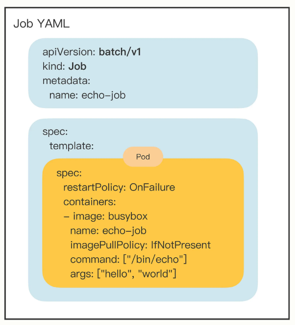


在kubernetes中操作job对象

```shell

kubectl apply -f job.yml

```

创建完成后，可以通过下面的命令分别查看Job和pod运行状态

```shell

kubectl get job
kubectl get pod

```

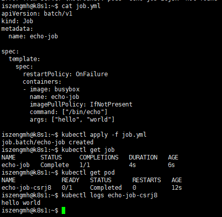

可以从图片中看到一个名字叫echo-job已经执行完成了，并且创建了一个echo-job-csrj8的pod

使用`kubectl logs echo-job-csrj8`可以看到pod正常地输出我们想要的结果


job当然还可以实现更多复杂的操作，就比如下面一些参数
* `activeDeadlineSeconds`，设置 Pod 运行的超时时间。
* `backoffLimit`，设置 Pod 的失败重试次数。
* `completions`，Job 完成需要运行多少个 Pod，默认是 1 个。
* `parallelism`，它与 completions 相关，表示允许并发运行的 Pod 数量，避免过多占用资源。
  
要注意这 4 个字段并不在 template 字段下，而是在 spec 字段下，所以它们是属于 Job 级别的，用来控制模板里的 Pod 对象。


下面我再创建一个 Job 对象，名字叫“sleep-job”，它随机睡眠一段时间再退出，模拟运行时间较长的作业（比如 MapReduce）。Job 的参数设置成 15 秒超时，最多重试 2 次，总共需要运行完 4 个 Pod，但同一时刻最多并发 2 个 Pod：

```yaml

apiVersion: batch/v1
kind: Job
metadata:
  name: sleep-job

spec:
  activeDeadlineSeconds: 15
  backoffLimit: 2
  completions: 4
  parallelism: 2

  template:
    spec:
      restartPolicy: OnFailure
      containers:
      - image: busybox
        name: echo-job
        imagePullPolicy: IfNotPresent
        command:
          - sh
          - -c
          - sleep $(($RANDOM % 10 + 1)) && echo done

```

可以看到实时打印pod的一些运行信息

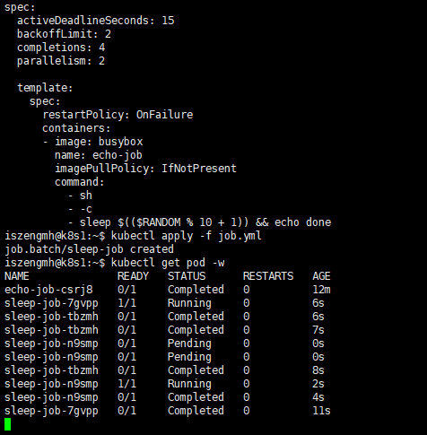


可以看最终的pod结果

```
iszengmh@k8s1:~$ kubectl get pod

NAME              READY   STATUS      RESTARTS   AGE
echo-job-csrj8    0/1     Completed   0          14m
sleep-job-7gvpp   0/1     Completed   0          90s
sleep-job-n9smp   0/1     Completed   0          83s
sleep-job-tbzmh   0/1     Completed   0          90s

```

## 定时任务 （cronjob）

cronjob的命令很长，k8s使用了`cj`来表示，这个可以通过`kubectl api-resources | grep cronjob` 查看相关的描述


```shell

export out="--dry-run=client -o yaml" # 定义Shell变量
kubectl create cj echo-cj --image=busybox --schedule="" $out

```


同样来一个小示例

```yaml

apiVersion: batch/v1
kind: CronJob
metadata:
  name: echo-cj

spec:
  schedule: '*/1 * * * *'
  jobTemplate:
    spec:
      template:
        spec:
          restartPolicy: OnFailure
          containers:
          - image: busybox
            name: echo-cj
            imagePullPolicy: IfNotPresent
            command: ["/bin/echo"]
            args: ["hello", "world"]


```

* 第一个 spec 是 CronJob 自己的对象规格声明
* 第二个 spec 从属于“jobTemplate”，它定义了一个 Job 对象。
* 第三个 spec 从属于“template”，它定义了 Job 里运行的 Pod。


所以cronJob的yaml结构大致如下 
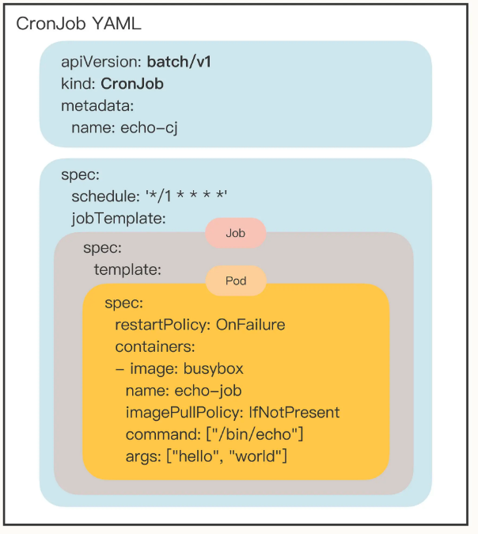


除了定义 Job 对象的`jobTemplate`字段之外，CronJob 还有一个新字段就是`schedule`，用来定义任务周期运行的规则。它使用的是标准的 Cron 语法，指定分钟、小时、天、月、周，和 Linux 上的 crontab 是一样的。像在这里我就指定每分钟运行一次，格式具体的含义你可以课后参考 Kubernetes 官网文档。
除了名字不同，CronJob 和 Job 的用法几乎是一样的，使用 kubectl apply 创建 CronJob，使用 `kubectl get cj`、`kubectl get pod `来查看状态：

```shell

kubectl apply -f cronjob.yml
kubectl get cj
kubectl get pod

```

# 常用命令

## 重启 docker

```shell

sudo systemctl daemon-reload
sudo systemctl restart docker

```

## 获取k8s的minikube的版本

```shell
minikube version
```

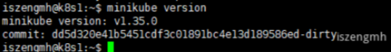

## 获取k8s的运行状态

```shell
minikube status
```

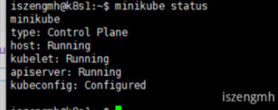

## 启动k8s

第一次启动也可以指定版本，k8s会自动下载搭建指定版本的k8s

```shell
minikube start --kubernetes-version=v1.23.3
```

```shell
minikube start
```


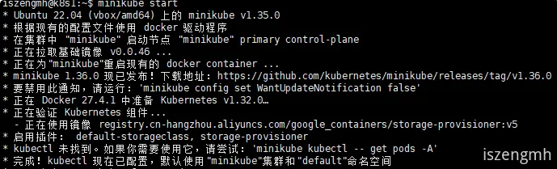

## 获取节点的状态

```shell
kubectl get node
```

version是当前集群中节点的版本，当roles为control-plane时说这是一个master节点

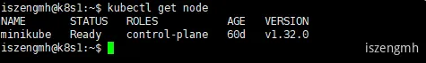


## 获取所有节点的信息

```shell
minikube node list
```

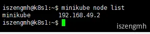


## 进入minikube内部的容器

minikube ssh 可以进入master node

```shell
minikube ssh 
```

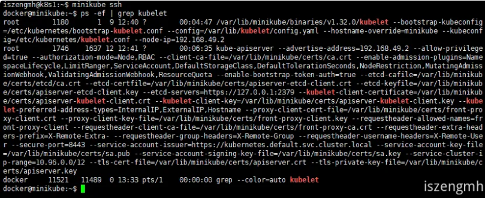

## 查询minikube中的插件

```shell
minikube addons list
```


## pod 管理

```shell

# 1. 查看事件（最重要）
kubectl describe pod ngx-pod -n <namespace>

# 2. 查看当前日志
kubectl logs ngx-pod -n <namespace>

# 3. 查看上一次崩溃的日志
kubectl logs ngx-pod -n <namespace> --previous 

# 4. 尝试进入容器（如果能运行）
kubectl exec -it ngx-pod -n <namespace> -- sh 

# 5. 删除 Pod 重新创建（有时能触发新日志）
kubectl delete pod ngx-pod -n <namespace>

# 实时观察pod的运行状态
kubectl get pod -w -n <namespace>

# 查看Deployments 详细
kubectl describe deployments -n <namespace>

# 查看Deployments 状态
kubectl get deployments -n devops-tools

# 查看所有pod时，并显示所属的节点是哪个
kubectl get pods -n devop-tools -o wide

# C:\Users\Rise>kubectl get pod jenkins-555fdb57b5-2zw42 -n # devops-tools -o wide
# NAME                       READY   STATUS    RESTARTS   AGE    IP           NODE             NOMINATED NODE   READINESS GATES
# jenkins-555fdb57b5-2zw42   1/1     Running   0          78m    10.244.1.6   desktop-worker   <none>           <none>


# 进入指定的pod
kubectl exec -it jenkins-555fdb57b5-2zw42 -n devops-tools -- /bin/bash

# 删除服务
kubectl delete service <service name> -n <namespace>
kubectl delete deployment <deployment name> -n <namespace> # 注：删除deployment连带会把pod一起删除
kubectl delete pod <pod name> -n <namespace>
kubectl delete namespace <namespace> # 注：删除namespace会连带这个namespace下所有资源一起删除


#让宿主机直接映射pod的端口，仅限开发机测试使用
kubectl port-forward pod/<podname> -n <namespace> <外部端口>:<待映射的内部端口>
#示例
kubectl port-forward pod/jenkins-555fdb57b5-2zw42 -n devops-tools 8080:8080

```
