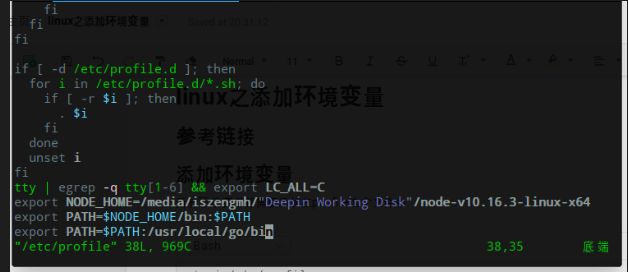

---

title: linux之添加环境变量
published: 2019-08-30 16:16:51
description: 'linux之添加环境变量'
image: ''
tags: [linux,操作系统]
category: 操作系统
draft: false 
lang: ''

---

# 添加环境变量
所有环境变量都需要添加在profile这个文件中

```bash
vi /etc/profile
```

在文件插入一行环境变量，例如下面这段环境变量，插入按esc，并输入:wq，即退出并保存 

```bash
export PATH=$PATH:/usr/local/go/bin
```



# 刷新环境变量

```bash
source /etc/profile
```
