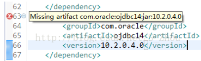
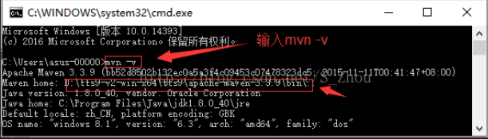
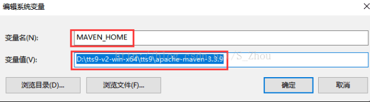
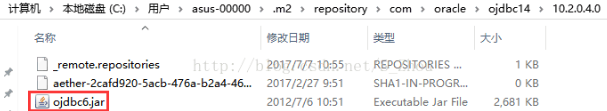
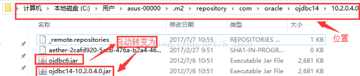
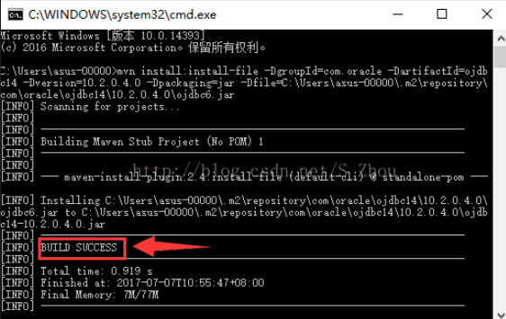

# 转载链接
[spring boot pom文件引入oracle依赖，具体方法——CSDN@gaoqiang1112](https://blog.csdn.net/gaoqiang1112/article/details/79482069)  

# **出现问题：**

  使用Maven管理项目时候，在【pom.xml】中会提示错误：Missing artifact com.[oracle](https://www.baidu.com/s?wd=oracle&tn=24004469_oem_dg&rsv_dl=gh_pl_sl_csd):ojdbc14:jar:10.2.0.4.0；如图所示

# **造成原因：**

   Oracle商业版权版权问题，Maven中央仓库没有这个资源

# **解决方法：**

   在Maven本地仓库添加Oracle.jar[驱动包](https://www.baidu.com/s?wd=%E9%A9%B1%E5%8A%A8%E5%8C%85&tn=24004469_oem_dg&rsv_dl=gh_pl_sl_csd)

（注解：Maven本地仓库位置，一般默认在C盘，如：C：用户>XXX用户名>.m2>repository>）

#  解决步骤：

    一、Maven环境变量

      先检查Maven环境变量是否配置好：【windows+R】->输入【cmd】打开命令窗口->输入【mvn -v】，如果有版本信息表示已经配置好，否则需配置

      配置Maven环境变量（前提：已经安装好JDK并配置好其环境变量）；

      1、【我的电脑】->【属性】->【高级系统设置】->【高级】->【环境变量】->【系统变量】->【新建】，新建系统环境变量MAVEN_HOME，并设置值为你安装的目录

      2、更新系统Path变量，添加 ;AVEN_HOME%\bin;

    二、安装Oracle驱动包到Maven本地仓库中

      1、下载ojdbc6.jar，复制到Maven本地仓库中

oracle官方驱动下载 

[http://www.oracle.com/technetwork/database/enterprise-edition/jdbc-112010-090769.html](http://www.oracle.com/technetwork/database/enterprise-edition/jdbc-112010-090769.html) 

需要登录 

[百度云下载](http://pan.baidu.com/s/1pLEoY9t)

      2、打开命令窗口，输入：

      mvn install:install-file -DgroupId=com.oracle -DartifactId=ojdbc14 -Dversion=10.2.0.4.0 -Dpackaging=jar -Dfile=C:\Users\asus-00000\.m2\repository\com\oracle\ojdbc14\10.20.4.0\ojdbc6.jar （红色固定，绿色为你安装位置）

这里多说一嘴,也不知道什么时候起  我们习惯把我们的repository库放在d盘跟目录下   这个安装语句 有2个要注意的地方  1个是绿色部分我们要换成自己ojdbc6.jar所存放的位置 另一个是 这个语句默认会将我们调整后的10.2.0.4.0放到电脑默认的库位置,也就是我绿色的部分  我的电脑是这样的 所以如果你放在了d盘的根目录下,并且你的项目中配置的maven也换成了你自己设定的地方,那么请去他转化后的地方将生成好的ojdbc14-10.2.0.4.0.jar复制到你的d盘里

        原先ojdbc6.jar会转化出新的ojdbc14-10.2.0.4.0.jar（如原先有这包要先删除才不会出现冲突），在命令窗口出现 BUILD SUCCESS 字样表示成功

    三、项目更新

      右键项目->【Maven】->【Update Project】->在Available Maven Codebases勾选要更新的项目->勾选Force Update of Sapshots/Releases->【OK】

