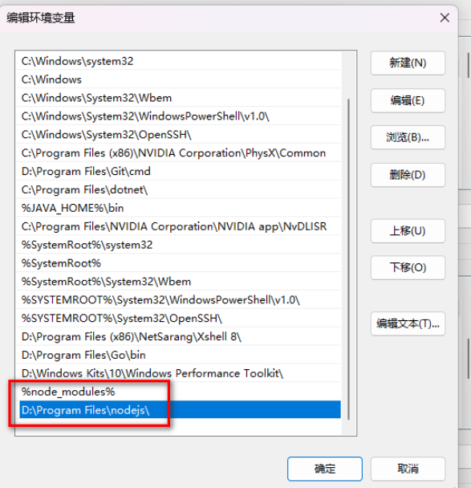
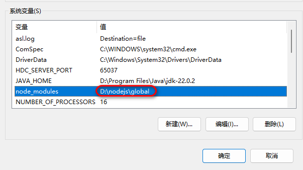
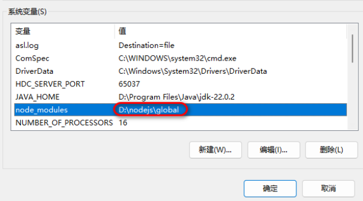

# 参考文章

[nodejs安装及npm全局模块路径的设置——segmentFault@归仓](https://segmentfault.com/a/1190000014919030)


# node 经验及配置
 


## node 环境变量及模块环境变量配置
 


**右键“我的电脑”——属性——高级——环境变量——修改“Path”**



环境变量可以直接输入路径，也可以用创建变量，用变量的形式插入到“Path”



node_modules环境变量很重要，很多人都有遇到一个用npm安装模块后，为什么模块定义命令无法在shell或者cmd中运行，会提示“not a command”，是因为需要手动配置环境变量。npm安装完后都在全局模块路径中"*.cmd"的文件




## 模块安装位置（即npm安装路径）
 


>  正常情况下，npm全局模块安装的存放路径是在你电脑C:\Users\你的电脑名称\AppData\Roaming\npm下的，以及cache路径是在你电脑的C:\Users\你的电脑名称\AppData\Roaming\npm-cache下的。
>
>  如果想要自己指定依赖包安装的位置可以先设置全局模块的存放路径和cache路径
>


```bash
npm config set prefix "D:\nodejs\global"
npm config set cache "D:\nodejs\cache"
```


