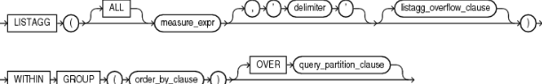
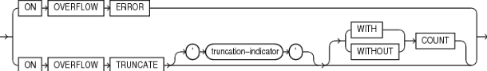
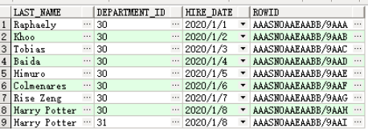
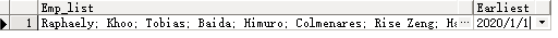

# 参考链接

[LISTAGG——Oracle](https://docs.oracle.com/en/database/oracle/oracle-database/18/sqlrf/LISTAGG.html#GUID-B6E50D8E-F467-425B-9436-F7F8BF38D466)

[<font style="color:#3194D0;">Oracle中replace函数的使用</font>](http://www.cnblogs.com/harvey888/p/5957656.html)<font style="color:#2F2F2F;">  
</font>[<font style="color:#3194D0;">Oracle round函数是什么意思?怎么运用?</font>](https://zhidao.baidu.com/question/14756835.html)<font style="color:#2F2F2F;">  
</font>[<font style="color:#3194D0;">oracle的nvl</font>](https://zhidao.baidu.com/question/552089573.html)<font style="color:#2F2F2F;">  
</font>[<font style="color:#3194D0;">Oracle 中 decode 函数用法</font>](http://www.cnblogs.com/vinsonLu/p/3512526.html)<font style="color:#2F2F2F;">  
</font>[<font style="color:#3194D0;">[oracle] to_date() 与 to_char() 日期和字符串转换</font>](http://www.cnblogs.com/gaojing/archive/2008/11/07/1328657.html)<font style="color:#2F2F2F;">  
</font>[<font style="color:#3194D0;">Oracle的Cast的用法</font>](http://blog.csdn.net/ziwen00/article/details/8685858)<font style="color:#2F2F2F;"> </font><font style="color:#2F2F2F;">  
</font>[<font style="color:#3194D0;">Oracle 大小写转换函数——博客园@Twang</font>](https://www.cnblogs.com/wangfuyou/p/6605166.html)


# 判断是否为数字


<!--more-->
```sql
# 注意只能判断纯数字，不带小数,判断带小数方式请查看下文“常用sql”创建函数

SELECT nvl2(translate('123','/1234567890','/'),'CHAR','NUMBER')   

FROM   dual ;
```


# add_months()日期增加，以月为单位


```sql
add_months(sysdate,12)--增加一年

add_months(sysdate,-12)--减去一年

sysdate+1 --加一天
```


# to_date()


```sql
to_date("要转换的字符串","转换的格式")

to_date(t.access_date,'yyyy-mm-dd hh24:mi:ss')--2005-12-25 13:25:59

TO_DATE('17-DEC-1980', 'DD-MON-YYYY','NLS_DATE_LANGUAGE=American')--日期语言
```


# replace替换字符


```sql
replace(原字段，'原字段旧内容','原字段新内容')--替换字符串
```


# round四舍五入


```sql
`round(number)``round(number, decimal_places )`

 

number ---需要四舍五入的数字

decimal_places ---从哪里开始四舍五入，此参数是下标，预设为0

 

select round(123.456, 0) from dual;     --- 123 
```


# nvl如果为空返回新值

```sql
nvl(字段名，'新的返回的值')

如果提供的字段的值为空，则将返回这个新值，注意：只是返回了这个值，并不是update到表中

 

 nvl(name,'小明')---name为空，返回小明
```


# decode逻辑判断简化


```sql
decode(条件,值1,返回值1,值2,返回值2,...值n,返回值n,缺省值)

 

该函数的含义如下：IF 条件=值1 THEN

　　　　RETURN(翻译值1)

ELSIF 条件=值2 THEN

　　　　RETURN(翻译值2)

　　　　......

ELSIF 条件=值n THEN

　　　　RETURN(翻译值n)ELSE

　　　　RETURN(缺省值)

END IF

decode(字段或字段的运算，值1，值2，值3）

 

该函数的含义如下：

 这个函数运行的结果是，当字段或字段的运算的值等于值1时，该函数返回值2，否则返回值3

 当然值1，值2，值3也可以是表达式，这个函数使得某些sql语句简单了许多
 注意：值2和值3的数据类型必须一致
```


# sys_guid()生成唯一32位字符串


```sql
sys_guid()
```


# CAST(expr AS type_name) 数值类型转换


```sql
--例

cast(R.MONTH as int)--将月份转换为整型类型
```


# 大小写转换


```sql
select UPPER('Test') as u from dual; --转大写

select LOWER('Test') as l from dual;--转小写
```


# 截取字符串


```sql
--截取身份证出生日期

to_date(substr('XXXXXXXXXXXXXXXXX',7,8),'YYYYMMDD')

--截取首个字符（从第一个字符开始截取）
substr(column,1,1)

-删除首个字符（从第二个字符开始截取）
 substr(column,2,length(column))
```


# 删除左右字符、添加左右字符


```sql
ltrim(原字符,'需要删除的字符')--删除左边字符

rtrim(原字符,'需要删除的字符')--删除右边字符

LPAD(原字符,'需要添加的字符') --添加字符在左边

RPAD(原字符,'需要添加的字符') --添加字符在右边--例

ltrim('abcdefg','abc')--删除左边abc，输出defg

ltrim('abqwert','abc')--删除左边ab，输出qwert

trim('字符')--删除字符串的左右空格

```


# listagg()列转行

## syntax



> + `ALL` 关键字是可选的，并且为了语义清晰提供的
> + `measure_expr` 是测量字段，可以是任何表达式。在测量字段中空值是被忽略的
> + 限定符限定字符是分隔测量列的值。这个子句是可选的，而且默认是`NULL`。如果`measure_expr` 的类型是`RAW`，则限定符类型必须是`RAW`。你可以通过指定一个限定符归类这个作为一个character字符串，character字符串可以被隐式地转换为`RAW`，或者明确地转换限定符为`RAW`，例如使用`UTL_RAW.CAST_TO_RAW`函数
> + `order_by_clause` 决定排序，在级联值被返回中排序。只有 `ORDER BY` 中的字段归类唯一排序时，函数是确定性。
>

If the measure column is of type `RAW`, then the return data type is `RAW`. Otherwise, the return data type is `VARCHAR2`.

如果测量字段类型是 `RAW` ,则返回的数据类型是`RAW` 。除此之外，返回的数据类型都是 `VARCHAR2` 。

## listagg_overflow_clause



**注：****oracle12 release 2以及早期版本可能不能这个特性，虽然****官方有在oracle12 release 2中说明了这个功能，stackoverflow上也说****oracle12 release 2可以使用这个特性（**[**oracle missing right parenthesis ON OVERFLOW TRUNCATE——Stackoverflow**](https://stackoverflow.com/questions/48832942/oracle-missing-right-parenthesis-on-overflow-truncate)**）但是我自己试过无法使用。**

> 当返回数据类型超过最大长度时，这个字句用于控制函数行为。
>
> ON OVERFLOW ERROR ：如果你指定这个子句，则函数返回ORA-01489 error。这是默认的。
>
> ON OVERFLOW TRUNCATE ：如果指定这个子句，则函数返回一个测量值截断list。
>
> 说明：
>
> + `truncation_indicator` 字符串被附加到一个测量值的截断list。如果你忽略这个子句，则truncation indicator 是一个省略号（…）
> + `measure_expr` 如果`measure_expr` 的类型是`RAW`，则truncation indicator 必须是`RAW`。你可以通过指定一个truncation indicator 归类这个作为一个character字符串，character字符串可以被隐式地转换为`RAW`，或者明确地转换truncation indicator 为`RAW`，例如使用`UTL_RAW.CAST_TO_RAW` 函数
> + 指定 `WITH` `COUNT` ，就相当于限定了返回值空间的大小，数据库会截断足够的值去适应允许的空间。
> + 指定`WITHOUT` `COUNT` ，数据库将从返回值忽略截断的数量，数据库为限定符和truncation indicator在返回值中截断足够的测量值到允许的空间。
> + 如果没有指定`WITH` `COUNT` 或者`WITHOUT` `COUNT` ，则默认为`WITH` `COUNT`
>

## 三种用法

> + 作为一个单集合聚合函数， `listagg` 操作所有行并且返回一个单行输出
> + 作为一个分组集合聚合，函数为通过 `group by` 定义的每个分组进行操作和返回一个单行输出
> + 作为一个分析函数，在`query_partition_clause`中`listagg` 区分查询结果集到基于一个或者多个表达式的分组
>

## 注意字符串的最大值

由于返回的数据类型开度是依赖于`MAX_STRING_SIZE` 这个初始化参数。当`MAX_STRING_SIZE` `=` `EXTENDED`，则VARCHAR2和RAW类型的最大长度为32767字节，当`MAX_STRING_SIZE` `=` `STANDARD`，则VARCHAR2为了4000 字节、RAW类型为2000字节。如果在返回数据类型中返回值合适，则当一个最终限定符确定时是不被包含的（A final delimiter is not included when determining if the return value fits in the return data type. ）

## 注意数据库版本兼容(listagg_overflow_clause)

[oracle missing right parenthesis ON OVERFLOW TRUNCATE——stackoverflow@Alex Poole](https://stackoverflow.com/questions/48832942/oracle-missing-right-parenthesis-on-overflow-truncate#answer-48833185)

> <font style="color:#242729;">The </font>[overflow clause](https://docs.oracle.com/en/database/oracle/oracle-database/12.2/sqlrf/LISTAGG.html#GUID-B6E50D8E-F467-425B-9436-F7F8BF38D466)<font style="color:#242729;"> was added in Oracle 12c release 2.</font>
>

<font style="color:#242729;">也就是说</font>listagg_overflow_clause<font style="color:#242729;">只支持</font><font style="color:#242729;">Oracle 12c release 2以上版本</font>

## quick started

[sql_demo](https://github.com/iszengmh/sql_demo/blob/master/oracle_aggregate_listagg.sql)

```sql
--这里可以很明显，用hire_date, last_name分组后，last_name合并结果，并用;分隔
SELECT LISTAGG(last_name, '; ')
         WITHIN GROUP (ORDER BY hire_date, last_name) "Emp_list",
       MIN(hire_date) "Earliest"
  FROM employees
  WHERE department_id = 30;
```






# **判断是否为数字**


```sql
# 注意只能判断纯数字，不带小数,判断带小数方式请查看下文“常用sql”创建函数

SELECT nvl2(translate('123','/1234567890','/'),'CHAR','NUMBER')   

FROM   dual ;
```


# **add_months()日期增加，以月为单位**


```sql
add_months(sysdate,12)--增加一年

add_months(sysdate,-12)--减去一年

sysdate+1 --加一天
```


# **to_date()**


```sql
to_date("要转换的字符串","转换的格式")

to_date(t.access_date,'yyyy-mm-dd hh24:mi:ss')--2005-12-25 13:25:59

TO_DATE('17-DEC-1980', 'DD-MON-YYYY','NLS_DATE_LANGUAGE=American')--日期语言
```


# **replace替换字符**


```sql
replace(原字段，'原字段旧内容','原字段新内容')--替换字符串
```


# **round四舍五入**


```sql
`round(number)``round(number, decimal_places )`

 

number ---需要四舍五入的数字

decimal_places ---从哪里开始四舍五入，此参数是下标，预设为0

 

select round(123.456, 0) from dual;     --- 123 
```


# **nvl如果为空返回新值**

<font style="color:#FFFFFF;"> </font>

```sql
nvl(字段名，'新的返回的值')

如果提供的字段的值为空，则将返回这个新值，注意：只是返回了这个值，并不是update到表中

 

 nvl(name,'小明')---name为空，返回小明
```


# **decode逻辑判断简化**


```sql
decode(条件,值1,返回值1,值2,返回值2,...值n,返回值n,缺省值)

 

该函数的含义如下：IF 条件=值1 THEN

　　　　RETURN(翻译值1)

ELSIF 条件=值2 THEN

　　　　RETURN(翻译值2)

　　　　......

ELSIF 条件=值n THEN

　　　　RETURN(翻译值n)ELSE

　　　　RETURN(缺省值)

END IF

decode(字段或字段的运算，值1，值2，值3）

 

该函数的含义如下：

 这个函数运行的结果是，当字段或字段的运算的值等于值1时，该函数返回值2，否则返回值3

 当然值1，值2，值3也可以是表达式，这个函数使得某些sql语句简单了许多
 注意：值2和值3的数据类型必须一致
```


# **sys_guid()生成唯一32位字符串**


```sql
sys_guid()
```


# **CAST(expr AS type_name) 数值类型转换**


```sql
--例

cast(R.MONTH as int)--将月份转换为整型类型
```


# **大小写转换**


```sql
select UPPER('Test') as u from dual; --转大写

select LOWER('Test') as l from dual;--转小写
```


# **截取字符串**


```sql
--截取身份证出生日期

to_date(substr('XXXXXXXXXXXXXXXXX',7,8),'YYYYMMDD')
```


# **删除左右字符、添加左右字符**


```sql
ltrim(原字符,'需要删除的字符')--删除左边字符

rtrim(原字符,'需要删除的字符')--删除右边字符

LPAD(原字符,'需要添加的字符') --添加字符在左边

RPAD(原字符,'需要添加的字符') --添加字符在右边--例

ltrim('abcdefg','abc')--删除左边abc，输出defg

ltrim('abqwert','abc')--删除左边ab，输出qwert

 

 

 

 

 
```


# **判断数字（创建函数）**


```sql
create or replace function isNumber(p in varchar2)return number

is

result number;begin

result := to_number(p);return 1;

exceptionwhen VALUE_ERROR then return 0;end;
```


导出表结构


```sql
SELECT B.TABLE_NAME     AS "表名",

       C.COMMENTS       AS "表说明",

       B.COLUMN_ID      AS "字段序号",

       B.COLUMN_NAME    AS "字段名",

       B.DATA_TYPE      AS "字段数据类型",

       B.DATA_LENGTH    AS "数据长度",

       B.DATA_PRECISION AS "整数位",

       B.DATA_SCALE     AS "小数位",

       A.COMMENTS       AS "字段说明"

  FROM ALL_COL_COMMENTS A, ALL_TAB_COLUMNS B, ALL_TAB_COMMENTS C

WHERE A.TABLE_NAME IN (SELECT U.TABLE_NAME FROM USER_ALL_TABLES U)

   AND A.OWNER = B.OWNER

   AND A.TABLE_NAME = B.TABLE_NAME

   AND A.COLUMN_NAME = B.COLUMN_NAME

   AND C.TABLE_NAME = A.TABLE_NAME

   AND C.OWNER = A.OWNER

   AND A.OWNER = 'PYE'ORDER BY A.TABLE_NAME, B.COLUMN_ID;
```


# **修改不符合的时间，修改年份和月份**

<font style="color:#FFFFFF;">-</font>


```sql
-- 更新有/的时间、有两个/的日期、月份为1位数的，改为两位数
-- select  (substr(t.stime,1,5)||'0'||substr(t.stime,6,length(t.stime))),substr(t.stime,1,5)||'0'||substr(t.stime,6,length(t.stime)),(length(substr(t.stime,0,7))-length(replace(substr(t.stime,0,7),'/',''))),t.stime,t.*,t.rowid From t_test_cc_all_b20181212 t where substr(t.stime,length(t.stime),length(t.stime)-1)='-'WHERE length(t.stime)<10 and  (length(t.stime)-length(replace(t.stime,'/','')))>=2 and  (length(substr(t.stime,0,7))-length(replace(substr(t.stime,0,7),'/','')))=2

update  t_test_cc_all_b20181212 t set t.stime=(substr(t.stime,1,5)||'0'||substr(t.stime,6,length(t.stime))) --where (length(t.stime)-length(replace(t.stime,'-',''))) =1WHERE length(t.stime)<10 and  (length(t.stime)-length(replace(t.stime,'/','')))>=2 and  (length(substr(t.stime,0,7))-length(replace(substr(t.stime,0,7),'/','')))=2

--更新有/的时间、有两个/的日期、年份为1位数的，改为两位数select (substr(t.stime,1,length(t.stime)-1)||'0'|| substr(t.stime,length(t.stime),1)), t.stime,t.*,t.rowid From t_test_cc_all_b20181212 t --where substr(t.stime,length(t.stime),length(t.stime)-1)='-'WHERE length(t.stime)<10 and  (length(t.stime)-length(replace(t.stime,'/','')))>=2 and   (length(substr(t.stime,length(t.stime)-1,2))-length(replace(substr(t.stime,length(t.stime)-1,2),'/','')))=1

update  t_test_cc_all_b20181212 t set t.stime=(substr(t.stime,1,length(t.stime)-1)||'0'|| substr(t.stime,length(t.stime),1)) --where (length(t.stime)-length(replace(t.stime,'-',''))) =1WHERE length(t.stime)<10 and  (length(t.stime)-length(replace(t.stime,'/','')))>=2 and   (length(substr(t.stime,length(t.stime)-1,2))-length(replace(substr(t.stime,length(t.stime)-1,2),'/','')))=1

 

--更新有/的时间、有两个-的日期、月份为1位数的，改为两位数select  (substr(t.stime,1,5)||'0'||substr(t.stime,6,length(t.stime))),t.stime,t.*,t.rowid From t_test_cc_all_b20181212 t --where substr(t.stime,length(t.stime),length(t.stime)-1)='-'WHERE length(t.stime)<10 and  (length(t.stime)-length(replace(t.stime,'-','')))>=2 and  (length(substr(t.stime,0,7))-length(replace(substr(t.stime,0,7),'-','')))=2

update  t_test_cc_all_b20181212 t set t.stime=(substr(t.stime,1,5)||'0'||substr(t.stime,6,length(t.stime))) --where (length(t.stime)-length(replace(t.stime,'-',''))) =1WHERE length(t.stime)<10 and  (length(t.stime)-length(replace(t.stime,'-','')))>=2 and  (length(substr(t.stime,0,7))-length(replace(substr(t.stime,0,7),'-','')))=2

--更新有-的时间、有两个-的日期、年份为1位数的，改为两位数select (substr(t.stime,1,length(t.stime)-1)||'0'|| substr(t.stime,length(t.stime),1)), t.stime,t.*,t.rowid From t_test_cc_all_b20181212 t --where substr(t.stime,length(t.stime),length(t.stime)-1)='-'WHERE length(t.stime)<10 and  (length(t.stime)-length(replace(t.stime,'-','')))>=2 and   (length(substr(t.stime,length(t.stime)-1,2))-length(replace(substr(t.stime,length(t.stime)-1,2),'-','')))=1

update  t_test_cc_all_b20181212 t set t.stime=(substr(t.stime,1,length(t.stime)-1)||'0'|| substr(t.stime,length(t.stime),1)) --where (length(t.stime)-length(replace(t.stime,'-',''))) =1WHERE length(t.stime)<10 and  (length(t.stime)-length(replace(t.stime,'-','')))>=2 and   (length(substr(t.stime,length(t.stime)-1,2))-length(replace(substr(t.stime,length(t.stime)-1,2),'-','')))=1

 

 
```


# 查看所有表空间及容量


```sql
SELECT DBF.TABLESPACE_NAME,
       DBF.TOTALSPACE "总量(M)",
       DBF.TOTALBLOCKS AS 总块数,
       DBF.TOTALSPACE-DFS.FREESPACE "使用量(M)",
       DBF.TOTALBLOCKS-DFS.FREEBLOCKS AS 使用块数,      
       DFS.FREESPACE "剩余总量(M)",
       DFS.FREEBLOCKS "剩余块数",
       (DFS.FREESPACE / DBF.TOTALSPACE) * 100 "空闲比例"
  FROM (SELECT T.TABLESPACE_NAME,
               SUM(T.BYTES) / 1024 / 1024 TOTALSPACE,
               SUM(T.BLOCKS) TOTALBLOCKS
          FROM DBA_DATA_FILES T
         GROUP BY T.TABLESPACE_NAME) DBF,
       (SELECT TT.TABLESPACE_NAME,
               SUM(TT.BYTES) / 1024 / 1024 FREESPACE,
               SUM(TT.BLOCKS) FREEBLOCKS
          FROM DBA_FREE_SPACE TT
         GROUP BY TT.TABLESPACE_NAME) DFS
 WHERE TRIM(DBF.TABLESPACE_NAME) = TRIM(DFS.TABLESPACE_NAME);
```


# oracle表空间不足时处理

表空间数据文件最大是32G，也就是说扩容最大为32G 

## 参考链接： 

[oracle 11g 导入数据库，表空间超过32G的解决办法——CSDN@冷静cc](https://blog.csdn.net/love_java_cc/article/details/52857363)    
[oracle 表空间不足解决办法大全——百度经验@javababy5](https://jingyan.baidu.com/article/48b37f8d6ca1eb1a646488dc.html)


## 第一，可能表空间还未达到最大扩容内存，但未设置自动扩容


```sql
--修改数据文件内存50m为当前数据文件的内存大小
alter database datafile 'D:\ORACLE\PRODUCT\ORADATA\TEST\USERS01.DBF' resize 50m;
--增加数据文件自动扩容功能,每次扩容为50m，最大不会超过32G
alterdatabase datafile 'D:\ORACLE\PRODUCT\ORADATA\TEST\USERS01.DBF' autoextend onnext 50m maxsize 32767m; 
```

## 第二，表空间数据文件已经达到32G，则可以通过增加数据文件方式


```sql
--USERS是你的表空间名，H:\IDE\oracle\oradata\orcl\USERS02.dbf可以改为你的任意地址，最好放在一起方便，
--每次扩容50m，最大32G
alter tablespace USERS  
add datafile 'H:\IDE\oracle\oradata\orcl\USERS02.dbf' size 50m 
autoextend on next 50m maxsize 32767m;
```