 

# **申明**

本文大部分资料来自《深入理解Oracle 12c数据库管理》，但是也有自己的个人观点，大家也去看这本书

# **简介**

	Oracle数据库已经是当今世界技术前沿了，因为它优点突出 

有以下优点：

(1) 拥有其他数据库系统所没有的表空间概念；

(2) 拥有真正的等级锁功能

(3) 拥有多版本数据功能，读写操作不会相互等待（我觉得是非常的好特性）

(4) 拥有更快的处理速度和更高的安全性；

(5) 拥有丰富的数据字典，易于DBA判断数据库的各种情况；

(6) 拥有非常简单明了的备份与恢复原理

(7) Oracle数据库可以启动到多个阶段，DBA可以在不同的情况下，通过启动到特定的阶段解决一些特殊问题

(8) Oracle可以跨越多种软、硬平台。


# **Oracle安装和创建(由于本文作者觉得linux太花费时间，故只有这部分讲解到linux)**

Oracle安装一般有两种，一种是图形界面的安装，另一种是无界面安装。建议是无界面，因为<font style="color:#FF0000;">图形界面在宽带不足情况下，可能出现加载远程界面慢的问题，而且不能自动化</font>。无界面可以依靠应答文件来安装。

##  **了解OFA标准**

OFA标准是指oracle的目录结构和文件名，然而大部分DBA（database manager数据库管理员简称DBA）都在一定程度上自定义了，以适应于不同的环境。


##  **库的高速缓存和数据字典的高速缓存**

 

### **库的高速缓存**

是用来存放你实际表的数据块的，如表TAB_A里实际存放的若干条数据记录，一般都<font style="color:#FF0000;">存放在用户的表空间里</font>。

 

 

### **数据字典的高速缓存**

用来存放表的定义，如表TAB_A，有几个字段，每个字段的类型、长度，表空间等，这类信息在你建表后会存放在系统表里，<font style="color:#FF0000;">都是在SYSTEM表空间下，ORACLE运行时，这些信息被装入数据字典高速缓存里。</font>

 

### **数据字典的意思是**

简单的说就和我们小学用的词典的目录一样  要查询个表的数据 首先要确认这个词典（数据库）中有这个词语（表）  吧

 

##  **安装oracle**

 

### **创建对应的权限的OS用户组**

我们需要linux上创建一些OS用户组，安装完oracle之后就可以为linuxOS用户组分配的相应的数据库操作权限，正常来说OS用户组（<font style="color:#FF0000;">注：用户和用户组是不一样的</font>）的创建是属于系统管理员（SA）的工作，但是大部分情况没有SA。

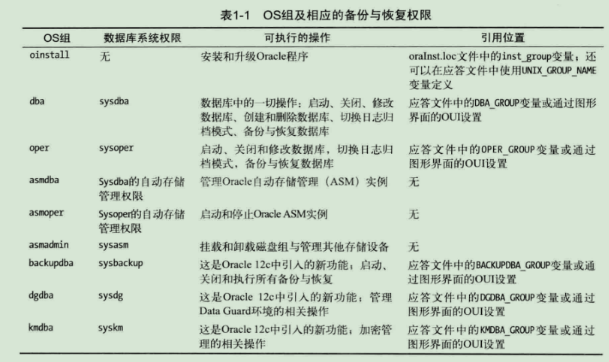

不必根据一字不差照搬组名，可以根据不一样环境来配置。

 

#### **运行linux命令，创建组**

我们只按照简单的功能来分组就好了，oinstall负责安装和卸载权限，dba具有完全操作权限，oper只具有数据库操作权限（包含一些删除表，创建表，修改等待权限 ）

<font style="color:#FF0000;">g</font><font style="color:#FF0000;">roupadd</font> oinstall

<font style="color:#FF0000;">g</font><font style="color:#FF0000;">roupadd</font><font style="color:#FF0000;"> </font>dba

<font style="color:#FF0000;">g</font><font style="color:#FF0000;">roupadd</font><font style="color:#FF0000;"> </font>oper

 

##### **查看创建的OS组**

<font style="color:#FF0000;">cat </font>/etc/group

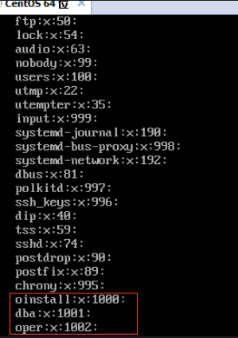

1000、1001、1002是我们组的ID

#### **创建用户并分配组**

<font style="color:#FF0000;">u</font><font style="color:#FF0000;">seradd </font><font style="color:#FF0000;">-u </font>500 <font style="color:#FF0000;">-g</font> oinstall <font style="color:#FF0000;">-G</font> dba , oper oracle

将组ID设置500(其他同事可能需要人执行相同的组ID来执行所有安装)

创建主属组为oinstall，创建副属组为dba,oper

<font style="color:#FF0000;">-g</font> 和<font style="color:#FF0000;">-</font><font style="color:#FF0000;">G</font>，分别是分配主属组和附属组的意思。

##### **查看用户信息**

<font style="color:#FF0000;">cat</font> /etc/passwd

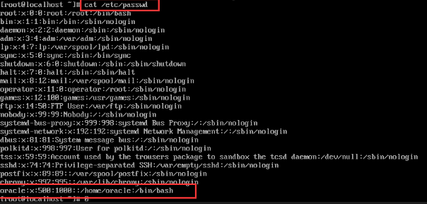
 

##### **删除修改用户，或者用户组**

修改删除用户组：<font style="color:#FF0000;">groupmod</font>、<font style="color:#FF0000;">groupdel</font>

修改删除用户：<font style="color:#FF0000;">usermod</font>、<font style="color:#FF0000;">userdel</font>

以上命令需要使用系统管理员登录

### **查看linux环境信息**

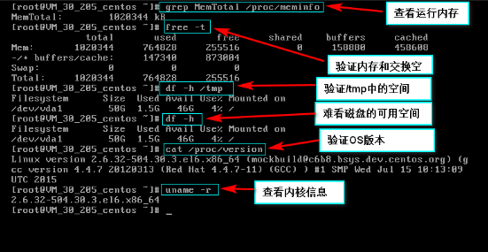

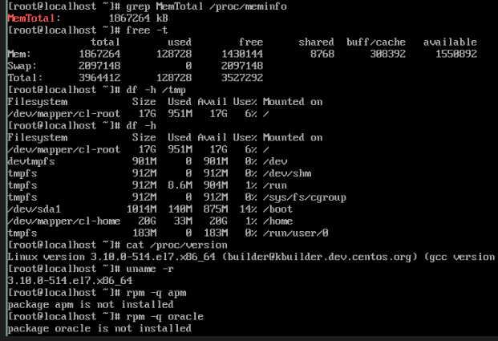

<font style="color:#FF0000;">grep MemTotal </font> /proc/meminfo

<font style="color:#FF0000;">free –t</font>

<font style="color:#FF0000;">df –h</font> /tmp

<font style="color:#FF0000;">df –h</font>

<font style="color:#FF0000;">cat</font> /proc/version

<font style="color:#FF0000;">uname –r</font>

<font style="color:#FF0000;"> </font>

<font style="color:#FF0000;">rpm –q </font><package name><font style="color:#FF0000;"> </font>查询是否已经安装必须的软件包

# **管理数据库**

 

##  **Sysdba数据库账号**

这个账号可拥有除了关闭数据库以外的所有操作权限

<font style="color:#FF0000;">as sysdba</font>作为系统管理员登录

##  **第一次操作数据库**

<font style="color:#FF0000;">s</font><font style="color:#FF0000;">tartup </font><font style="color:#FF0000;">onmount </font>启动后台进程并分配内存，此命令执行后，sql*plus会读取ORACLE_HOME/dbs中的初始化文件，<font style="color:#FF0000;">会使后台进程和内存区域初始化，这样你就拥有了o</font><font style="color:#FF0000;">racle</font><font style="color:#FF0000;">的实例，但是还没有数据库</font>

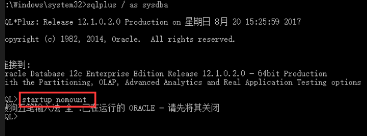

<font style="color:#FF0000;">oracle</font><font style="color:#FF0000;">实例</font>是指后台进程和内存区域，<font style="color:#FF0000;">oracle数据库</font>是指磁盘上的物理文件（数据文件、控制文件、联机重做日志文件）

##  **表空间**

### **查询TEMP临时表空间**

select*from database_properties where property_name='DEFAULT_TEMP_TABLESPACE';

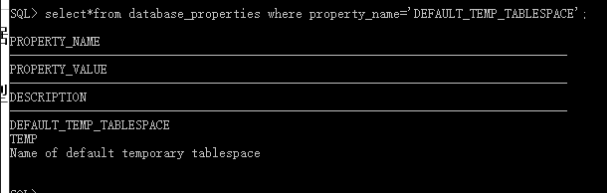

### **USER表空间**

select*from database_properties

where roperty_name='DEFAULT_PERMANENT_TABLESPACE';

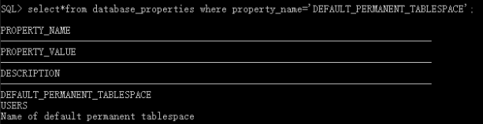
##  **连接标识**

### **Oracle 的OCI Driver 和 Thin Driver的区别**

有以下两种标识方式：

 

jdbc:oracle:<font style="color:#FF0000;">oci8</font>:@shdb

 

1）从使用上来说，<font style="color:#FF0000;">oci必须在客户机上安装oracle客户端或才能连接，而thin就不需要</font>，因此从使用上来讲thin还是更加方便，这也是thin比较常见的原因。   
2）原理上来看，thin是纯java实现tcp/ip的c/s通讯；而oci方式,客户端通过native java method调用c library访问服务端，而这个c library就是oci(oracle called interface)，因此这个oci总是需要随着oracle客户端安装（从oracle10.1.0开始，单独提供OCI Instant Client，不用再完整的安装client）   
3）它们分别是不同的驱动类别，oci是二类驱动， thin是四类驱动，<font style="color:#FF0000;">但它们在功能上并无差异。</font>

 

##  **查询实例名（SID）**

<font style="color:#657B83;">sqlplus / as sysdba</font>

<font style="color:#657B83;">show parameter instance_name</font>

 

# **Oracle 导入导出及连接**

##  **参考链接**

[<font style="color:#3194D0;">Oracle数据库导入导出命令总结</font>](http://blog.itpub.net/21614165/viewspace-766937/)<font style="color:#2F2F2F;">  
</font>[<font style="color:#3194D0;">sqlplus连接远程数据库</font>](http://blog.csdn.net/wildin/article/details/5850252)<font style="color:#2F2F2F;">  
</font>[<font style="color:#3194D0;">ORACLE的impdp和expdp命令</font>](http://www.cnblogs.com/wanghongyun/p/6307652.html)<font style="color:#2F2F2F;">  
</font>[<font style="color:#3194D0;">oracle expdp——红黑联盟</font>](https://www.2cto.com/database/201304/203709.html)

##  **exp 和imp导入导出**

### **导出命令 (exp)**

**格式：**


```shell
exp [用户名]/[密码]@[主机ip]:[端口号]/[SID/service] file=d:\zhpt.dmp full=n
```


<font style="color:#333333;">file</font><font style="color:#333333;">是导出路径</font><font style="color:#000080;">full</font><font style="color:#333333;">=n,</font><font style="color:#333333;">表示是否导出主机数据库上全部用户，</font><font style="color:#333333;">n</font><font style="color:#333333;">表示否，</font><font style="color:#333333;">y</font><font style="color:#333333;">表示是</font>

<font style="color:#FFFFFF;">exp</font><font style="color:#FFFFFF;"> abc/abc@</font><font style="color:#FFFFFF;">183.233.179.165</font><font style="color:#FFFFFF;">:</font><font style="color:#FFFFFF;">1521</font><font style="color:#FFFFFF;">/orcl file=d:\zhpt.dmp full=y</font>


如果密码出特殊符号，使用`"""`包裹，如果其他地址有特殊符号，需要用`\`转义，需要指定用户导出可以使用`owner`


```powershell
exp grz/"""g2011*)"""@19.129.180.19:1521/oracle file=gr20190410.dmp owner in \(\'gr\',\'jzs'\) full=n
```


### **导入数据库（imp）**


```powershell
# full 表示是否导出全部数据，一定要设置
# log 输出日志文件# fromuser 从哪一个用户导入
# touser 导入到哪个用户
# ignore=y buffer=100000000; 修改缓冲区大小，有时sql语句过长，会造成缓冲区空间不足
imp username/pwd@orcl file=d:\zhpt.dmp log=C:\data\logname.log full=y
# 或者
imp username/pwd@orcl file=E:\20171108.dmp fromuser=username touser= username log=D:\webBackend\kingzheng\住房保障系统\fszfbz201711191635.log full=n
# 或者
imp username/pwd@orcl file=d:\zhpt.dmp log=C:\data\logname.log full=y ignore=y buffer=100000000;
```

 

##  **expdp和impdp创建数据泵导入导出 **

### **需要先创建数据泵**

数据泵，说白了就是指定一个目录给oracle，但是oracle不会帮你创建的，需要自己先实际地创建


```sql
#  查看所有数据泵地址
select * from dba_directories;# 创建数据泵，数据泵地址即为你的导出导入地址文件地址
create directory myname as 'D:\temp\数据泵地址';# 授予权限 sshe这个用户可读可写
grant read,write on directory dpdata1 to sshe;

sql>--可以使用以下语句查看目录操作权限
sql>  SELECT privilege, directory_name, DIRECTORY_PATH FROM user_tab_privs t, all_directories d WHERE t.table_name(+) = d.directory_name ORDER BY 2, 1; 
```


**注意：**<font style="color:#2F2F2F;"> 数据泵地址以及文件dmp需要自己创建</font>

### **导出数据（expdp）**

<font style="color:#2F2F2F;">这种数据泵效率非常高，但是使用这种数据泵导出的数据，</font>**<u>一般情况下只在本机导出</u>**<font style="color:#2F2F2F;">，</font><font style="color:#2F2F2F;">需要用impdp导入</font>


```plain
rem my_dir是数据泵名称

rem exclude table:"in(表名,列名2，……)"不导出某些表

expdp test/test@orcl directory=my_dir dumpfile=my.dmp exclude=table:\"in \(\'DEPT\',\'EMP\'\)\" SCHEMAS=FSJSCX
```


### **Impdp**

<font style="color:#2F2F2F;">跟</font><font style="color:#C7254E;">expdp</font><font style="color:#2F2F2F;">的语法格式差不多</font>


```plain
 impdp test/test@orcl DIRECTORY=my_dir  DUMPFILE=my.dmp SCHEMAS=test logfile=%logfile%
```

<font style="color:#2F2F2F;"> </font>

#### **问题：**

##### **这些对象由 FSZJZ 导出, 而不是当前用户**


<font style="color:#2F2F2F;">导出是哪个用户，导入时用户也要相同，需要自己再创建一个用户</font>

 

##### **只有管理员用户，才可以导入**


##### **ora-28759 无法打开文件**

<font style="color:#2F2F2F;">以下这两句可能在不同的操作系统，支持不同，不太清楚，我服务器，两个都是sever2008，但是只有一个报这个错误，这个报错确实跟用户连接有关系，</font>**最好是采用second**

 

##  **sqlplus 远程连接数据库**

### **远程连接**


```plain
命令：sqlplus 用户名/密码@ip地址[:端口]/service_name [as sysdba]

示例：sqlplus sys/pwd@ip:1521/test as sysdba
```


### **常用命令**


```plain
SQL>set colsep' ';　　　　 //-域输出分隔符

SQL>set echo off;　　　　 //显示start启动的脚本中的每个sql命令，缺省为on

SQL> set echo on              //设置运行命令是是否显示语句

SQL> set feedback on;       //设置显示“已选择XX行”

SQL>set feedback off;　    //回显本次sql命令处理的记录条数，缺省为on

SQL>set heading off;　　 //输出域标题，缺省为on

SQL>set pagesize 0;　　    //输出每页行数，缺省为24,为了避免分页，可设定为0。

SQL>set linesize 80;　　   //输出一行字符个数，缺省为80

SQL>set numwidth 12;　    //输出number类型域长度，缺省为10

SQL>set termout off;　　   //显示脚本中的命令的执行结果，缺省为on

SQL>set trimout on;　　　//去除标准输出每行的拖尾空格，缺省为off

SQL>set trimspool on;　　//去除重定向（spool）输出每行的拖尾空格，缺省为off

SQL>set serveroutput on; //设置允许显示输出类似dbms_output

SQL> set timing on;          //设置显示“已用时间：XXXX”

SQL> set autotrace on;    //设置允许对执行的sql进行分析

SQL> set verify off;           //可以关闭和打开提示确认信息old 1和new 1的显示.
```


<font style="color:#2F2F2F;">导出结果到文本：</font><font style="color:#2F2F2F;">  
</font><font style="color:#C7254E;">spool<spool_flat_file></font><font style="color:#2F2F2F;">  
</font><font style="color:#2F2F2F;">例如：spool d:\Spool_flatquery.txt</font><font style="color:#2F2F2F;">  
</font><font style="color:#2F2F2F;">这样，SQL*Plus将把所有的输出以及在屏幕上的命令等都指定给该文件。</font><font style="color:#2F2F2F;">  
</font><font style="color:#2F2F2F;">执行查询输出。此时，系统并没有把结果保存到文件中，而是保存到缓冲区中。</font><font style="color:#2F2F2F;">  
</font><font style="color:#2F2F2F;">查询结束后，关闭文件即可。命令格式为：spool off。</font>

##  **oracle之jdbc连接oracle**

### **使用sid方式：**


```plain
jdbc:oracle:thin:@host:port:SID 

Example: jdbc:oracle:thin:@localhost:1521:orcl 
```


### **使用服务名方式**

<font style="color:#2F2F2F;">使用服务名的方式，这种格式是Oracle 推荐的格式，因为对于集群来说，每个节点的SID 是不一样的，但是SERVICE_NAME 确可以包含所有节点。</font>


```plain
jdbc:oracle:thin:@//host:port/service_name

Example:jdbc:oracle:thin:@//localhost:1521/orcl.city.com
```


### **使用TNSName **

<font style="color:#2F2F2F;">使用</font><font style="color:#2F2F2F;">TNSName </font><font style="color:#2F2F2F;">， 要实现这种连接方式首先要建立tnsnames.ora文件，然后通过System.setProperty指明这个文件路径。再通过上面URL中的@符号指定文件中的要使用到的资源。</font><font style="color:#2F2F2F;">  
</font><font style="color:#2F2F2F;">这种格式我现在水平几乎没见过，对于我来说用得到这种的情况并不多吧。当然既然是通过配置文件来读取指定资源肯定也可以直接将资源拿出来放在URL中，直接放在URL中的URL模版是下面这样的（tnsnames.ora这个文件中放的就是@符号后面的那一段代码，当然用文件的好处就是可以配置多个，便于管理）：</font>


```plain
jdbc:oracle:thin:@TNSName 

Example: jdbc:oracle:thin:@TNS_ALIAS_NAME

jdbc:oracle:thin:@(DESCRIPTION=(ADDRESS_LIST=(ADDRESS=(PROTOCOL= TCP)(HOST=hostA)(PORT= 1522))(ADDRESS=(PROTOCOL=TCP)(HOST=your host)(PORT=1521)))(SOURCE_ROUTE=yes)(CONNECT_DATA=(SERVICE_NAME=your service_name)))
```


# **Oracle obj（plsql中解释为对象）**

### **Function 函数**

 

### **Procedure 存储过程**

#### **参考链接**

[<font style="color:#3194D0;">Oracle创建存储过程、创建函数、创建包——博客园@helong</font>](https://www.cnblogs.com/helong/articles/2093807.html)<font style="color:#2F2F2F;"> </font><font style="color:#2F2F2F;">  
</font>[<font style="color:#3194D0;">ORACLE执行存储过程权限不足——CSDN@He之涅槃</font>](https://blog.csdn.net/u010109335/article/details/60577055)

 

#### **格式**


```plain
create or replace procedure procedure_name(Name in out type, Name in out type, ...) isbegin

  end procedure_name;
```


#### **示例**


```sql
--自动创建表格，并update数据

--dbms_output.put_line()需要先在command（命令行界面）“set serverout on ”打开输出

create or replace procedure update_qylxid_of_null_for_rygx

Authid Current_User

is

  v_date varchar2(8);--定义日期变量

  v_sql varchar2(2000);--定义动态sql

  v_tablename varchar2(20);--定义动态表名

  begin

   select to_char(sysdate,'yyyymmdd') into v_date from dual;--取日期变量

   v_tablename := 'T_'||v_date;--为动态表命名

   v_sql := 'create table '||v_tablename||'as select*from t_qy';--为动态sql赋值

   dbms_output.put_line(v_sql);--打印sql语句

   execute immediate v_sql;--执行动态sql

   v_sql:='update t_qy t set t.LXID=(select LXID from t_qy_qy lx where lx.bh=t.bh and lx.LX =t.dm) where  t.lxid is null';

   dbms_output.put_line(v_sql);--打印sql语句

   execute immediate v_sql;--执行动态sql

end update_qylxid_of_null_for_rygx;
```


#### **常见问题**

##### **ORACLE执行存储过程权限不足**

[<font style="color:#3194D0;">ORACLE执行存储过程权限不足——CSDN@He之涅槃</font>](https://blog.csdn.net/u010109335/article/details/60577055)


```plain
--需要增加Authid Current_User

--AUTHID DEFINER （定义者权限）：指编译存储对象的所有者。也是默认权限模式。

--AUTHID CURRENT_USER（调用者权限）：指拥有当前会话权限的模式，这可能和当前登录用户相同或不同(alter session set current_schema 可以改变调用者Schema)create or replace PROCEDURE 存储过程名称

Authid Current_User

IS 

BEGIN

 

……；

END;

 
```


### **Database link 数据库链接**

即在需要在两个不同的数据库中连接表或者查询数据时，可创建数据库链接

#### **如何使用**


```plain
--user_tables 是DBLINK_test所链接的用户的表

select * from user_tables@DBLINK_test;

--链接可以方便于多个数据库用户关联查询数据，非常方便,mytable 是你当前登录用户的表

select * from user_tables@DBLINK_test t,mytable t2 where t2.id=t.id;
```


#### **参考链接**

[<font style="color:#3194D0;">oracle中的database link如何使用——百度经验@wangzhiqing999</font>](#best-answer-746405041)

#### **oracle sql创建**


```plain

-- Drop existing old  database link --DBLINK_test是database link的名称drop database link DBLINK_test;-- Create new database link -- other_db 为用户名 pwd为密码create database link DBLINK_test

  connect to other_db IDENTIFIED BY  pwd

  using '(DESCRIPTION =

(ADDRESS_LIST =

(ADDRESS = (PROTOCOL = TCP)(HOST = 127.0.0.1)(PORT = 1521))

)

(CONNECT_DATA =

(SERVICE_NAME = orcl)

)

)';--查询 database link select * from dba_db_links;
```


<font style="color:#2F2F2F;">如果创建全局dblink，必须使用systm或sys用户，在database前加public</font>


```plain
create  public  database link DBLINK_test

  connect to other_db IDENTIFIED BY  pwd

  using '(DESCRIPTION =

(ADDRESS_LIST =

(ADDRESS = (PROTOCOL = TCP)(HOST = 127.0.0.1)(PORT = 1521))

)

(CONNECT_DATA =

(SERVICE_NAME = orcl)

)

)';
```


#### **通过plsql创建**

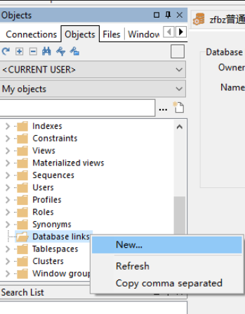

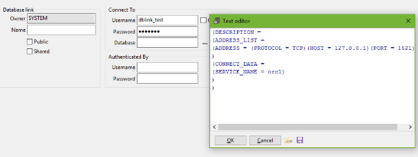
 


# **问题**

##  **oracle之违反唯一约束条件**

<font style="color:#2F2F2F;">出现这个原因，除了自己手动新增ID的情况外，还有就是引用自己创建的sequance，导入新表数据后，没有将新的sequance导入进来，可以将新sequance导入进来，也可以自动手动修改</font>

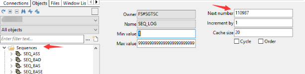

 

##  **修改字符集**

### **参考链接**

[<font style="color:#3194D0;">如何改oracle AL16UTF16为AL32UTF8——百度知道</font>](https://link.jianshu.com/?t=https://zhidao.baidu.com/question/134444813.html)

[<font style="color:#3194D0;">建库时AL16UTF16字符集怎么设置？——出处: ITPUB论坛－中国最专业的IT技术社区</font>](https://link.jianshu.com/?t=http://www.itpub.net/thread-505857-1-1.html%23pid3728655)

**操作：**


```plain
Microsoft Windows [版本 6.1.7601]

版权所有 (c) 2009 Microsoft Corporation。保留所有权利。

 

C:\Users\Administrator>sqlplus / as sysdba

 

SQL*Plus: Release 11.2.0.1.0 Production on 星期四 1月 11 12:00:49 2018

 

Copyright (c) 1982, 2010, Oracle.  All rights reserved.

 

 

连接到:

Oracle Database 11g Enterprise Edition Release 11.2.0.1.0 - 64bit Production

With the Partitioning, OLAP, Data Mining and Real Application Testing options

 

SQL> shutdown immediate

数据库已经关闭。

已经卸载数据库。

ORACLE 例程已经关闭。

SQL> startup mount

ORACLE 例程已经启动。

 

Total System Global Area 3290345472 bytes

Fixed Size                  2180224 bytes

Variable Size            2164263808 bytes

Database Buffers         1107296256 bytes

Redo Buffers               16605184 bytes

数据库装载完毕。

SQL> ALTER SYSTEM ENABLE RESTRICTED SESSION;

 

系统已更改。

 

SQL> ALTER SYSTEM SET JOB_QUEUE_PROCESSES=0;

 

系统已更改。

 

SQL> ALTER SYSTEM SET AQ_TM_PROCESSES=0;

 

系统已更改。

 

SQL> ALTER DATABASE OPEN;

 

数据库已更改。

 

SQL> ALTER DATABASE CHARACTER SET AL32UTF8;

ALTER DATABASE CHARACTER SET AL32UTF8

*

第 1 行出现错误:

ORA-12712: 新字符集必须为旧字符集的超集

 

 

SQL> ALTER DATABASE CHARACTER SET AL16UTF16;

ALTER DATABASE CHARACTER SET AL16UTF16

*

第 1 行出现错误:

ORA-12712: 新字符集必须为旧字符集的超集# ALTER DATABASE national CHARACTER SET AL16UTF16;

 

SQL> ALTER DATABASE character set INTERNAL_USE AL32UTF8;

 

数据库已更改。

 

SQL> SHUTDOWN IMMEDIATE;

数据库已经关闭。

已经卸载数据库。

ORACLE 例程已经关闭。

SQL> STARTUP

ORACLE 例程已经启动。

 

Total System Global Area 3290345472 bytes

Fixed Size                  2180224 bytes

Variable Size            2164263808 bytes

Database Buffers         1107296256 bytes

Redo Buffers               16605184 bytes

数据库装载完毕。

数据库已经打开。

SQL>
```


<font style="color:#C7254E;">ALTER DATABASE character set INTERNAL_USE AL32UTF8;</font><font style="color:#2F2F2F;">  
</font><font style="color:#C7254E;">INTERNAL_USE</font><font style="color:#2F2F2F;">有点像是强制修改，其他用户角色可能会报错</font>

### **其他问题**

#### **AL16UTF16不能作为character set**

<font style="color:#2F2F2F;">AL16UTF16 不能用做数据库的character set，只能用做national character set 。</font><font style="color:#2F2F2F;">  
</font><font style="color:#2F2F2F;">character set必须是single byte 7-bit ASCII或是单字节EBCDIC的子集，因此fixed width的多字节字符集(AL16UTF16)就不能做为character set。</font>

<font style="color:#2F2F2F;"> </font>

<font style="color:#2F2F2F;">你可以用如下这样用的：</font>


```plain
CHARACTER SET US7ASCII NATIONAL CHARACTER SET AL16UTF16

或是

CHARACTER SET zhs16cgb231280  NATIONAL CHARACTER SET AL16UTF16

 

 

 

 
```


##  **如何修改服务名service_name**

#### **转载链接**

[<font style="color:#3194D0;">如何修改 service_name</font>](https://link.jianshu.com/?t=https://www.2cto.com/kf/201311/259856.html)

#### **例：**

##### **service_name原有环境：**


```plain
sid： mynewdb

global_name：mynewdb

service_names： MYNEWDB

db_domain  ：

db_name：mynewdb
```


##### **需要修改如下：**


```plain
global_name：mynewdb

service_names： test

db_domain  ：

db_name：mynewdb
```


#### **方法：**

服务器端：

<font style="color:#C7254E;">alter system set service_names='test';</font>

这里采用静态注册，同时还要修改下 listener.ora


```plain
SID_LIST_LISTENER =

  (SID_LIST =

    (SID_DESC =

      (SID_NAME = PLSExtProc)

      (ORACLE_HOME =/u01/app/oracle/product/11.2.0/dbhome_1)

      (PROGRAM = extproc)

    )

        (SID_DESC=

        (GLOBAL_DBNAME = mynewdb)

        (ORALCE_HOME = /u01/app/oracle/product/11.2.0/dbhome_1)

        (SID_NAME = mynewdb)

        )

        (SID_DESC=

        (GLOBAL_DBNAME = test)  -------这个是需要添加

        (ORALCE_HOME = /u01/app/oracle/product/11.2.0/dbhome_1)

        (SID_NAME = mynewdb)    ------这个还是原来的实例名

        )

  )
```


<font style="color:#2F2F2F;">cmd下执行命令</font><font style="color:#C7254E;">lsnrctl reload</font>

<font style="color:#2F2F2F;">查看监听状态</font><font style="color:#C7254E;">lsnrctl status</font>

<font style="color:#FFFFFF;">L</font>


```plain
SNRCTL>

Connecting to (DESCRIPTION=(ADDRESS=(PROTOCOL=TCP)(HOST=10.80.11.202)(PORT=1521)))

STATUS of the LISTENER

------------------------

Alias                     LISTENER

Version                   TNSLSNR for [Linux](https://www.2cto.com/os/linux/): Version 11.2.0.1.0 - Production

Start Date                21-NOV-2013 00:09:35

Uptime                    0 days 20 hr. 30 min. 55 sec

Trace Level               off

Security                  ON: Local OS Authentication

SNMP                      OFF

Listener Parameter File   /u01/app/oracle/product/11.2.0/dbhome_1/network/admin/listener.ora

Listener Log File         /u01/app/oracle/diag/tnslsnr/oracle11g/listener/alert/log.xml

Listening Endpoints Summary...

  (DESCRIPTION=(ADDRESS=(PROTOCOL=tcp)(HOST=10.80.11.202)(PORT=1521)))

Services Summary...

Service "PLSExtProc" has 1 instance(s).

  Instance "PLSExtProc", status UNKNOWN, has 1 handler(s) for this service...

Service "mynewdb" has 1 instance(s).

  Instance "mynewdb", status UNKNOWN, has 1 handler(s) for this service...

Service "test" has 1 instance(s).

  Instance "mynewdb", status UNKNOWN, has 1 handler(s) for this service...

The command completed successfully
```


<font style="color:#2F2F2F;">可以看到新的 Service "test" 已经可以使用了</font>

<font style="color:#2F2F2F;">客户端配置：</font>

<font style="color:#FFFFFF;">net manager 配置 服务名为 </font><font style="color:#FFFFFF;">test</font><font style="color:#FFFFFF;"> ，ip为数据库服务器主机ip，相应端口。</font>

<font style="color:#2F2F2F;">测试连接：</font>


```plain
SQL>  conn sys/oracle@test as sysdba

已连接。

SQL>
```


<font style="color:#2F2F2F;">当然不使用静态注册，动态注册也可以</font>

 

##  **警告日志文件**

<font style="color:#2F2F2F;">不知道日志文件在哪的，可以使用这个命令</font>

<font style="color:#2F2F2F;">select value from v$diag_info where name='Diag Trace';</font><font style="color:#2F2F2F;">  
</font><font style="color:#2F2F2F;">以下是我的输出地址</font>


```plain
SQL> select value from v$diag_info where name='Diag Trace';

 

VALUE

--------------------------------------------------------------------------------

D:\FLYINGCLOUD\diag\rdbms\odb\odb\trace

 

 
```


# **开发工具配置及问题**

##  **Plsql**

### **plsql设置可显示的查询记录条数**

<font style="color:#2F2F2F;">tools->prifereces->window types->sql window->records per page</font><font style="color:#2F2F2F;">  
</font><font style="color:#2F2F2F;">查询所有记录</font>

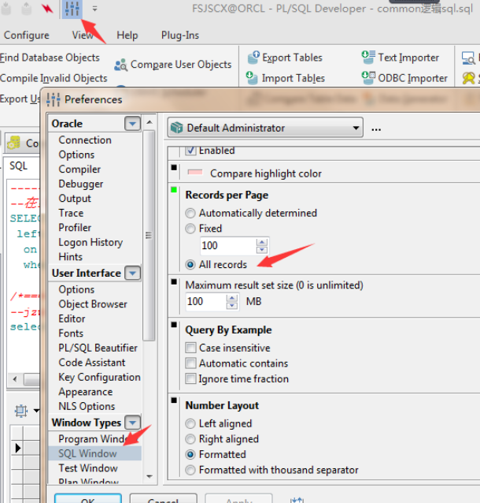

### **plsql如何查询sql执行计划**

[<font style="color:#3194D0;">怎么使用plsql查看执行计划</font>](https://link.jianshu.com/?t=https://jingyan.baidu.com/article/ab69b270bffc2e2ca7189fee.html)

执行计划可以用计划sql执行的性能

<font style="color:#2F2F2F;">选中需要执行的sql语句，然后按F5，或者直接点击"执行计划"</font>

### **PLSQL工具如何远程连接数据库**

#### **参考链接**

[<font style="color:#3194D0;">如何配置pl/sql 连接远程oracle服务器——百度知道</font>](https://link.jianshu.com/?t=https://zhidao.baidu.com/question/333852172.html)

#### **方法1：**

<font style="color:#2F2F2F;">找到oracle的安装目录。如：C:\oracle\product\10.2.0\db_1\network\ADMIN</font>


<font style="color:#2F2F2F;">添加如下内容</font><font style="color:#2F2F2F;">  
</font><font style="color:#2F2F2F;">其中中文部分是需要修改的部分，除第一个“本地实例名”外，其他需要跟远程数据库管理员咨询，本地实例名就是方便自己识别数据库的一个名字，可以自定义。</font>


```plain
本地实例名 =

  (DESCRIPTION =

    (ADDRESS = (PROTOCOL = TCP)(HOST = 远程数据库IP地址)(PORT = 远程服务器端口号))

    (CONNECT_DATA =

      (SERVER = DEDICATED)

      (SERVICE_NAME = 远程数据库服务名)

    )

  )
```


<font style="color:#2F2F2F;">然后打开pl/sql就能看到自己创建的链接，如图：</font>

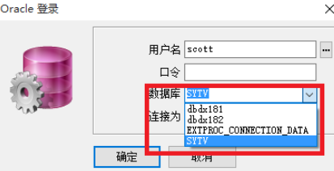

方法2：

 

 

#### **方法2：**

##### **格式：**

<font style="color:#FF0000;">ip</font>:<font style="color:#FF0000;">端口</font>/<font style="color:#FF0000;">sid</font>

##### **示例：**

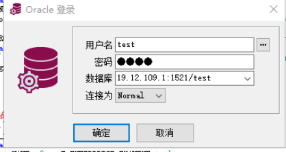
