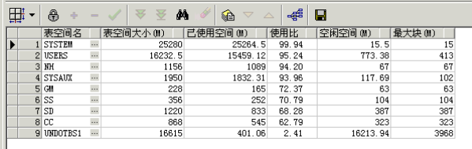
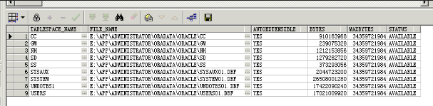

# 查询表空间使用情况


<!--more-->
```sql

----查询表空间使用情况---     
    
SELECT UPPER(F.TABLESPACE_NAME) "表空间名",     
D.TOT_GROOTTE_MB "表空间大小(M)",     
D.TOT_GROOTTE_MB - F.TOTAL_BYTES "已使用空间(M)",     
TO_CHAR(ROUND((D.TOT_GROOTTE_MB - F.TOTAL_BYTES) / D.TOT_GROOTTE_MB * 100,2),'990.99') "使用比",     
F.TOTAL_BYTES "空闲空间(M)",     
F.MAX_BYTES "最大块(M)"    
FROM (SELECT TABLESPACE_NAME,     
ROUND(SUM(BYTES) / (1024 * 1024), 2) TOTAL_BYTES,     
ROUND(MAX(BYTES) / (1024 * 1024), 2) MAX_BYTES     
FROM SYS.DBA_FREE_SPACE     
GROUP BY TABLESPACE_NAME) F,     
(SELECT DD.TABLESPACE_NAME,     
ROUND(SUM(DD.BYTES) / (1024 * 1024), 2) TOT_GROOTTE_MB     
FROM SYS.DBA_DATA_FILES DD     
GROUP BY DD.TABLESPACE_NAME) D     
WHERE D.TABLESPACE_NAME = F.TABLESPACE_NAME     
ORDER BY 4 DESC;  

```


```sql

--查看表空间是否具有自动扩展的能力     
SELECT T.TABLESPACE_NAME,D.FILE_NAME,     
D.AUTOEXTENSIBLE,D.BYTES,D.MAXBYTES,D.STATUS     
FROM DBA_TABLESPACES T,DBA_DATA_FILES D     
WHERE T.TABLESPACE_NAME =D.TABLESPACE_NAME     
 ORDER BY TABLESPACE_NAME,FILE_NAME; 
```




# 表空间扩容

通常默认的表空间都一个数据文件

## 给表空间增加数据文件


```sql

ALTER TABLESPACE app_data ADD DATAFILE  
'D:\ORACLE\PRODUCT\10.2.0\ORADATA\EDWTEST\APP03.DBF' SIZE 50M;  
```

## 新增数据文件，并且允许数据文件自动增长


```sql
ALTER TABLESPACE app_data ADD DATAFILE
'D:\ORACLE\PRODUCT\10.2.0\ORADATA\EDWTEST\APP04.DBF' SIZE 50M
AUTOEXTEND ON NEXT 5M MAXSIZE 31G;
```

## 允许已存在的数据文件自动增长


```sql

ALTER DATABASE DATAFILE 'D:\ORACLE\PRODUCT\10.2.0\ORADATA\EDWTEST\APP03.DBF'  
AUTOEXTEND ON NEXT 5M MAXSIZE 100M;
```


## 手工改变已存在数据文件的大小


```sql
ALTER DATABASE DATAFILE 'D:\ORACLE\PRODUCT\10.2.0\ORADATA\EDWTEST\APP02.DBF'  
RESIZE 100M;
```

