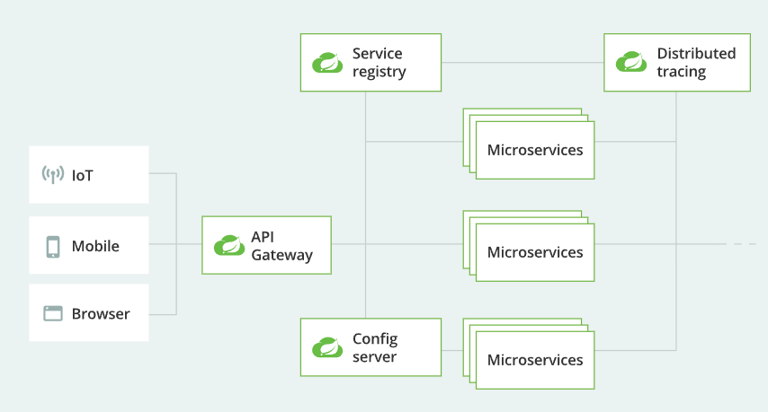
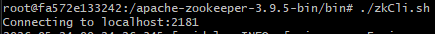
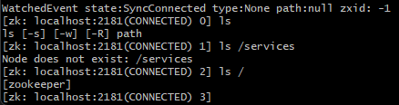

# 参考链接

[Spring Could——Spring](https://spring.io/cloud)

[Spring Cloud及Cloud Native概述——极客时间](https://time.geekbang.org/course/detail/100023501-92249)

[Spring Cloud Demo——Github](https://gitee.com/geektime-geekbang/geektime-spring-family)

# 什么是微服务

微服务就是一些协同工作的小而自治的服务。

传统的单一组件的修改更新，往往会影响整个服务，微服务的技术是将一个系统分成多个小服务，比如银行系统的支付、订单、网关等分成独立的服务，在对相关的服务做更新时，不影响其他正在运行的服务。

# 如何理解Cloud Native

运原生技术有篮球各组织在公有云和混合云等新型动态环境中，构建和运行可弹性扩展的应用。


## Cloud Native架构

云原生架构由四个部分组成：devops、continuous delivery、microservices、containers

云原生应用的要求：
1. **Devops**开发与运维一同致力于交付高品质的软件服务于客户
2. 在**持续交付**中，软件的构建、测试和发布，要更快更频繁、更稳定
3. 构造一组小型服务形式来部署应用的**微服务**架构
4. 使用比传统虚拟机更高效率的**容器**（k8s、docker）

构建云原生技术的相关技术栈：Kubernetes、Prometheus、Envoy、CoreDNS、Containerd

# spring could的技术架构



# spring could的主要功能

* 服务发现
* 服务网关
* 服务熔断
* 配置服务
* 服务安全
* 分布式消息
* 分布式跟踪
* 各种云平台支持

## 服务的注册和发现

常见的服务注册和发现的组件有：Netflix Eureka（不再更新了）、Zookeeper、Alibaba Nacos、Consul

### 服务注册中心的核心思想

* 作为服务中心，必须遵守的核心思想，注册中心不能因为自身的原因破坏服务之间本身的连通性。

* 遵守CAP原则 —— 遵守一致性、可用性、分区容忍性

### zookeeper作为注册中心

使用docker快速集成

```bash
docker run -d \
  --name zk-single \
  --restart always \
  -p 2181:2181 \
  -p 8080:8080 \
  -v D:/containerMountedDisk/zookeeper/data:/data \
  -v D:/containerMountedDisk/zookeeper/datalog:/datalog \
  -e ZOO_MY_ID=1 \
  zookeeper:latest
```

* `-d`：后台运行容器。

* `--name zk-single`：为容器命名，便于后续管理。

* `--restart always`：设置容器退出或Docker重启时自动启动，保证服务稳定性。

* `-p 2181:2181`：将容器内的2181端口映射到宿主机。这是ZooKeeper的核心通信端口，客户端（如Kafka、Dubbo）通过此端口连接。

* `-p 8080:8080`：映射Admin Server端口。从ZooKeeper 3.5.0版本开始，提供Web UI监控页面，访问 http://localhost:8080 即可查看节点状态。

* `-v /your/local/data/path:/data`：挂载数据目录。这是最重要的一步，将容器内ZooKeeper的数据文件（如快照）持久化到宿主机，防止容器删除后数据丢失。

* `-v /your/local/datalog/path:/datalog`：挂载事务日志目录。将事务日志持久化存储，方便问题排查。

* `-e ZOO_MY_ID=1`：设置当前节点的唯一ID。在单机模式下通常设为1。

* `zookeeper:latest`：使用的镜像名称和标签。建议指定具体版本号，如 zookeeper:3.8.4，避免因版本更新带来的兼容性问题。


docker容器启动运行完成后，可以通过进入容器，用client工具去查看zookeeper一些信息

```bash
docker exec -it zk-single bash

# 进入容器后
cd ~/bin
./zkCli.sh

# 进入zookeeper的client后，使用命令ls [path]查看所有已经注册的服务
ls /
```


最初的安装，是没有任何服务的，只有一个叫zookeeper的服务


