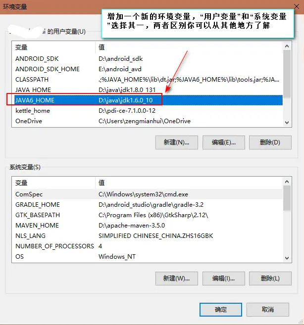
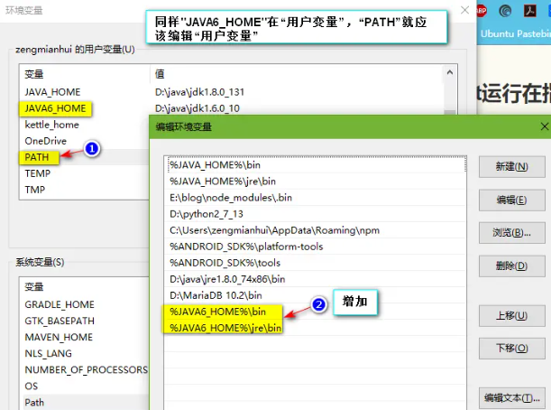

# 参考链接
[tomcat下指定jdk——百度经验](https://jingyan.baidu.com/article/066074d62d371cc3c21cb0ec.html)
# 正文
## 概述
我与参考链接中的不太一样，我是嫌麻烦的，直接在环境变量中新建了一个。
## 设置环境变量

1. 变量名可以自定义的，因为我的是tomcat6，所以我准备使用JDK6。  





1.  编辑`PATH` 变量，`%JAVA6_HOME%\bin;%JAVA6_HOME%\jre\bin;`



## 编辑tomcat的catalina.bat文件

将`echo Using JAVA_HOME:       "%JAVA_HOME%"`修改为`echo Using JAVA_HOME:       "%JAVA6_HOME%"`

## 编辑setclasspath.bat

<!--more-->
```
# 这个是原代码
if not "%JAVA_HOME%" == "" goto gotJdkHome
# 忽略大部分代码……………………………………………………………………
:gotJdkHome
if not exist "%JAVA_HOME%\bin\java.exe" goto noJavaHome
if not exist "%JAVA_HOME%\bin\javaw.exe" goto noJavaHome
if not exist "%JAVA_HOME%\bin\jdb.exe" goto noJavaHome
if not exist "%JAVA_HOME%\bin\javac.exe" goto noJavaHome
if not "%JRE_HOME%" == "" goto okJavaHome
set "JRE_HOME=%JAVA_HOME%"
# 忽略大部分代码……………………………………………………………………
set _RUNJDB="%JAVA_HOME%\bin\jdb.exe"
```

```
# 这个是修改后的代码
if not "%JAVA6_HOME%" == "" goto gotJdkHome
# 忽略大部分代码……………………………………………………………………
:gotJdkHome
if not exist "%JAVA6_HOME%\bin\java.exe" goto noJavaHome # 需要修改的地方
if not exist "%JAVA6_HOME%\bin\javaw.exe" goto noJavaHome # 需要修改的地方
if not exist "%JAVA6_HOME%\bin\jdb.exe" goto noJavaHome # 需要修改的地方
if not exist "%JAVA6_HOME%\bin\javac.exe" goto noJavaHome # 需要修改的地方
if not "%JRE_HOME%" == "" goto okJavaHome
set "JRE_HOME=%JAVA6_HOME%" # 需要修改的地方
# 忽略大部分代码……………………………………………………………………
set _RUNJDB="%JAVA6_HOME%\bin\jdb.exe"# 需要修改的地方
```
