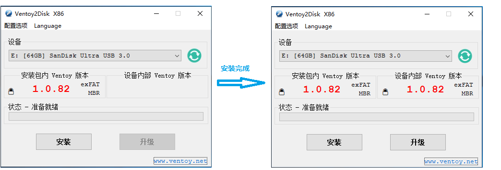
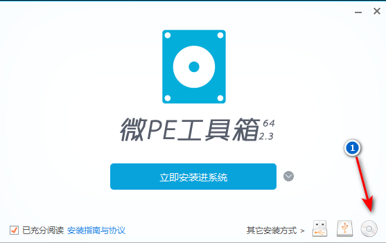
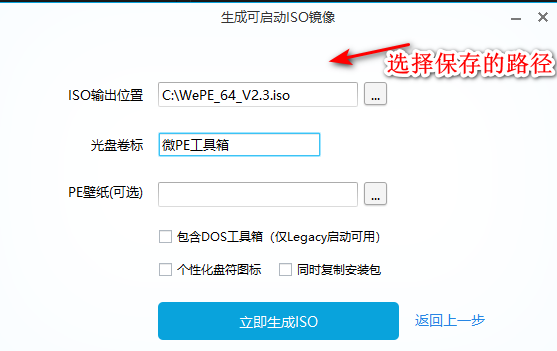
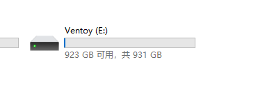
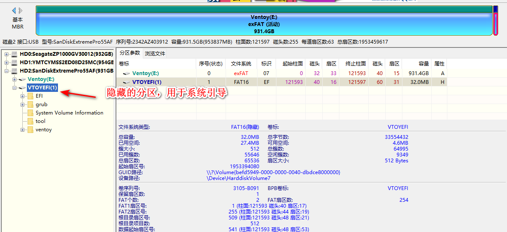
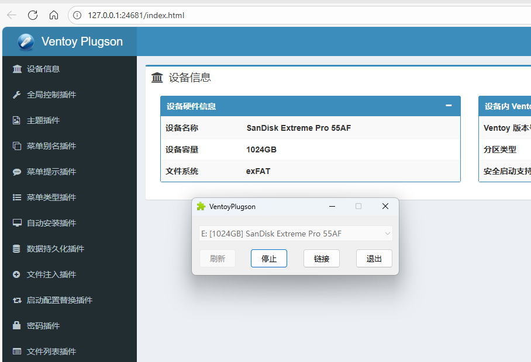
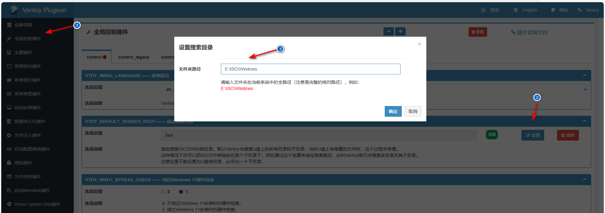

# 参考链接

[Ventoy使用说明————Ventoy](https://www.ventoy.net/cn/doc_start.html)

[Ventoy的下载————Ventoy](https://www.ventoy.net/cn/download.html)

[UEFI模式安全启动操作说明————Ventoy](https://www.ventoy.net/cn/doc_secure.html)

[微PE工具箱下载————微PE](https://www.wepe.com.cn/download.html)

# 下载Ventoy

下载安装包，例如 ventoy-1.0.00-windows.zip 然后解压开。
直接执行 Ventoy2Disk.exe 如下图所示，选择磁盘设备，然后点击 安装 按钮即可。

说明：
默认的 Ventoy2Disk.exe 是32位x86程序，同时支持最常见的32位和64位Windows系统，绝大部分情况下使用它就可以。
从1.0.58版本开始，Ventoy还同时提供了 Ventoy2Disk_X64.exe/Ventoy2Disk_ARM.exe/Ventoy2Disk_ARM64.exe 可以根据需要使用。
这些文件位于安装包内的altexe目录下，使用时需要将其拷贝到上一层目录（即和 Ventoy2Disk.exe 同一位置）。
更多详细教程请参考官方文档

左上角的配置选项，可以根据需要设置，没有什么太大影响

# 制作微PEISO

去到官网去下载[微PE工具箱下载————微PE](https://www.wepe.com.cn/download.html)

按以下步骤操作后，会得到一个ISO的镜像，在Ventoy引导后的界面里面选择这个ISO文件即可

# 存放镜像

ventoy创建引导后，会有一个隐藏的分区（UEFI引导）加一个正常显示的分区，正常显示的分区，可以用于存放ISO镜像

# 安全引导支持

建议直接看官方文档，你肯定会遇到，进入引导后会提示安全引导的问题，按照官方文档操作即可，一次设置就永久使用
[UEFI模式安全启动操作说明————Ventoy](https://www.ventoy.net/cn/doc_secure.html)

# 指定ISO的搜索路径

正常来说，ISO是可以正常显示的分区里面任意存放，但是我们可以设置插件来指定引导的路径

在你下载的ventoy压缩包里面肯定会有一个叫ventoyPlugson的文件，启动它，并在界面中选择U盘，再点击启动，会弹出一个网页，这个网页是可以用来配置参数，我们可以在里面指定插件，这个网页原理也只是生成一个json的配置文件而已，如果有特别需要，可以直接修改文件，相当在网页的设置操作。

在全局配置中设置对应的路径即可

