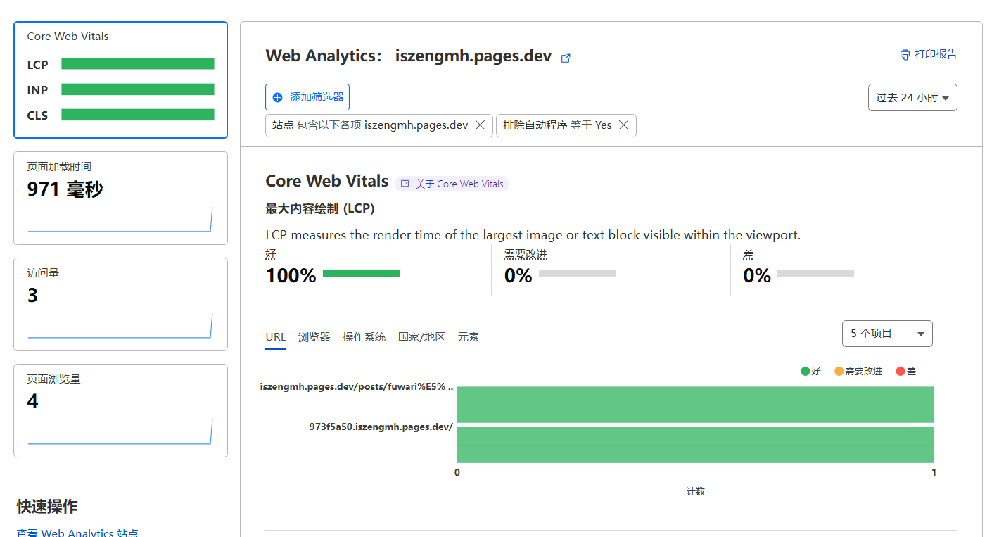
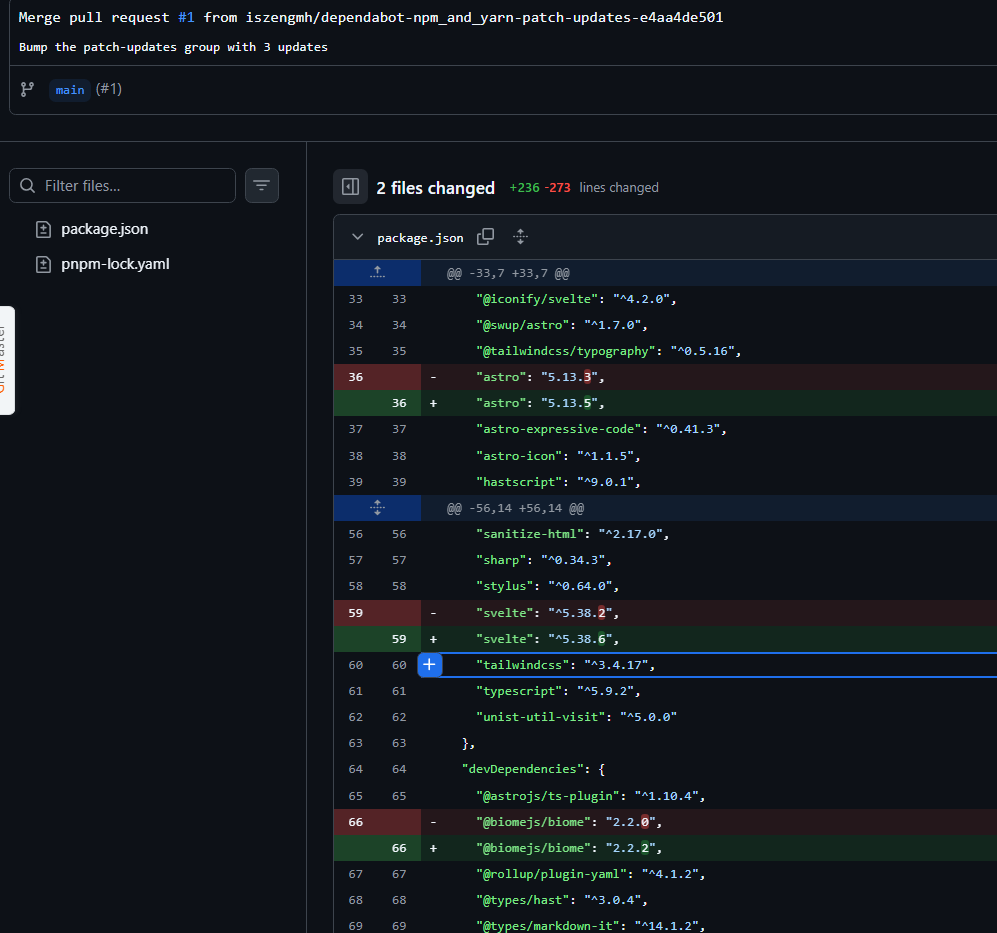
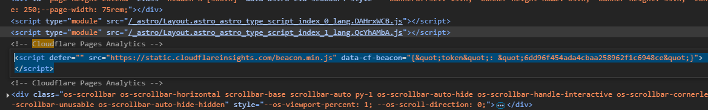
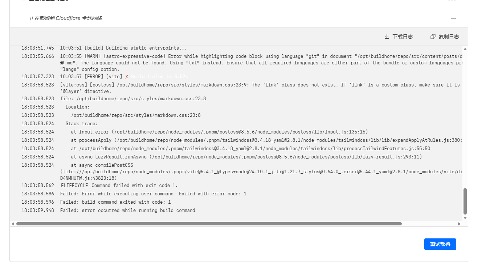
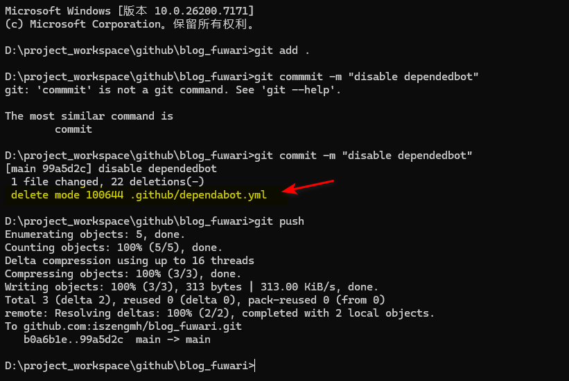
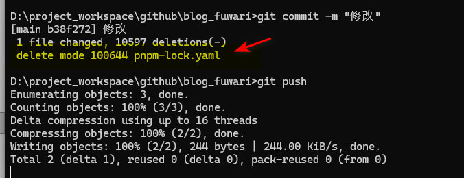
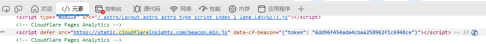

# 为什么Couldflare pages启用Web Analytics没有数据

我在Couldflare用 pages部署了fuwari，手动点击启用Web Analytics，但是发现两天了，还显示没有足够数据使用Web analytics，最后发现github仓库里面有一个cloudflare的提交失败了，我就手动合并了代码，发现Web analytics居然有数据了

我看到有以下提交失败了

找到这个提交失败的代码，在github仓库里面点击这个提交失败的代码，可以看到这个代码里面有cloudflare的配置，我手动合并了代码，就出现了数据

并且在网页源代码上找到cloudflare嵌入的脚本，在浏览器控制台查看，可以查看到数据

--------------------------------

# 后续

我近期发现build的时候会失败，然后百思不得其解，就尝试去还原了package.json，然后发现真的成功，看来问题还是出在自动依赖的更新，接着我又去查询为什么cloudflare会自动提交代码，才发现这个叫自动依赖管理，且并不是cloudflare在管理的，是github，可能是我误开启了 个自动依赖管理。所以回来重新审视“为什么Couldflare pages启用Web Analytics没有数据”这个问题，觉得Web Analytics没有数据可能并不是cloudflare引起

由于我发现自动依赖管理会引起build报错，所以我还是决定禁用这个功能，重新还原pakcage.json到原始的

删除对应的配置文件并提交

查看webAnalysis有没有受到影响

