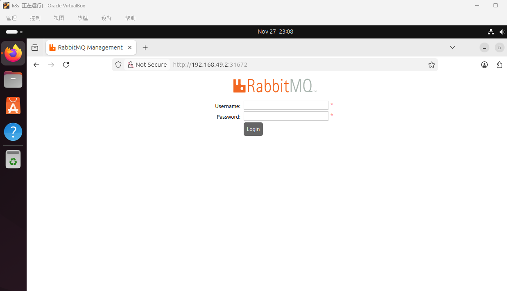

# 参考链接

[tutorials——rabbitMQ](https://www.rabbitmq.com/tutorials)


# 确认你的的docker用了正确的镜像

国内是无法正常docker.io，本来我是使用的全局代理的，虚拟机也可以ping 通docker.io，但是奇怪的是，当去minikube ssh中去ping docker.io也是成功的，但是创建pod，总是报错无法访问docker.io

不知道怎么使用国内镜像地址的，可以看下面这个文章
[docker之定义自定义镜像](https://iszengmh.github.io/posts/docker%E4%B9%8B%E5%A6%82%E4%BD%95%E6%9B%B4%E6%8D%A2%E5%9B%BD%E5%86%85%E9%95%9C%E5%83%8F)

# 创建secret用于保存rabbitmq的用户名和密码


文件名： rabbitmq-secret.yaml

```yaml

# rabbitmq-secret.yaml
apiVersion: v1
kind: Secret
metadata:
  name: rabbitmq-secret
type: Opaque
data:
  # 注意：值必须是 base64 编码
  RABBITMQ_DEFAULT_USER: YWRtaW4=
  RABBITMQ_DEFAULT_PASS: YWRtaW4=

```

密码可以通过这个命令来创建
```shell

echo -n 'username' | base64
echo -n 'password' | base64

```

# 创建一个deployment文件，用于部署rabbitMQ的pod


文件名：rabbitmq-deployment.yaml

```yaml

metadata:
  name: rabbitmq
spec:
  replicas: 1
  selector:
    matchLabels:
      app: rabbitmq
  template:
    metadata:
      labels:
        app: rabbitmq
    spec:
      containers:
      - name: rabbitmq
        image: rabbitmq:3-management
        envFrom:
        - secretRef:
            name: rabbitmq-secret
        ports:
        - containerPort: 5672   # AMQP
        - containerPort: 15672  # Management UI
        resources:
          requests:
            memory: "512Mi"
            cpu: "200m"
          limits:
            memory: "1Gi"
            cpu: "500m"

```

# 创建容器的端口映射的服务，方便宿主机访问容器的管理系统

文件名：rabbitmq-service.yaml
```yaml

# rabbitmq-service.yaml
apiVersion: v1
kind: Service
metadata:
  name: rabbitmq
spec:
  type: NodePort   # 或 NodePort / LoadBalancer（如果需要外部访问）
  ports:
  - port: 5672
    targetPort: 5672
    nodePort: 31671
    name: amqp
  - port: 15672
    targetPort: 15672
    name: management
    nodePort: 31672
  selector:
    app: rabbitmq

```
* port: 15672 表示当前POD的端口
* targetPort: 15672 表示当前POD里面的某个端口，如果你的rabbitMQ用的管理系统端口是8080，那么这里应该设置为8080，那么8080就会被映射为15672，以便其他POD可以访问这个RabbitMQ的服务。
* 当type: NodePort时，则可以设置nodePort: 31672,则表示POD的端口15672为被映射为31672，以便宿主机可以访问31672端口

以上端口映射路径为： 用户->31672->15672->15672


# 执行三个申明式的配置文件

```batch

kubectl apply -f rabbitmq-secret.yaml
kubectl apply -f rabbitmq-deployment.yaml
kubectl apply -f rabbitmq-service.yaml

```

# 验证结果

## 验证容器是否创建成功

```batch

kubectl get pod -A # 先查一下rabbitMQ在哪个POD

kubectl describe pod <your pod name> -n <namespace> # 根据对应的POD，查询这个POD执行结果

```


你会日志中大概看到这样的结果，代表pod创建并成功运行
```

Events:
  Type    Reason          Age    From               Message
  ----    ------          ----   ----               -------
  Normal  Scheduled       59m    default-scheduler  Successfully assigned default/rabbitmq-69cc6bdf8d-c4qlc to minikube
  Normal  Pulling         59m    kubelet            Pulling image "rabbitmq:3-management"
  Normal  Pulled          59m    kubelet            Successfully pulled image "rabbitmq:3-management" in 1.492s (29.507s including waiting). Image size: 178549379 bytes.
  Normal  Created         59m    kubelet            Created container: rabbitmq
  Normal  Started         59m    kubelet            Started container rabbitmq
  Normal  SandboxChanged  9m36s  kubelet            Pod sandbox changed, it will be killed and re-created.
  Normal  Pulled          9m33s  kubelet            Container image "rabbitmq:3-management" already present on machine
  Normal  Created         9m33s  kubelet            Created container: rabbitmq
  Normal  Started         9m32s  kubelet            Started container rabbitmq


```

## 访问rabbitMQ管理页面

```batch

minikube ip
```
你会看到，打印了当前节点k8s的单机集群的节点IP，可能是192.168.49.2

然后你可以在虚拟机上访问http://192.168.49.2:31672, 去访问管理界面。



# 曝露虚拟机端口（未测试成功，暂时留作记录）

## ubuntu

```batch

sudo ufw allow 31672/tcp
```
## centos

```batch

sudo firewall-cmd --add-port=31672/tcp --permanent
sudo firewall-cmd --reload
```

## 查看是否成功监听端口

```batch

# 查看 kube-proxy 或 CNI 是否监听了 31672
sudo ss -tulnp | grep 31672
```

## 后记

经过一段测试，推断应该minikube阻断HTTP的流量，前面说过使用`minikube ip` 打印的IP可以在虚拟机中访问rabbitmq的管理界面，其实生成的ip通过在宿主机使用`telnet 192.168.49.2 31672`是可以连接成功的，说明端口没有问题，minikube的IP也可以直接与宿主机通信，但是在宿主机的浏览器上访问http://192.168.49.2:31672，却报连接错误，可能是minikube阻断了，暂时还未找到原因。

```batch
kubectl port-forward svc/rabbitmq 31671:5672 31672:15672 --address 0.0.0.0
```
