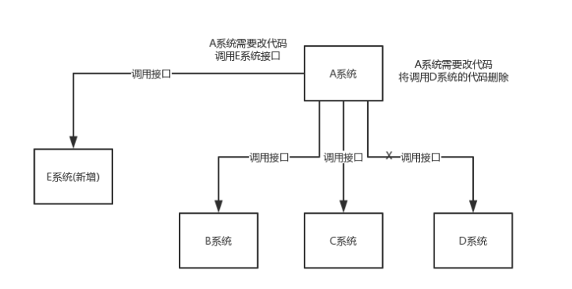
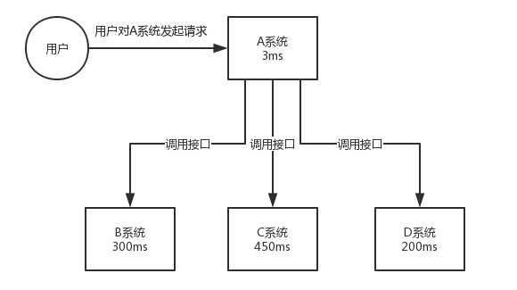
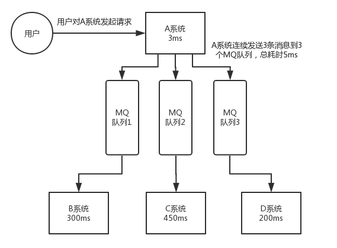
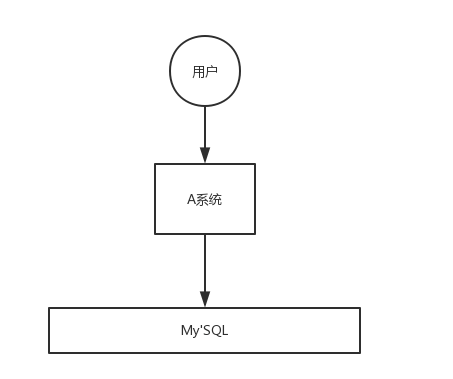
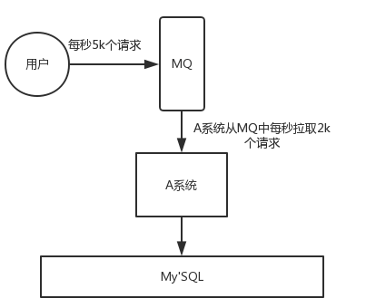

# 参考链接

[advanced-java———消息队列](https://java.doocs.org/high-concurrency/why-mq)
[比较 Solace 和 Kafka——Solace](https://solace.com/vs-kafka/#Introduction)
# 面试官心理分析

* 你知不知道你们系统里为什么要用消息队列这个东西？

不少候选人，说自己项目里用了 Redis、MQ，但是其实他并不知道自己为什么要用这个东西。其实说白了，就是为了用而用，或者是别人设计的架构，他从头到尾都没思考过。

没有对自己的架构问过为什么的人，一定是平时没有思考的人，面试官对这类候选人印象通常很不好。因为面试官担心你进了团队之后只会木头木脑的干呆活儿，不会自己思考。

* 你既然用了消息队列这个东西，你知不知道用了有什么好处&坏处？

你要是没考虑过这个，那你盲目弄个 MQ 进系统里，后面出了问题你是不是就自己溜了给公司留坑？你要是没考虑过引入一个技术可能存在的弊端和风险，面试官把这类候选人招进来了，基本可能就是挖坑型选手。就怕你干 1 年挖一堆坑，自己跳槽了，给公司留下无穷后患。

* 既然你用了 MQ，可能是某一种 MQ，那么你当时做没做过调研？

你别傻乎乎的自己拍脑袋看个人喜好就瞎用了一个 MQ，比如 Kafka，甚至都从没调研过业界流行的 MQ 到底有哪几种。每一个 MQ 的优点和缺点是什么。每一个 MQ 没有绝对的好坏，但是就是看用在哪个场景可以扬长避短，利用其优势，规避其劣势。

如果是一个不考虑技术选型的候选人招进了团队，leader 交给他一个任务，去设计个什么系统，他在里面用一些技术，可能都没考虑过选型，最后选的技术可能并不一定合适，一样是留坑。

# 各大主流消息系统

|特性|	ActiveMQ|	RabbitMQ|	RocketMQ|	Kafka|Solace|
|--|--|--|--|--|--|
单机吞吐量|	万级，比 RocketMQ、Kafka| 低一个数量级|	同 ActiveMQ	10 万级，支撑高吞吐|	超高吞吐（单集群可达千万 msg/s），专为大数据设计|高（单节点可达百万 msg/s），但不如 Kafka 极致优化|
topic 数量对吞吐量的影响|N/A	|	N/A|topic 可以达到几百/几千的级别，吞吐量会有较小幅度的下降，这是 RocketMQ 的一大优势，在同等机器下，可以支撑大量的|	 topic	topic 从几十到几百个时候，吞吐量会大幅度下降，在同等机器下，Kafka 尽量保证 topic 数量不要过多，如果要支撑大规模的 topic，需要增加更多的机器资源|	N/A|
时效性|	ms 级|	微秒级，这是 RabbitMQ 的一大特点，延迟最低|	ms 级|	延迟在 ms 级以内|极低延迟（微秒级），适合高频交易、IoT 实时控制|
可用性|	高，基于主从架构实现高可用|	同 ActiveMQ|	非常高，分布式架构|	非常高，分布式，一个数据多个副本，少数机器宕机，不会丢失数据，不会导致不可用|高，基于主从架构实现高可用  内置主动/备用代理 HA 自动故障转移，无数据丢失 不依赖外部协调服务 适用于所有消息类型和协议|
消息可靠性|	有较低的概率丢失数据|	基本不丢|	经过参数优化配置，可以做到 0 丢失|	同 RocketMQ|可选：内存 or 持久化队列（支持磁盘存储）|
功能支持|		MQ|	 领域的功能极其完备|		基于 erlang 开发，并发能力很强，性能极好，延时很低	MQ 功能较为完善，还是分布式的，扩展性好|		功能较为简单，主要支持简单的 MQ 功能，在大数据领域的实时计算以及日志采集被大规模使用|基于推送的交付，具有动态主题路由 支持通配符的代理端过滤 在过滤后的邮件中保留顺序 支持多种服务质量（尽力而为或有保证）多协议原生支持：  * SMF（Solace 自有）  *  MQTT  *  AMQP  * JMS  *  REST  * WebSocket  |
# 为什么使用消息队列？

使用场景有很多，但是核心是有三个**解耦、异步和削峰**。
## 解耦
假如有A系统需要发送消息到BCD等系统，但是某一天突然需要发送消息新系统E，D系统又不需要不发送了，那么A系统就不得不更改代码，调用新的接口。

这个图很直接表现，如果用传统的restful接口的话，就不得不改动代码去调用的新的系统，并且需要删除旧的系统调用，维护成本高

但是如果使用消息队列，那么A系统只需要保证消息的发送即可，而不需要关心有哪些系统需要消费，下游系统只要订阅对应的消息。

## 异步

我们知道当调用一个web接口时，通常系统需要跑一段时间程序后再将是否执行成功的消息返回，这个时候如果遇到耗时程序时，就会阻塞下一条消息，这个消息队列的优势就体现出来了，生产者只需要保证消息已经成功发送到目标系统即可（消息的可靠性），用户能立即得到请求响应的结果。

我们从下面这个传统接口调用的使用场景来看，当A系统需要处理用户的请求需要3ms,然后发送3条消息，但是由于消息是阻塞式的，那用户得到消息的反馈就需要3ms+300ms+450ms+200ms=953ms，这个用户收到响应就要将近1秒，体验非常差，正常合理的响应处理应该控制在200ms以内。

这个时候如果采用消息队列，那么用户的响应是3ms+5ms，总共8ms。

## 削峰
每天 0:00 到 12:00，A 系统风平浪静，每秒并发请求数量就 50 个。结果每次一到 12:00 ~ 13:00 ，每秒并发请求数量突然会暴增到 5k+ 条。但是系统是直接基于 MySQL 的，大量的请求涌入 MySQL，每秒钟对 MySQL 执行约 5k 条 SQL。

一般的 MySQL，扛到每秒 2k 个请求就差不多了，如果每秒请求到 5k 的话，可能就直接把 MySQL 给打死了，导致系统崩溃，用户也就没法再使用系统了。

但是高峰期一过，到了下午的时候，就成了低峰期，可能也就 1w 的用户同时在网站上操作，每秒中的请求数量可能也就 50 个请求，对整个系统几乎没有任何的压力。

如果使用 MQ，每秒 5k 个请求写入 MQ，A 系统每秒钟最多处理 2k 个请求，因为 MySQL 每秒钟最多处理 2k 个。A 系统从 MQ 中慢慢拉取请求，每秒钟就拉取 2k 个请求，不要超过自己每秒能处理的最大请求数量就 ok，这样下来，哪怕是高峰期的时候，A 系统也绝对不会挂掉。而 MQ 每秒钟 5k 个请求进来，就 2k 个请求出去，结果就导致在中午高峰期（1 个小时），可能有几十万甚至几百万的请求积压在 MQ 中。

# 消息队列的缺点

## 系统可用性降低

**系统依赖越多，可靠性越低，越容易挂掉。** 本来你就是 A 系统调用 BCD 三个系统的接口就好了，ABCD 四个系统还好好的，没啥问题，你偏加个 MQ 进来，万一 MQ 挂了咋整？MQ 一挂，整套系统崩溃，你不就完了？如何保证消息队列的高可用，

## 系统复杂度提高

硬生生加个 MQ 进来，你怎么保证消息没有重复消费？怎么处理消息丢失的情况？怎么保证消息传递的顺序性？头大头大，问题一大堆，痛苦不已。

## 一致性问题

**A 系统处理完了直接返回成功了，人都以为你这个请求就成功了**；但是问题是，要是 BCD 三个系统那里，BD 两个系统写库成功了，结果 C 系统写库失败了，咋整？你这数据就不一致了。

所以消息队列实际是一种非常复杂的架构，你引入它有很多好处，但是也得针对它带来的坏处做各种额外的技术方案和架构来规避掉，做好之后，你会发现，妈呀，系统复杂度提升了一个数量级，也许是复杂了 10 倍。但是关键时刻，用，还是得用的。

# 总结 
综上，各种对比之后，有如下建议：

一般的业务系统要引入 MQ，最早大家都用 ActiveMQ，但是现在确实大家用的不多了，没经过大规模吞吐量场景的验证，社区也不是很活跃，所以大家还是算了吧，我个人不推荐用这个了。

后来大家开始用 RabbitMQ，但是确实 erlang 语言阻止了大量的 Java 工程师去深入研究和掌控它，对公司而言，几乎处于不可控的状态，但是确实人家是开源的，比较稳定的支持，活跃度也高。

不过现在确实越来越多的公司会去用 RocketMQ，确实很不错，毕竟是阿里出品，但社区可能有突然黄掉的风险（目前 RocketMQ 已捐给 Apache，但 GitHub 上的活跃度其实不算高）对自己公司技术实力有绝对自信的，推荐用 RocketMQ，否则回去老老实实用 RabbitMQ 吧，人家有活跃的开源社区，绝对不会黄。

所以中小型公司，技术实力较为一般，技术挑战不是特别高，用 RabbitMQ 是不错的选择；大型公司，基础架构研发实力较强，用 RocketMQ 是很好的选择。

如果是大数据领域的实时计算、日志采集等场景，用 Kafka 是业内标准的，绝对没问题，社区活跃度很高，绝对不会黄，何况几乎是全世界这个领域的事实性规范。